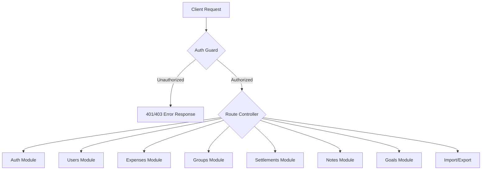

# 🔌 FinMate API Documentation & Contracts

This document contains the finalized API contracts, request/response models, versioning guidelines, pagination rules, and validation structures.

For the formal API specification schema, see the raw OpenAPI 3.0 draft in [openapi.yaml](file:///d:/prvn/Projects/FinMate/openapi.yaml).

---

## 🌐 Global API Conventions

### 1. Versioning Strategy

- **Path-based Versioning**: All production endpoints are versioned inside the path prefix: `/api/v1/...`
- **Future Deprecation Policy**: When versioning changes (e.g. to `v2`), older endpoints will respond with `X-API-Deprecate-Date: YYYY-MM-DD` and `X-API-Sunset-Date: YYYY-MM-DD` headers.

### 2. Authentication

Endpoints requiring authentication must specify the Bearer Token in the HTTP Authorization header:

```http
Authorization: Bearer <JWT_ACCESS_TOKEN>
```

For critical actions (e.g., disabling 2FA, changing passwords), a multi-factor session code is validated inline or via header: `X-MFA-Code: <6-digit-totp>`.

### 3. Pagination & Filtering

- **Standard Paginated Response Shape**:
  ```json
  {
    "data": [],
    "meta": {
      "totalItems": 105,
      "itemCount": 20,
      "itemsPerPage": 20,
      "totalPages": 6,
      "currentPage": 1
    },
    "links": {
      "first": "/api/v1/expenses?limit=20",
      "previous": null,
      "next": "/api/v1/expenses?page=2&limit=20",
      "last": "/api/v1/expenses?page=6&limit=20"
    }
  }
  ```
- **Cursor-based Pagination**:
  Used for frequently updated feeds (e.g., expenses, audit logs) to prevent element duplication/skipping when elements are modified in real-time.
  Query parameters: `cursor` (opaque base64 string) and `limit` (max 100).
- **Filtering Operators**:
  Filtering is supported on list endpoints via query parameters:
  - `groupId`: Filter by specific group (UUID)
  - `category`: Filter by category string
  - `startDate`/`endDate`: Filter by date range (ISO-8601 date: `YYYY-MM-DD`)
  - `status`: Filter by status enum (e.g. `active`, `achieved`, `posted`)

---

## 📂 Endpoint Directory



### 🔐 1. Auth Module

#### Register User

- **Endpoint**: `POST /api/v1/auth/register`
- **Description**: Registers a new user.
- **Request Example**:
  ```json
  {
    "email": "jane.doe@example.com",
    "password": "securePassword123!",
    "displayName": "Jane Doe"
  }
  ```
- **Response Example (`201 Created`)**:
  ```json
  {
    "id": "e44d3202-b2a6-42d4-bb06-b33df1fb3e61",
    "email": "jane.doe@example.com",
    "displayName": "Jane Doe",
    "status": "active",
    "createdAt": "2026-06-09T22:45:00.000Z",
    "updatedAt": "2026-06-09T22:45:00.000Z"
  }
  ```

#### Login User

- **Endpoint**: `POST /api/v1/auth/login`
- **Description**: Authenticate user credentials and retrieve a JWT token pair.
- **Request Example**:
  ```json
  {
    "email": "jane.doe@example.com",
    "password": "securePassword123!",
    "deviceId": "chrome-mac-uuid-1"
  }
  ```
- **Response Example (`200 OK`)**:
  ```json
  {
    "accessToken": "eyJhbGciOiJIUzI1NiIsInR5cCI6IkpXVCJ9.eyJ1c2VySWQiOiJlNDRkMzIwMi1iMmE2...",
    "refreshToken": "eyJhbGciOiJIUzI1NiIsInR5cCI6IkpXVCJ9.eyJyZWZyZXNoSWQiOiI1NTA4...",
    "user": {
      "id": "e44d3202-b2a6-42d4-bb06-b33df1fb3e61",
      "email": "jane.doe@example.com",
      "displayName": "Jane Doe",
      "status": "active",
      "createdAt": "2026-06-09T22:45:00.000Z",
      "updatedAt": "2026-06-09T22:45:00.000Z"
    }
  }
  ```

#### Refresh Tokens

- **Endpoint**: `POST /api/v1/auth/refresh`
- **Description**: Exchange an active refresh token for a new access token.
- **Request Example**:
  ```json
  {
    "refreshToken": "eyJhbGciOiJIUzI1NiIsInR5cCI6IkpXVCJ9.eyJyZWZyZXNoSWQiOiI1NTA4..."
  }
  ```
- **Response Example (`200 OK`)**:
  ```json
  {
    "accessToken": "eyJhbGciOiJIUzI1NiIsInR5cCI6IkpXVCJ9.eyJ1c2VySWQiOiJlNDRk...",
    "refreshToken": "eyJhbGciOiJIUzI1NiIsInR5cCI6IkpXVCJ9.eyJyZWZyZXNoSWQiOiI1NTA4..."
  }
  ```

#### Logout User

- **Endpoint**: `POST /api/v1/auth/logout`
- **Description**: Invalidate the session refresh token.
- **Request Example**:
  ```json
  {
    "refreshToken": "eyJhbGciOiJIUzI1NiIsInR5cCI6IkpXVCJ9.eyJyZWZyZXNoSWQiOiI1NTA4..."
  }
  ```
- **Response Example (`204 No Content`)**: Empty response body.

#### 2FA Setup Initiate

- **Endpoint**: `POST /api/v1/auth/2fa/enable`
- **Description**: Returns TOTP configuration parameters for registering to authenticator apps.
- **Response Example (`200 OK`)**:
  ```json
  {
    "secret": "KVKFKRCSN5RHK33O",
    "qrCodeUrl": "otpauth://totp/FinMate:jane.doe@example.com?secret=KVKFKRCSN5RHK33O&issuer=FinMate"
  }
  ```

#### 2FA Setup Verify

- **Endpoint**: `POST /api/v1/auth/2fa/verify`
- **Description**: Validates the 6-digit TOTP code and locks multi-factor authentication.
- **Request Example**:
  ```json
  {
    "code": "456812"
  }
  ```
- **Response Example (`200 OK`)**: Empty response body (status 200).

---

### 👤 2. Users Module

#### Get Current Profile

- **Endpoint**: `GET /api/v1/users/me`
- **Description**: Retrieve the current user's security context and preference profiles.
- **Response Example (`200 OK`)**:
  ```json
  {
    "user": {
      "id": "e44d3202-b2a6-42d4-bb06-b33df1fb3e61",
      "email": "jane.doe@example.com",
      "displayName": "Jane Doe",
      "status": "active",
      "lastLoginAt": "2026-06-09T22:42:00.000Z",
      "createdAt": "2026-06-09T22:45:00.000Z",
      "updatedAt": "2026-06-09T22:45:00.000Z"
    },
    "profile": {
      "id": "c1192804-d02f-41ad-b1a9-32219fa84fe3",
      "userId": "e44d3202-b2a6-42d4-bb06-b33df1fb3e61",
      "avatarUrl": "https://supabase.storage.finmate/avatars/e44d3202.png",
      "locale": "en-IN",
      "timezone": "Asia/Kolkata",
      "defaultCurrency": "INR",
      "monthlyBudget": 60000.0,
      "createdAt": "2026-06-09T22:45:00.000Z",
      "updatedAt": "2026-06-09T22:45:00.000Z"
    }
  }
  ```

#### Update Profile

- **Endpoint**: `PATCH /api/v1/users/me`
- **Description**: Modify localization, budgets, and display data.
- **Request Example**:
  ```json
  {
    "displayName": "Jane D. Smith",
    "locale": "en-US",
    "defaultCurrency": "USD",
    "monthlyBudget": 1500.0
  }
  ```
- **Response Example (`200 OK`)**: Updated profile schema payload matching `GET /api/v1/users/me`.

---

### 👥 3. Groups Module

#### Create Group

- **Endpoint**: `POST /api/v1/groups`
- **Description**: Creates a new shared ledger context.
- **Request Example**:
  ```json
  {
    "name": "Goa Trip 2026",
    "description": "Sharing travel and lodging costs for our Goa summer getaway",
    "visibility": "private"
  }
  ```
- **Response Example (`201 Created`)**:
  ```json
  {
    "id": "2ab72e81-b20f-488f-a9cb-b2f5cf111818",
    "name": "Goa Trip 2026",
    "description": "Sharing travel and lodging costs for our Goa summer getaway",
    "visibility": "private",
    "ownerUserId": "e44d3202-b2a6-42d4-bb06-b33df1fb3e61",
    "isArchived": false,
    "createdAt": "2026-06-09T22:46:00.000Z",
    "updatedAt": "2026-06-09T22:46:00.000Z"
  }
  ```

#### List Groups

- **Endpoint**: `GET /api/v1/groups`
- **Description**: Lists all active/archived groups user belongs to.
- **Response Example (`200 OK`)**: Paginated response wrapper around `Group` list data.

#### Invite Member

- **Endpoint**: `POST /api/v1/groups/{id}/members`
- **Description**: Invite a user to a group via their email.
- **Request Example**:
  ```json
  {
    "email": "bob.friend@example.com",
    "role": "member"
  }
  ```
- **Response Example (`201 Created`)**:
  ```json
  {
    "id": "b3e0c0fe-3f04-411a-86c2-48fb8a221f1e",
    "groupId": "2ab72e81-b20f-488f-a9cb-b2f5cf111818",
    "userId": "bfa899a8-e1a1-432d-9831-43229b1aa921",
    "role": "member",
    "joinStatus": "invited",
    "joinedAt": null,
    "leftAt": null,
    "createdAt": "2026-06-09T22:47:00.000Z",
    "updatedAt": "2026-06-09T22:47:00.000Z"
  }
  ```

---

### 💵 4. Expenses Module

#### Create Expense

- **Endpoint**: `POST /api/v1/expenses`
- **Description**: Creates a personal or group expense with splits.
- **Request Example (Equal Split)**:
  ```json
  {
    "title": "Villa Booking Advance",
    "description": "Airbnb deposit payment",
    "amountTotal": 15000.0,
    "currency": "INR",
    "category": "Accommodation",
    "paidByUserId": "e44d3202-b2a6-42d4-bb06-b33df1fb3e61",
    "groupId": "2ab72e81-b20f-488f-a9cb-b2f5cf111818",
    "expenseDate": "2026-06-09",
    "status": "posted",
    "splits": [
      {
        "participantUserId": "e44d3202-b2a6-42d4-bb06-b33df1fb3e61",
        "splitType": "equal",
        "shareValue": 1.0
      },
      {
        "participantUserId": "bfa899a8-e1a1-432d-9831-43229b1aa921",
        "splitType": "equal",
        "shareValue": 1.0
      }
    ],
    "attachmentKeys": ["receipts/20260609_villa_adv.pdf"]
  }
  ```
- **Response Example (`201 Created`)**:
  ```json
  {
    "id": "f5e929b9-d2b3-4f9e-990a-f0c33a923df2",
    "title": "Villa Booking Advance",
    "description": "Airbnb deposit payment",
    "amountTotal": 15000.0,
    "currency": "INR",
    "category": "Accommodation",
    "paidByUserId": "e44d3202-b2a6-42d4-bb06-b33df1fb3e61",
    "ownerUserId": "e44d3202-b2a6-42d4-bb06-b33df1fb3e61",
    "groupId": "2ab72e81-b20f-488f-a9cb-b2f5cf111818",
    "expenseDate": "2026-06-09",
    "status": "posted",
    "splits": [
      {
        "id": "782ab11a-ee4c-4e89-9832-fa11cbe2d321",
        "expenseId": "f5e929b9-d2b3-4f9e-990a-f0c33a923df2",
        "participantUserId": "e44d3202-b2a6-42d4-bb06-b33df1fb3e61",
        "splitType": "equal",
        "shareValue": 1.0,
        "amountOwed": 7500.0,
        "isSettled": false,
        "createdAt": "2026-06-09T22:48:00.000Z",
        "updatedAt": "2026-06-09T22:48:00.000Z"
      },
      {
        "id": "e99ad220-410a-4fb4-811c-fe998da2b34e",
        "expenseId": "f5e929b9-d2b3-4f9e-990a-f0c33a923df2",
        "participantUserId": "bfa899a8-e1a1-432d-9831-43229b1aa921",
        "splitType": "equal",
        "shareValue": 1.0,
        "amountOwed": 7500.0,
        "isSettled": false,
        "createdAt": "2026-06-09T22:48:00.000Z",
        "updatedAt": "2026-06-09T22:48:00.000Z"
      }
    ],
    "attachments": [
      {
        "id": "62e12a81-d703-4903-b09a-4c22fb09ffae",
        "uploaderUserId": "e44d3202-b2a6-42d4-bb06-b33df1fb3e61",
        "expenseId": "f5e929b9-d2b3-4f9e-990a-f0c33a923df2",
        "storageKey": "receipts/20260609_villa_adv.pdf",
        "originalName": "20260609_villa_adv.pdf",
        "mimeType": "application/pdf",
        "sizeBytes": 1048576,
        "createdAt": "2026-06-09T22:48:00.000Z"
      }
    ],
    "createdAt": "2026-06-09T22:48:00.000Z",
    "updatedAt": "2026-06-09T22:48:00.000Z"
  }
  ```

---

### 🤝 5. Settlements Module

#### Calculate Group Balances

- **Endpoint**: `GET /api/v1/groups/{groupId}/settlements/balances`
- **Description**: Returns a list of net balances for group members, and the simplified transaction sets required to bring all balances to zero.
- **Response Example (`200 OK`)**:
  ```json
  {
    "balances": [
      {
        "userId": "e44d3202-b2a6-42d4-bb06-b33df1fb3e61",
        "displayName": "Jane Doe",
        "netBalance": 7500.0,
        "currency": "INR"
      },
      {
        "userId": "bfa899a8-e1a1-432d-9831-43229b1aa921",
        "displayName": "Bob Friend",
        "netBalance": -7500.0,
        "currency": "INR"
      }
    ],
    "suggestedSettlements": [
      {
        "fromUserId": "bfa899a8-e1a1-432d-9831-43229b1aa921",
        "toUserId": "e44d3202-b2a6-42d4-bb06-b33df1fb3e61",
        "amount": 7500.0,
        "currency": "INR"
      }
    ]
  }
  ```

#### Propose Settlement Payment

- **Endpoint**: `POST /api/v1/groups/{groupId}/settlements`
- **Description**: Proposes a settlement transfer to clear balance debts.
- **Request Example**:
  ```json
  {
    "toUserId": "e44d3202-b2a6-42d4-bb06-b33df1fb3e61",
    "amount": 7500.0,
    "currency": "INR",
    "note": "Paid via UPI"
  }
  ```
- **Response Example (`201 Created`)**:
  ```json
  {
    "id": "92da7670-3c12-4fb6-a05e-fca0d631df89",
    "groupId": "2ab72e81-b20f-488f-a9cb-b2f5cf111818",
    "fromUserId": "bfa899a8-e1a1-432d-9831-43229b1aa921",
    "toUserId": "e44d3202-b2a6-42d4-bb06-b33df1fb3e61",
    "amount": 7500.0,
    "currency": "INR",
    "status": "proposed",
    "settledOn": null,
    "note": "Paid via UPI",
    "createdAt": "2026-06-09T22:50:00.000Z",
    "updatedAt": "2026-06-09T22:50:00.000Z"
  }
  ```

#### Confirm Settlement

- **Endpoint**: `PATCH /api/v1/groups/{groupId}/settlements/{id}`
- **Description**: Called by the creditor to confirm receipt, settling the splits associated with the debts.
- **Request Example**:
  ```json
  {
    "status": "confirmed",
    "settledOn": "2026-06-09",
    "version": 1
  }
  ```
- **Response Example (`200 OK`)**: Updates status to `confirmed` and triggers internal ledger updates.

---

### 📝 6. Notes Module

#### Create Note

- **Endpoint**: `POST /api/v1/notes`
- **Description**: Create a personal note or shared group note.
- **Request Example**:
  ```json
  {
    "title": "Hotel Booking Links",
    "body": "1. Grand Hyatt Goa: https://link\n2. Vivanta: https://link",
    "visibility": "group",
    "groupId": "2ab72e81-b20f-488f-a9cb-b2f5cf111818"
  }
  ```
- **Response Example (`201 Created`)**:
  ```json
  {
    "id": "ca8b3de3-d144-4822-ba30-dcbbf11ab9c2",
    "authorUserId": "e44d3202-b2a6-42d4-bb06-b33df1fb3e61",
    "groupId": "2ab72e81-b20f-488f-a9cb-b2f5cf111818",
    "title": "Hotel Booking Links",
    "body": "1. Grand Hyatt Goa: https://link\n2. Vivanta: https://link",
    "visibility": "group",
    "createdAt": "2026-06-09T22:52:00.000Z",
    "updatedAt": "2026-06-09T22:52:00.000Z"
  }
  ```

---

### 🎯 7. Goals Module

#### Create Goal

- **Endpoint**: `POST /api/v1/goals`
- **Description**: Initialize a target budget saving goal.
- **Request Example**:
  ```json
  {
    "title": "New MacBook Pro",
    "targetAmount": 180000.0,
    "savedAmount": 25000.0,
    "currency": "INR",
    "targetDate": "2026-12-31"
  }
  ```
- **Response Example (`201 Created`)**:
  ```json
  {
    "id": "e30cbb02-fc2f-4809-b4cb-de89a2bc91b1",
    "ownerUserId": "e44d3202-b2a6-42d4-bb06-b33df1fb3e61",
    "title": "New MacBook Pro",
    "targetAmount": 180000.0,
    "savedAmount": 25000.0,
    "currency": "INR",
    "targetDate": "2026-12-31",
    "status": "active",
    "createdAt": "2026-06-09T22:53:00.000Z",
    "updatedAt": "2026-06-09T22:53:00.000Z"
  }
  ```

---

### 📥 8. Import/Export Module

#### Import Expenses File

- **Endpoint**: `POST /api/v1/import/expenses`
- **Description**: Import transaction rows from a CSV or Excel file.
- **Request Type**: `multipart/form-data`
- **Request Params**:
  - `file`: Binary file.
  - `groupId` (string, UUID, optional): Associate imported transactions to this group.
- **Response Example (`200 OK`)**:
  ```json
  {
    "successCount": 24,
    "errorCount": 1,
    "errors": [
      {
        "row": 12,
        "message": "Invalid date format: '09/32/2026'"
      }
    ]
  }
  ```

#### Export Expenses File

- **Endpoint**: `GET /api/v1/export/expenses`
- **Description**: Generates and downloads a spreadsheet file containing expenses.
- **Query Parameters**:
  - `format`: Either `csv` or `xlsx` (default: `csv`).
  - `groupId`: Filter export to group (optional).
  - `startDate`/`endDate`: Optional date bounding.
- **Response Example (`200 OK`)**: File binary payload with headers:
  ```http
  Content-Type: text/csv
  Content-Disposition: attachment; filename="expenses_export_20260609.csv"
  ```

---

### 🔁 9. Recurring Expenses Module

#### Create Recurring Expense Template

- **Endpoint**: `POST /api/v1/recurring-expenses`
- **Description**: Creates a template for generating periodic expenses automatically.
- **Request Example**:
  ```json
  {
    "title": "Gym Membership",
    "description": "Monthly subscription fee",
    "amountTotal": 1200.0,
    "currency": "INR",
    "category": "Subscription",
    "paidByUserId": "e44d3202-b2a6-42d4-bb06-b33df1fb3e61",
    "groupId": null,
    "frequency": "monthly",
    "startDate": "2026-06-23",
    "splits": [
      {
        "participantUserId": "e44d3202-b2a6-42d4-bb06-b33df1fb3e61",
        "splitType": "equal",
        "shareValue": 1.0
      }
    ]
  }
  ```
- **Response Example (`201 Created`)**:
  ```json
  {
    "id": "e6f4773c-bf5c-4148-be22-df38ca9e661c",
    "title": "Gym Membership",
    "description": "Monthly subscription fee",
    "amountTotal": 1200.0,
    "currency": "INR",
    "category": "Subscription",
    "paidByUserId": "e44d3202-b2a6-42d4-bb06-b33df1fb3e61",
    "ownerUserId": "e44d3202-b2a6-42d4-bb06-b33df1fb3e61",
    "groupId": null,
    "frequency": "monthly",
    "startDate": "2026-06-23",
    "nextOccurrenceDate": "2026-06-23",
    "status": "active",
    "splits": [
      {
        "id": "1826bbcc-1a1a-4ab0-88cb-fe88a1be992c",
        "participantUserId": "e44d3202-b2a6-42d4-bb06-b33df1fb3e61",
        "splitType": "equal",
        "shareValue": 1.0,
        "amountOwed": 1200.0
      }
    ],
    "version": 1,
    "createdAt": "2026-06-23T13:30:00.000Z",
    "updatedAt": "2026-06-23T13:30:00.000Z"
  }
  ```

#### List Recurring Expense Templates

- **Endpoint**: `GET /api/v1/recurring-expenses`
- **Description**: Retrieve all recurring templates. Optional query filter `groupId`.
- **Response Example (`200 OK`)**: List of Recurring Expense Templates.
