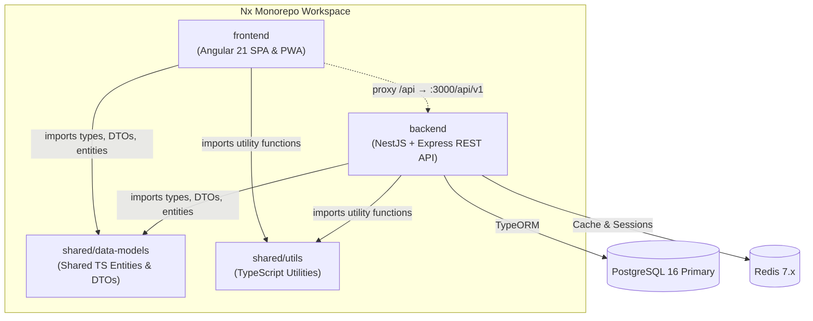
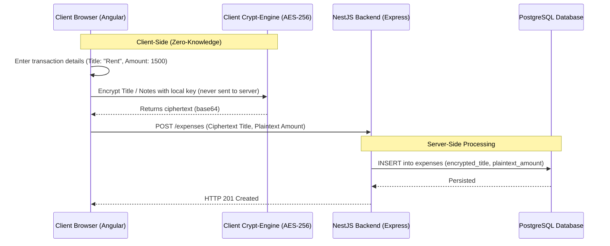
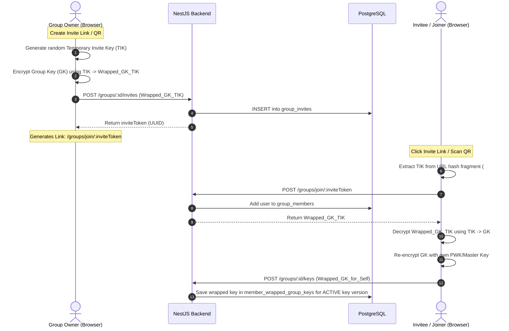
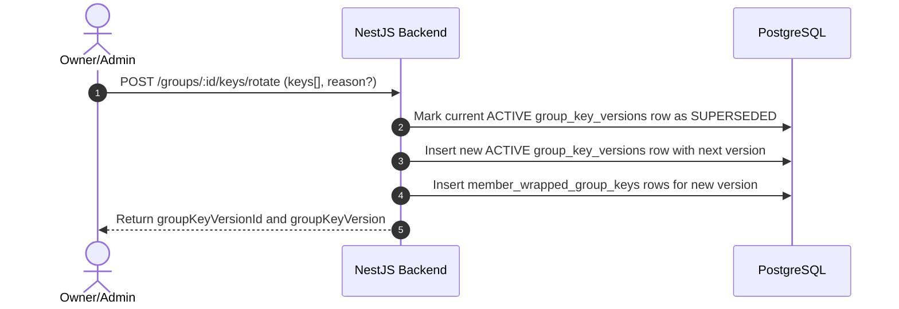
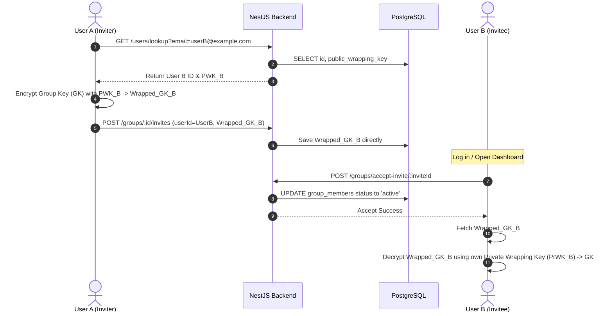
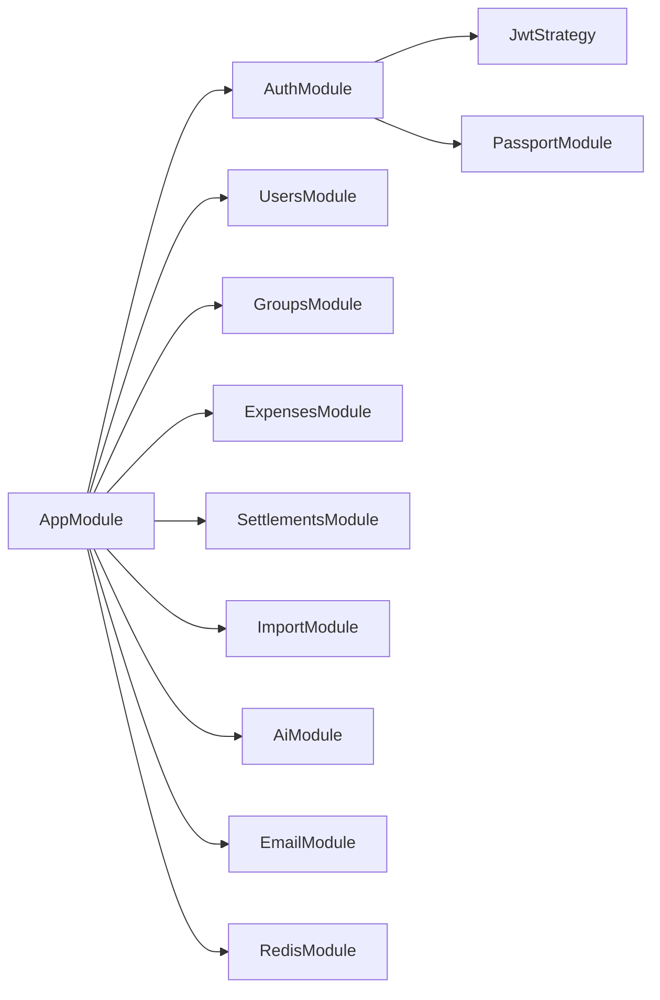
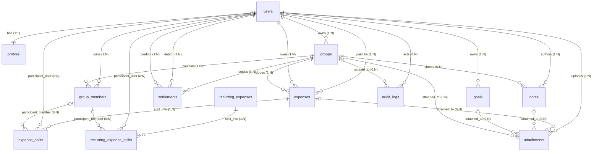

# FinMate Architecture Overview

FinMate is a secure, collaborative personal and group finance application built as an **Nx monorepo**. It features a zero-knowledge (ZK) client-side encryption design, relational database consistency, high-performance API endpoints, and a responsive Angular progressive web app (PWA).

---

## 1. Monorepo Workspace Overview

FinMate leverages an **Nx Monorepo** structure to coordinate frontend applications, backend services, and shared TypeScript libraries under a unified build, test, and linting pipeline.



### Directory Structure & Packages

| Package / Library | Path                  | Technology / Framework                                      | Role                                                                                                                               |
| :---------------- | :-------------------- | :---------------------------------------------------------- | :--------------------------------------------------------------------------------------------------------------------------------- |
| **`frontend`**    | `frontend/`           | Angular 21, Standalone Components, RxJS, NGXS, Tailwind CSS | The user-facing Single Page Application and progressive web app (PWA), including native compilation configuration via Capacitor.   |
| **`backend`**     | `backend/`            | NestJS, Express, TypeORM                                    | The RESTful application server managing API requests, database queries, caching, and audit logging.                                |
| **`data-models`** | `shared/data-models/` | TypeScript, class-validator, TypeORM entities               | The shared code library containing base data models, DTOs (Data Transfer Objects), validation rules, and central type definitions. |
| **`utils`**       | `shared/utils/`       | TypeScript                                                  | Shared mathematical and operational utility functions, such as the minimum transaction split-debt calculator.                      |

---

## 2. Security & Zero-Knowledge (ZK) Cryptography Model

Security and user privacy are core columns of FinMate's architecture. It operates a hybrid model ensuring zero-knowledge privacy for transactional descriptions and notes, combined with plaintext numerical ledger storage for performant reporting and settlements.



### Client-Side (Zero-Knowledge) Encryption & Key Management

1. **Encryption Key Boundaries**:
   - **User Data Key (UDK)**: Used to encrypt personal-scope data (personal expenses, personal notes, goals, and user secrets). It is derived from the user's password using PBKDF2 (AES-256-GCM).
   - **Group Key**: Each group owns a dedicated AES-256-GCM symmetric key. All collaborative data (group expenses, group notes, group attachments) is encrypted using this Group Key. Shared data is never encrypted using a personal UDK.
2. **Key Cache & Refresh Behavior (Current Release)**:
   - **Temporary Key Cache**: The wrapped/exported User Data Key (UDK) and wrapped Group Keys are stored in a local **IndexedDB** cache via `ZkKeyVaultService` and in memory. This ensures keys survive page refreshes without re-prompting the user for their password.
   - **Cache Lifetime**: The cache is strictly cleared upon logout, session expiration, or explicit security revoking.
3. **Future Key Vault Architecture (Roadmap)**:
   - The temporary cache will be replaced with an **Encrypted IndexedDB Key Vault** protected by:
     - **WebAuthn** / Device Trust
     - **Biometric Unlock** (Fingerprint/FaceID via Capacitor native APIs)
     - **PIN Unlock**
4. **Password Changes**:
   - Changing the login password only requires re-wrapping the UDK with the new master key. It does **not** require re-encrypting existing expenses, notes, or attachments.
5. **Group Membership & Ownership Rules**:
   - **Invitations**: When a new member joins, the existing Group Key is wrapped using the new member's public key (RSA-OAEP). No duplicate group keys are generated.
   - **Leaving Groups**: Members who leave a group retain access only to historical data they were authorized to see.
   - **Group Ownership**: A group owner is blocked from leaving the group until ownership is explicitly transferred to another member.
6. **Decryption Failures**:
   - Handled gracefully using the placeholder `DECRYPTION_FAILED_PLACEHOLDER` (`'Unable to display this item'`) to avoid leaking ciphertexts or raw technical details in the UI.

### Automatic Group Key Provisioning Flow (Zero-Knowledge)

To make key distribution seamless without requiring the group owner to be online or manually approve new keys, the system supports automatic provisioning:

#### Flow A: Invite Links & QR Codes (TIK Symmetric Wrapping)
A Temporary Invite Key (TIK) is generated on the creator's device and appended to the invite link hash fragment (never sent to the backend). The Group Key is encrypted with the TIK and uploaded as `wrappedGroupKey` in the invite table, associated with the currently ACTIVE `group_key_versions` row.



#### Flow B: Lookup Direct Invites (Asymmetric PWK Wrapping)
When User A invites User B directly via email/username lookup, User A's browser resolves User B's Public Wrapping Key (`public_wrapping_key`) immediately, encrypts the currently ACTIVE Group Key, and uploads it.

#### Flow C: Group Key Rotation (Versioned)
Group key rotation uses immutable version history. Rotating creates a new ACTIVE key version and marks the previous ACTIVE version as SUPERSEDED.





### Personal Dashboard Aggregation

To avoid duplicate encrypted records and prevent synchronization overhead, the application handles personal dashboard aggregation as follows:
- **Only One Record**: Every expense exists as a single record in the database.
- **Backend Aggregation**: The backend joins `expense_splits` with `expenses` to fetch the user's relevant shares. It aggregates:
  $$\text{Personal Expenses} + \text{User's Share from Group Expenses}$$
- **Frontend Decryption**: The frontend resolves the corresponding Group Key for group expenses or the UDK for personal expenses, decrypting the details on the fly. No duplicate encrypted entries are stored or synced.

### Future Cryptography & Integration Roadmap

1. **Zero-Knowledge Attachment Storage**:
   - Attachments (receipts/files) will be encrypted in the client browser using a random File Key (AES-256-GCM) prior to upload. The File Key is wrapped with the Group Key (or UDK for personal) and uploaded to Supabase Storage.
2. **Offline Key Restoration**:
   - Future offline support will cache the decrypted keys in a secure in-memory context, allowing the user to create, view, and queue encrypted expenses while offline.
3. **Receipt OCR Workflow**:
   - Receipt files uploaded by the user will trigger client-side temporary decryption or transmission to an isolated, transient AI engine for OCR text extraction. The extracted details will pre-fill the creation forms for user review before encryption and persistence, ensuring plaintext receipts are never saved directly to the database.
4. **Blind Index Search**:
   - To allow searching on client-side encrypted fields (like expense titles) without decrypting them on the server, we will implement blind index hashing (`title_search_hash` and `title_ciphertext` columns) enabling server-side exact-match indexing without exposure to the raw plaintext.

### 4. Authentication & Session Security:

- **JWT Tokens**: Dual token architecture consisting of short-lived `access_tokens` (15 mins) and HTTP-only, secure `refresh_tokens` (7 days) signed via HS256.
- **Redis Session Caching**: Active session refresh token IDs (`refreshId`) are stored in Redis. To mitigate database compromise or session hijacking, key identifiers in Redis are stored deterministically as `refresh_token:${userId}:${sha256(refreshId)}`, and the value stored is the Argon2 hash of the `refreshId`.
- **Two-Factor Authentication (MFA)**: TOTP verification via authenticator apps, with secrets encrypted in PostgreSQL using AES-256-GCM.

4. **Rate Limiting**:
   - Enforced using Redis and `@nestjs/throttler`:
     - Global API paths: Max 100 requests / minute.
     - Sensitive auth routes: Max 5 requests / minute.
   - Security headers are enforced globally via Helmet.

---

## 3. Backend Architecture (NestJS)

The NestJS backend operates as a modular REST API configured with standard controllers and services.

### Module Structure



### Request Lifecycle

```
Incoming Request
  └── Helmet Middleware (Security Headers)
        └── CORS Interceptor (Allowed Origins Validation)
              └── ThrottlerGuard (Redis-backed Rate Limiter)
                    └── JwtAuthGuard (Token Verification & Extraction)
                          └── ValidationPipe (DTO Schema Integrity)
                                └── Controller Handler
                                      └── Service Layer / TypeORM Repositories
                                            └── Database / Cache Mutators
                                                  └── Central Response Utilities (SuccessResponse)
                                                        └── Centralized Error Filter (HttpExceptionFilter)
                                                              └── Outgoing Response
```

### Key Entities

| Entity                    | Description                                                                        |
| ------------------------- | ---------------------------------------------------------------------------------- |
| `User`                    | Account with email, username, phone number, password hash, status, and 2FA support |
| `Profile`                 | Extended user profile data                                                         |
| `Group`                   | Expense group (normal, household, trip types) with invite token and settings       |
| `GroupMember`             | Membership link with role (owner/admin/member/viewer/spectator) and joinStatus     |
| `GroupMemberContribution` | Custom contribution percentages per ledger month                                   |
| `Expense`                 | Expense record with soft delete, ledgerMonth, and carry-forward flag               |
| `ExpenseSplit`            | Individual split allocation (fixed, equal, percent, share splits)                  |
| `RecurringExpense`        | Recurring expense template template with frequency and occurrence tracking         |
| `RecurringExpenseSplit`   | Individual split allocation for recurring templates                                |
| `Settlement`              | Payment settlement between users                                                   |
| `Note`                    | Shared group or personal rich notes with attachments                               |
| `Goal`                    | Savings goals with target values, progress tracks, and attachments                 |
| `Attachment`              | Metadata records for uploaded files and receipts attached to entities              |
| `AuditLog`                | Action audit trail                                                                 |

---

## 4. Database Schema & Ledger Design

The PostgreSQL database enforces relational integrity and ACID compliance, which is vital for ledger auditability.



### Critical Ledger Mechanics

1. **Database Transactions**:
   All write operations for group settlements and expense spreadsheet imports are executed inside explicit TypeORM database transaction blocks. Any individual validation error triggers a rollback of the entire batch.
2. **Concurrency Control (Optimistic Locking)**:
   To prevent concurrent updates from overwriting ledger states, entities contain a `@VersionColumn()` configuration. Transactions fail with a conflict error (`CON_VERSION_CONFLICT`) if their version is stale, triggering client reconciliation via an Angular conflict modal.
3. **Soft Deletes**:
   Expenses and splits use soft-deletion patterns through `@DeleteDateColumn()` (stored with `deletedAt`) to preserve ledger history and allow easy restorations within a 7-day grace period.
4. **Roll-over / Carry-Forward Support**:
   Household groups can toggle `carryForwardEnabled`. Finalizing a ledger month calculates net balances ($P_u - T_u$) and generates carry-forward expenses under the next ledger month automatically.

---

## 5. Multi-Currency Ledgers & Friends Balances

### Currency Consistency

To prevent ledger balance corruption:

- Group base currency changes are blocked if any expenses or settlements have already been posted in the group.
- Proposed settlements within a group must match the group's active base currency.

### Friends Balance Representation

Friends balances across all mutual groups are grouped by currency. To prevent frontend track-by collisions, the friend records are virtualized per currency:

- `friendId` is mapped using a combined key format: `${friendId}_${currency}`.
- `displayName` is output with the currency suffix: `Name (Currency)`.

---

## 6. Immutable Audit Logging

An active, write-only audit trail logs high-priority actions for authentication, group configuration, settlements, and spreadsheet imports.
To protect user privacy:

- The actor's requesting IP address is hashed using SHA-256 (`ipHash`) before being written to the database.
- Request User Agent details and other non-sensitive operational parameters are saved in the `metadataJson` field.

---

## 7. Frontend Architecture (Angular 19)

The frontend is a modern Angular SPA designed with standalone components, fine-grained reactivity, and offline-first functionality.

### Layout & Routing

- **Lazy Loading**: Route configurations isolate feature bundles (`groups`, `friends`) and load them dynamically to keep initial package sizes optimized.
- **Organization**:
  - `core/`: Singleton services, auth guards, interceptors, and cryptographic engines.
  - `features/`: Isolated layout contexts containing dashboard and feature tabs.
  - `shared/`: Reusable components (e.g., custom Submit Buttons, Confirm Modals), custom pipes, and utility classes.

### State & Reactivity

FinMate uses a three-tier hybrid reactivity structure:

| Layer             | Technology      | Use Case                                               |
| ----------------- | --------------- | ------------------------------------------------------ |
| **Local UI**      | Angular Signals | Toggles, form state, local filters, and derived values |
| **Async Streams** | RxJS            | HTTP requests, debounced inputs, event composition     |
| **Global State**  | NGXS            | Auth state, cached entities, user preferences          |

### Styling

- **Primary**: Tailwind CSS v3 with custom `finmate` color palette.
- **Fallback**: SCSS for complex keyframes or cases Tailwind can't cover.
- **Dark Mode**: Class-based (`dark` class on `<html>`).
- **Safe Areas**: iOS notch/bottom inset CSS variables.

---

## 8. Environment Variables

All backend environment variables are documented in `.env.example`. Key variables:

| Variable             | Required | Description                             |
| -------------------- | -------- | --------------------------------------- |
| `DATABASE_URL`       | ✅       | PostgreSQL connection string            |
| `REDIS_URL`          | ✅       | Redis connection string                 |
| `JWT_SECRET`         | ✅       | JWT signing secret                      |
| `JWT_REFRESH_SECRET` | ✅       | Refresh token secret                    |
| `ENCRYPTION_KEY`     | ✅       | AES-256 server-side encryption key      |
| `FRONTEND_URL`       | ✅       | Frontend origin (CORS + invite links)   |
| `CORS_ORIGINS`       | ❌       | Comma-separated additional CORS origins |
| `PORT`               | ❌       | Server port (default: 3000)             |

---

## 9. Infrastructure Scripts

### Local Development

```bash
# Start PostgreSQL + Redis
docker-compose up -d

# Run database migrations
npm run db:migrate

# Start backend
npx nx serve backend

# Start frontend
npx nx serve frontend
```

### Build

```bash
npx nx build frontend
npx nx build backend
```

### Testing

```bash
npx nx test frontend
npx nx test backend
```
