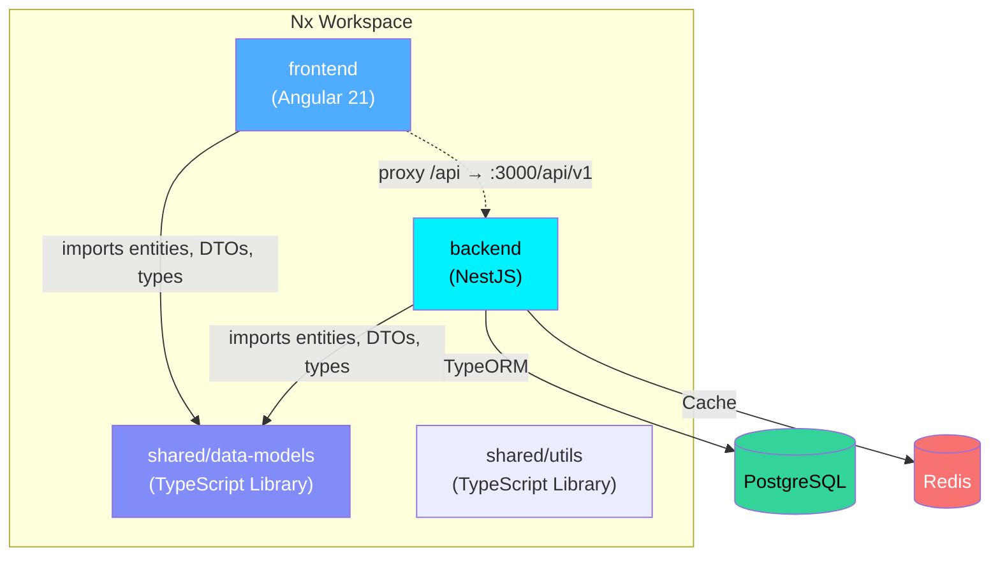
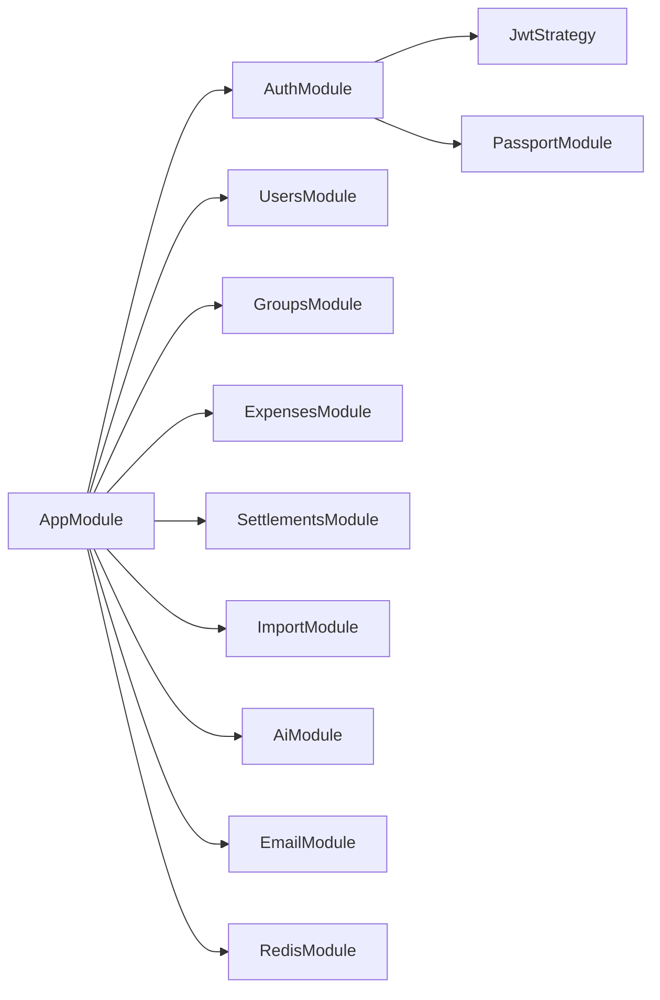

# FinMate Architecture Overview

## Workspace Layout

FinMate is an Nx monorepo containing three primary packages and supporting infrastructure:



### Package Descriptions

| Package | Path | Purpose |
|---------|------|---------|
| `frontend` | `frontend/` | Angular 21 SPA with standalone components, NGXS state, Tailwind CSS |
| `backend` | `backend/` | NestJS REST API with JWT auth, TypeORM, PostgreSQL |
| `data-models` | `shared/data-models/` | Shared TypeORM entities, DTOs, validation classes, response types |
| `utils` | `shared/utils/` | Shared utility functions |

---

## Backend Architecture

### Module Structure



### Request Flow

```
Client Request
  → Helmet (security headers)
  → CORS check
  → ThrottlerGuard (rate limiting)
  → JwtAuthGuard (authentication)
  → ValidationPipe (DTO validation)
  → Controller → Service → TypeORM Repository → PostgreSQL
  → HttpExceptionFilter (error formatting)
  → Response
```

### Database Layer

- **ORM**: TypeORM with PostgreSQL
- **Naming**: `SnakeNamingStrategy` (all DB columns use `snake_case`)
- **Migrations**: Stored in `backend/src/migrations/`, exported via barrel `index.ts`
- **Entities**: Defined in `shared/data-models/src/lib/`, imported via `@finmate/data-models`
- **Optimistic Locking**: Entities use `@VersionColumn()` for conflict detection
- **Soft Deletes**: Expenses support soft delete via `@DeleteDateColumn()`

### Key Entities

| Entity | Description |
|--------|-------------|
| `User` | Account with email, password hash, 2FA support |
| `Profile` | Extended user profile data |
| `Group` | Expense group (normal, household, trip types) |
| `GroupMember` | Membership with role (owner/admin/member/viewer/spectator) |
| `GroupMemberContribution` | Custom contribution percentages per ledger month |
| `Expense` | Expense record with soft delete and carry-forward |
| `ExpenseSplit` | Individual split allocation per participant |
| `Settlement` | Payment settlement between users |
| `Note` | User notes/memos |
| `Goal` | Financial goals |
| `Attachment` | File attachments for expenses/notes/goals |
| `AuditLog` | Action audit trail |

### Security & Cryptography

- **Authentication**: JWT access + refresh tokens via `@nestjs/passport` (15-minute access token, 7-day refresh token).
- **Password Hashing**: Argon2 for user passwords.
- **Argon2 Hashed Refresh Tokens in Redis**: Active session refresh token IDs (`refreshId`) are stored in Redis. To mitigate database compromise or session hijacking, key identifiers in Redis are stored deterministically as `refresh_token:${userId}:${sha256(refreshId)}`, and the value stored is the Argon2 hash of the `refreshId`.
- **Zero-Knowledge Key Model**: On the Angular frontend, derived master keys for client-side encryption are retained exclusively in-memory as non-extractable `CryptoKey` objects. No `sessionStorage` or local storage cache is maintained, preventing XSS-based key exfiltration.
- **Two-Factor Authentication (MFA)**: TOTP verification via authenticator apps, with secrets encrypted in PostgreSQL using AES-256-GCM.
- **Rate Limiting**: `@nestjs/throttler` enforces request limit limits globally.
- **Security Headers**: Helmet middleware configured globally.

---

## Ledger & Database Transaction Safety

### Database Transactions
All write operations for group settlements and expense spreadsheet imports are executed inside explicit TypeORM database transaction blocks. This ensures that:
- For settlements, creation, verification, and status updates (confirmed/cancelled) are atomic and consistent.
- For imports, rows and their corresponding expense split associations are validated collectively, and any individual row validation error triggers a rollback of the entire import batch.

### Concurrency Control
Version columns (`@VersionColumn()`) on entities like `Settlement` act as an optimistic locking mechanism to prevent race conditions during concurrent modifications.

---

## Multi-Currency Ledgers & Friends Balances

### Currency Consistency
To prevent ledger balance corruption:
- Group base currency changes are blocked if any expenses or settlements have already been posted in the group.
- Proposed settlements within a group must match the group's active base currency.

### Friends Balance Representation
Friends balances across all mutual groups are grouped by currency. To prevent frontend track-by collisions, the friend records are virtualized per currency:
- `friendId` is mapped using a combined key format: `${friendId}_${currency}`.
- `displayName` is output with the currency suffix: `Name (Currency)`.

---

## Immutable Audit Logging

An active, write-only audit trail logs high-priority actions for:
1. **Authentication**: Successful logins, MFA enablement, MFA verification/activation, and MFA disabling.
2. **Groups**: Group creation, info updates, member invitations, membership joins, role changes, and member removals.
3. **Settlements**: Settlement proposal, confirmation, and cancellation.
4. **Imports**: Successful expense spreadsheet imports.

### Privacy Compliance
To protect user privacy:
- The actor's requesting IP address is hashed using SHA-256 (`ipHash`) before being written to the database.
- Request User Agent details and other non-sensitive operational parameters are saved in the `metadataJson` field.

## Frontend Architecture

### Structure

```
frontend/src/
├── app/
│   ├── core/                  # Singletons (auth, interceptors, services)
│   │   ├── auth/              # AuthService, AuthGuard, AuthState (NGXS)
│   │   ├── interceptors/      # JWT, error, optimistic-lock interceptors
│   │   ├── services/          # Encryption, automerge, conflict-modal
│   │   └── constants/         # App-wide constants
│   ├── features/              # Feature modules (lazy-loaded)
│   │   ├── groups/            # Group management + expenses
│   │   └── friends/           # Friends & balances
│   └── shared/                # Shared components, pipes, models
├── environments/              # environment.ts, environment.prod.ts
└── styles.scss                # Global Tailwind + safe-area CSS
```

### State Management

FinMate uses a hybrid approach:

| Layer | Technology | Use Case |
|-------|-----------|----------|
| **Local UI** | Angular Signals | Toggles, form state, derived values |
| **Async Streams** | RxJS | HTTP requests, debounced inputs, event composition |
| **Global State** | NGXS | Auth state, cached entities, user preferences |

### Styling

- **Primary**: Tailwind CSS v3 with custom `finmate` color palette
- **Fallback**: SCSS for complex keyframes or cases Tailwind can't cover
- **Dark Mode**: Class-based (`dark` class on `<html>`)
- **Mobile-First**: Responsive breakpoints (xs → 2xl) in Tailwind config
- **Safe Areas**: iOS notch/bottom inset CSS variables

### API Communication

- All services use `environment.apiBaseUrl` (from `environments/environment.ts`)
- Dev proxy (`proxy.conf.json`) rewrites `/api` → `http://localhost:3000/api/v1`
- Interceptors handle JWT injection, error formatting, and optimistic lock conflicts

---

## Environment Variables

All backend environment variables are documented in `.env.example`. Key variables:

| Variable | Required | Description |
|----------|----------|-------------|
| `DATABASE_URL` | ✅ | PostgreSQL connection string |
| `REDIS_URL` | ✅ | Redis connection string |
| `JWT_SECRET` | ✅ | JWT signing secret |
| `JWT_REFRESH_SECRET` | ✅ | Refresh token secret |
| `ENCRYPTION_KEY` | ✅ | AES-256 encryption key |
| `FRONTEND_URL` | ✅ | Frontend origin (CORS + invite links) |
| `CORS_ORIGINS` | ❌ | Comma-separated additional CORS origins |
| `RESEND_API_KEY` | ❌ | Email service API key |
| `OPENAI_API_KEY` | ❌ | AI categorization API key |
| `PORT` | ❌ | Server port (default: 3000) |

---

## Infrastructure

### Local Development

```bash
# Start PostgreSQL + Redis
docker-compose up -d

# Run database migrations
npm run db:migrate

# Start backend (Terminal 1)
npx nx serve backend

# Start frontend (Terminal 2)
npx nx serve frontend
```

### Build

```bash
npx nx build frontend
npx nx build backend
```

### Testing

```bash
npx nx test frontend
npx nx test backend
```
