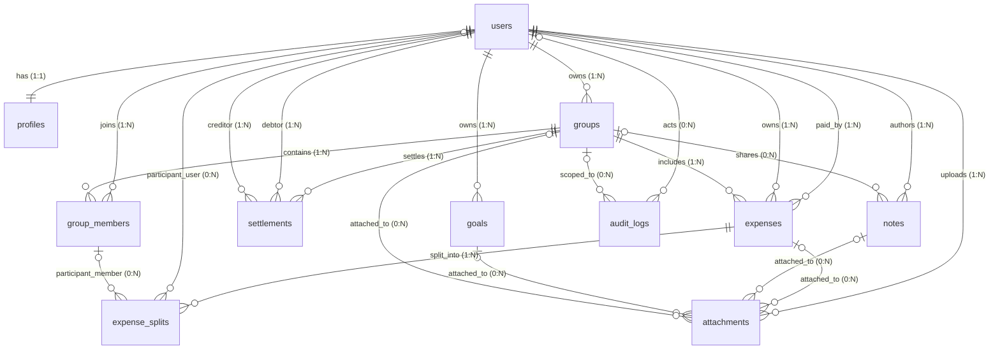

# 🗄️ Database Schema Specification (DATABASE_SCHEMA.md)

## 📊 Entity Relationship Diagram

---

## 📋 Tables Specification

### 1. `users`
- **Purpose**: Core user identity records.
- **Columns**:

| Column Name | Type | Nullable | Default | Constraints |
| :--- | :--- | :---: | :--- | :--- |
| `id` | `uuid` | No | `uuid_generate_v4()` | Primary Key |
| `email` | `varchar(255)` | No | | Unique |
| `username` | `varchar(50)` | Yes | `NULL` | Unique |
| `phone_number`| `varchar(20)` | Yes | `NULL` | Unique |
| `password_hash`| `varchar(255)` | No | | |
| `display_name`| `varchar(120)` | Yes | `NULL` | |
| `status` | `enum` | No | `'active'` | Values: `active`, `disabled`, `invited` |
| `last_login_at`| `timestamptz` | Yes | `NULL` | |
| `created_at` | `timestamptz` | No | `NOW()` | |
| `updated_at` | `timestamptz` | No | `NOW()` | |

### 2. `profiles`
- **Purpose**: User customization preferences and target budgets.
- **Columns**:

| Column Name | Type | Nullable | Default | Constraints |
| :--- | :--- | :---: | :--- | :--- |
| `id` | `uuid` | No | `uuid_generate_v4()` | Primary Key |
| `user_id` | `uuid` | No | | Foreign Key -> `users(id)`, Unique |
| `avatar_url` | `text` | Yes | `NULL` | |
| `locale` | `varchar(10)` | No | `'en-IN'` | |
| `timezone` | `varchar(64)` | No | `'Asia/Kolkata'`| |
| `default_currency`| `char(3)`| No | `'INR'` | |
| `monthly_budget`| `decimal(12,2)`| Yes| `NULL` | |
| `monthly_income`| `decimal(12,2)`| Yes| `NULL` | |

### 3. `groups`
- **Purpose**: Shared ledger workspaces.
- **Columns**:

| Column Name | Type | Nullable | Default | Constraints |
| :--- | :--- | :---: | :--- | :--- |
| `id` | `uuid` | No | `uuid_generate_v4()` | Primary Key |
| `name` | `varchar(120)` | No | | |
| `description` | `text` | Yes | `NULL` | |
| `visibility` | `enum` | No | `'private'` | Values: `private`, `invite_only`, `public_readonly` |
| `owner_user_id`| `uuid` | No | | Foreign Key -> `users(id)` |
| `invite_token`| `uuid` | Yes | `NULL` | Unique |
| `is_archived` | `boolean` | No | `false` | |
| `carry_forward_enabled`| `boolean`| No| `false` | Household rollover toggle |

### 4. `group_members`
- **Purpose**: Membership mapping for users in groups.
- **Columns**:

| Column Name | Type | Nullable | Default | Constraints |
| :--- | :--- | :---: | :--- | :--- |
| `id` | `uuid` | No | `uuid_generate_v4()` | Primary Key |
| `group_id` | `uuid` | No | | Foreign Key -> `groups(id)` |
| `user_id` | `uuid` | No | | Foreign Key -> `users(id)` |
| `role` | `enum` | No | `'member'` | Values: `owner`, `admin`, `member`, `viewer`, `spectator` |
| `join_status` | `enum` | No | `'invited'` | Values: `invited`, `active`, `left`, `removed` |
| `joined_at` | `timestamptz` | Yes | `NULL` | |
| `left_at` | `timestamptz` | Yes | `NULL` | |
| **Unique Constraint**| | | | Unique combination `(group_id, user_id)` |

### 5. `group_member_contributions`
- **Purpose**: Set monthly contribution percentages for household members.
- **Columns**:

| Column Name | Type | Nullable | Default | Constraints |
| :--- | :--- | :---: | :--- | :--- |
| `id` | `uuid` | No | `uuid_generate_v4()` | Primary Key |
| `group_member_id`| `uuid`| No | | Foreign Key -> `group_members(id)`, Cascade on Delete |
| `ledger_month`| `char(7)` | No | | Format: `YYYY-MM` |
| `percentage` | `decimal(5,2)`| No | | |
| **Unique Constraint**| | | | Unique combination `(group_member_id, ledger_month)` |

### 6. `expenses`
- **Purpose**: Financial transactional headers.
- **Columns**:

| Column Name | Type | Nullable | Default | Constraints |
| :--- | :--- | :---: | :--- | :--- |
| `id` | `uuid` | No | `uuid_generate_v4()` | Primary Key |
| `title` | `varchar(160)` | No | | Client-Side Encrypted (base64 string) |
| `description` | `text` | Yes | `NULL` | Client-Side Encrypted |
| `amount_total`| `varchar(255)` | No | | Server-Side Encrypted (base64 string) |
| `currency` | `char(3)` | No | | |
| `category` | `varchar(64)` | No | | |
| `paid_by_user_id`| `uuid` | No | | Foreign Key -> `users(id)` |
| `owner_user_id`| `uuid` | No | | Foreign Key -> `users(id)` |
| `group_id` | `uuid` | Yes | `NULL` | Foreign Key -> `groups(id)` (Null for personal) |
| `expense_date`| `date` | No | | |
| `status` | `varchar(20)` | No | `'posted'` | Values: `draft`, `posted`, `void` |
| `ledger_month`| `char(7)` | Yes | `NULL` | Format: `YYYY-MM` (Household groups only) |
| `is_carry_forward`| `boolean`| No | `false` | System rollover record flag |
| `version` | `integer` | No | `1` | For Optimistic Concurrency Control |
| `deleted_at` | `timestamptz` | Yes | `NULL` | Soft delete support |

### 7. `expense_splits`
- **Purpose**: Splitting expenditures among participants.
- **Columns**:

| Column Name | Type | Nullable | Default | Constraints |
| :--- | :--- | :---: | :--- | :--- |
| `id` | `uuid` | No | `uuid_generate_v4()` | Primary Key |
| `expense_id` | `uuid` | No | | Foreign Key -> `expenses(id)` |
| `participant_user_id`| `uuid` | Yes | `NULL` | Foreign Key -> `users(id)` |
| `participant_group_member_id`| `uuid`| Yes| `NULL` | Foreign Key -> `group_members(id)` |
| `split_type` | `varchar(16)`| No | | Values: `equal`, `fixed`, `percent`, `share` |
| `share_value` | `decimal(12,4)`| No | | |
| `amount_owed` | `varchar(255)`| No | | Server-Side Encrypted (base64 string) |
| `is_settled` | `boolean` | No | `false` | |
| `settled_at` | `timestamptz`| Yes | `NULL` | |
| **Check Constraint**| | | | Exactly one participant reference must be non-null |

### 8. `settlements`
- **Purpose**: Settlement transfers between members.
- **Columns**:

| Column Name | Type | Nullable | Default | Constraints |
| :--- | :--- | :---: | :--- | :--- |
| `id` | `uuid` | No | `uuid_generate_v4()` | Primary Key |
| `group_id` | `uuid` | No | | Foreign Key -> `groups(id)` |
| `from_user_id`| `uuid` | No | | Foreign Key -> `users(id)` (Debtor) |
| `to_user_id` | `uuid` | No | | Foreign Key -> `users(id)` (Creditor) |
| `amount` | `decimal(12,2)`| No | | Plaintext |
| `currency` | `char(3)` | No | | |
| `status` | `enum` | No | `'proposed'` | Values: `proposed`, `confirmed`, `cancelled` |
| `settled_on` | `date` | Yes | `NULL` | |
| `note` | `text` | Yes | `NULL` | Client-Side Encrypted |

---

## 🗂️ Indexes

- **`expenses`**:
  - `idx_expenses_group_status_date`: ON `(group_id, status, expense_date)`
  - `idx_expenses_group_category`: ON `(group_id, category)`
  - `idx_expenses_group_ledger_month`: ON `(group_id, ledger_month)`
- **`group_members`**:
  - `idx_group_members_user`: ON `(user_id)`
  - `idx_group_members_group`: ON `(group_id)`

---

## ⚙️ Security Rules (Row Level Security / RBAC)

1. **Personal Contexts**:
   - `expenses` records where `group_id` is `NULL` are accessible ONLY to the user where `owner_user_id == authenticated_user_id`.
2. **Shared Group Contexts**:
   - Access to group expenses, note boards, and settlements is permitted only if the requesting `authenticated_user_id` is an active member in the `group_members` mapping table for the corresponding `group_id`.
   - **Viewers** are rejected from executing mutations.
   - **Members** can only modify or void expenses they authored (`owner_user_id == authenticated_user_id`).
   - **Owners** and **Admins** hold modification rights over all group transactions.
