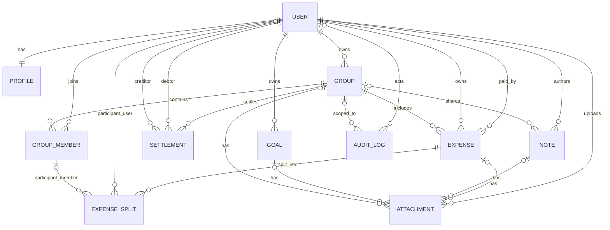

# 💰 FinMate — Personal Finance & Lifestyle Companion

## 🧩 Overview
**FinMate** is a comprehensive web and mobile application designed to manage, analyze, and share personal and group expenses. It also integrates notes, goals, and AI insights to make financial management intuitive, collaborative, and intelligent.

---


I've reviewed the suggestions against your current spec. Here's my assessment:

**Critical Gaps to Address (in priority order):**

1. **Data Model & ERD** — Required before backend development starts
2. **API Contracts** — Essential to prevent integration rework
3. **RBAC Matrix** — Authorization rules are vague; define role/permission pairs explicitly
4. **Settlement Algorithm** — Core feature is undefined; needs pseudo-code or formula
5. **Encryption Boundary Table** — Clarify what's encrypted vs. what the AI can access (zero-knowledge conflict)
6. **Real-time Conflict Resolution** — Define versioning/locking strategy for shared edits
7. **Error Model & Validation Standards** — Standardize error responses across API
8. **Import/Export Schemas** — CSV/XLSX format specs are missing

**Medium Priority:**
- Backup/RTO/RPO requirements
- Cost/dependency constraints (OpenAI, Supabase, Sentry limits)
- Offline key-management details

**Fair Concerns:**
- 200KB bundle target may be tight given scope; document MVP boundary
- "One-click setup" needs detailed scripting plan
- Zero-knowledge + AI analysis needs reconciliation

**Recommendation:**
Add a new section **"System Design Details"** after "Architecture & Tech Stack" covering:
- Domain Model (entities, relationships)
- RBAC Matrix (roles × permissions)
- Encryption Classification (per-data rules)
- API Error Taxonomy
- Settlement Logic (pseudocode)

Then add **"Operational Requirements"** section (RTO/RPO, backups, incident response).

Should I draft the replacement markdown for these sections?


| Layer | Technology | Notes |
|-------|-------------|-------|
| **Frontend** | Angular 19 (Standalone Components) | Modular, scalable, SSR-ready |
| **Backend** | NestJS + Fastify | High-performance REST API, WebSockets |
| **Database** | PostgreSQL 16 + pgcrypto | ACID compliance, encrypted storage |
| **Cache Layer** | Redis 7.x | Session store, rate limiting, caching |
| **State Management** | NGXS + RxJS | Predictable state, optimized selectors |
| **Deployment** | Docker + Docker Compose | One-click local & cloud deployment |
| **AI Integration** | OpenAI API (GPT-4) | Smart insights & chatbot |
| **Auth** | JWT + Argon2 + 2FA | Secure session, encryption, RBAC |
| **Storage** | Supabase Storage | Encrypted files, CDN delivery |
| **CDN** | Cloudflare (Free) | Global edge caching, DDoS protection |
| **Offline Support** | PWA + Service Workers + IndexedDB | Offline-first, encrypted local storage |
| **Performance Monitor** | Lighthouse CI + Web Vitals | Continuous performance tracking |

---

## 🧠 Core Features

### A. Expense Management
- Add/edit/delete categorized expenses.
- Monthly and yearly analytics.
- Group-based shared expense tracking.
- Balance carry-forward and debt simplification.
- Multi-user expense contribution tracking.

### B. Shared Group Module
- Create or join expense groups (public/private).
- Add members via invite or link.
- Shared ledger with smart settlement.
- **Export/Import (CSV, XLSX) Support**:
  Enables offline bulk editing and migrations. Exported files MUST align with the import schema, allowing zero-modification re-imports of the exact same records.

  #### 📊 1. CSV Schema v1 (and XLSX Template Columns)
  Both CSV and XLSX files share the same column layout and header names:

  | Column Index | Column Header | Data Type | Constraint / Validation | Description |
  | :--- | :--- | :--- | :--- | :--- |
  | 1 | `date` | Date | Required. Format: `YYYY-MM-DD`. Must be in the past or today. | The calendar date of the expense. |
  | 2 | `title` | String | Required. Max 160 characters. | Short name of the expense. |
  | 3 | `amount` | Decimal | Required. Positive number (> 0.00). Max 2 decimal places. | Total expenditure amount. |
  | 4 | `currency` | String | Required. ISO 4217 code (3 chars, uppercase, e.g. `INR`, `USD`). | Transaction currency. |
  | 5 | `category` | String | Required. Max 64 characters. | Expense category (e.g. Travel, Food). |
  | 6 | `payer_email` | String | Required. Valid email format. Must belong to an active member. | The user who paid the amount. |
  | 7 | `split_type` | String | Required. Enum: `equal`, `fixed`, `percent`, `share`. | Distribution algorithm model. |
  | 8 | `shares_data` | String | Optional. Semicolon-separated list: `email:value;email:value`. | Allocation parameters. If empty, defaults to equal splits among all active group members. |
  | 9 | `description` | String | Optional. Text format. | Additional contextual notes. |

  #### 🛡️ 2. Validation & Atomic Processing Rules
  1.  **Row-Level Structural Integrity**:
      *   **Emails Resolution**: All emails in `payer_email` and `shares_data` must resolve to registered user records currently active in the group.
      *   **Currency Check**: Must match currency codes active in the group parameters.
      *   **Split Math Validation**:
          *   `equal`: Shares data can be omitted or define participant emails with values of `1` (weights).
          *   `fixed`: Sum of values in `shares_data` must equal the exact value of the `amount` column.
          *   `percent`: Sum of values in `shares_data` must equal exactly `100.00`.
          *   `share`: Shares sum can be arbitrary; fractional owed values are computed relative to the total share sum.
  2.  **Transactional Atomicity**:
      *   API uploads are processed within a single database transaction boundary.
      *   If **any** validation check fails (e.g., cell parsing error, unknown member email, invalid split math), the entire file import is **rejected** and rolled back. No partial records are committed.
- Collaborative notes inside groups.

### C. Notes & Content Integration
- Personal and shared notes.
- Import social media posts (Instagram, etc.).
- AI summarization and tagging.

### D. Goal & Saving Tracker
- Define financial goals (e.g., “Trip to Goa”).
- Track savings progress.
- Set reminders and targets.

### E. AI Assistant
- Smart insights and analysis.
- Automatic expense categorization.
- Summarization and reminders.

### F. Settings & Controls
- Enable/disable collaboration.
- Manage import/export permissions.
- Sync preferences.
- Theme selection.

---

## ⚙️ Technical Requirements

### 🎯 Performance Standards
- **First Contentful Paint (FCP):** < 1.5s
- **Time to Interactive (TTI):** < 3.0s
- **Lighthouse Score:** > 90 (all categories)
- **Bundle Size:** < 200KB (initial load, gzipped)
- **API Response Time:** < 200ms (p95)
- **Database Query Time:** < 50ms (indexed queries)

### 🏗️ Architecture Requirements
- Reusable UI components with OnPush change detection.
- Proper cleanup of observables (takeUntil pattern).
- Centralized error handling and logging.
- Environment configuration per stage.
- State persistence via encrypted IndexedDB.
- Lazy loading for all feature modules.
- Virtual scrolling for large lists.
- Image optimization (WebP, lazy loading, responsive).
- Tree-shaking enabled for minimal bundles.
- CI/CD pipeline for Web, iOS, and Android (via Capacitor).

---

## 🧱 System Design Details

### 1. Domain Model
#### Scope
Core entities finalized for schema design:
- User
- Profile
- Expense
- ExpenseSplit
- Group
- GroupMember
- Settlement
- Note
- Goal
- Attachment
- AuditLog

#### Naming Conventions (Final)
- Entity class names: singular PascalCase (`User`, `ExpenseSplit`).
- Table names: plural snake_case (`users`, `expense_splits`, `group_members`).
- Primary keys: UUID (`id uuid`).
- Foreign keys: `<entity>_id` (`user_id`, `group_id`, `expense_id`).
- Money: `decimal(12,2)` + `char(3)` currency code (ISO 4217).
- Timestamps: `created_at`, `updated_at` on mutable entities.
- Soft delete (optional later phase): `deleted_at`.
- Enum columns: snake_case values (`pending`, `settled`, `active`, `archived`).

#### Ownership and Sharing Boundaries
- Personal scope (owned by `User`): `Profile`, personal `Expense`, personal `Note`, personal `Goal`, related `Attachment`.
- Shared scope (owned by `Group`): shared `Expense`, `GroupMember`, group `Note`, `Settlement`, related `Attachment`.
- Split scope: `ExpenseSplit` can reference either a direct `User` context or a `GroupMember` context.
- Governance scope: `AuditLog` is append-only, immutable after insert, and retained indefinitely.

#### Entity Field List (Required)

##### User
- `id: uuid` (PK)
- `email: varchar(255)` (unique, required)
- `password_hash: varchar(255)` (required)
- `display_name: varchar(120)` (nullable)
- `status: enum(active|disabled|invited)` (default `active`)
- `last_login_at: timestamptz` (nullable)
- `created_at: timestamptz` (required)
- `updated_at: timestamptz` (required)

##### Profile
- `id: uuid` (PK)
- `user_id: uuid` (FK -> users.id, unique, required)
- `avatar_url: text` (nullable)
- `locale: varchar(10)` (default `en-IN`)
- `timezone: varchar(64)` (default `Asia/Kolkata`)
- `default_currency: char(3)` (required)
- `monthly_budget: decimal(12,2)` (nullable)
- `created_at: timestamptz` (required)
- `updated_at: timestamptz` (required)

##### Group
- `id: uuid` (PK)
- `name: varchar(120)` (required)
- `description: text` (nullable)
- `visibility: enum(private|invite_only|public_readonly)` (default `private`)
- `owner_user_id: uuid` (FK -> users.id, required)
- `is_archived: boolean` (default `false`)
- `created_at: timestamptz` (required)
- `updated_at: timestamptz` (required)

##### GroupMember
- `id: uuid` (PK)
- `group_id: uuid` (FK -> groups.id, required)
- `user_id: uuid` (FK -> users.id, required)
- `role: enum(owner|admin|member|viewer)` (required)
- `join_status: enum(invited|active|left|removed)` (required)
- `joined_at: timestamptz` (nullable)
- `left_at: timestamptz` (nullable)
- `created_at: timestamptz` (required)
- `updated_at: timestamptz` (required)
- Unique constraint: `(group_id, user_id)`

##### Expense
- `id: uuid` (PK)
- `title: varchar(160)` (required)
- `description: text` (nullable)
- `amount_total: decimal(12,2)` (required)
- `currency: char(3)` (required)
- `category: varchar(64)` (required)
- `paid_by_user_id: uuid` (FK -> users.id, required)
- `owner_user_id: uuid` (FK -> users.id, required)
- `group_id: uuid` (FK -> groups.id, nullable)
- `expense_date: date` (required)
- `status: enum(draft|posted|void)` (default `posted`)
- `created_at: timestamptz` (required)
- `updated_at: timestamptz` (required)

##### ExpenseSplit
- `id: uuid` (PK)
- `expense_id: uuid` (FK -> expenses.id, required)
- `participant_user_id: uuid` (FK -> users.id, nullable)
- `participant_group_member_id: uuid` (FK -> group_members.id, nullable)
- `split_type: enum(equal|fixed|percent|share)` (required)
- `share_value: decimal(12,4)` (required)
- `amount_owed: decimal(12,2)` (required)
- `is_settled: boolean` (default `false`)
- `settled_at: timestamptz` (nullable)
- `created_at: timestamptz` (required)
- `updated_at: timestamptz` (required)
- Check constraint: exactly one participant reference is non-null.

##### Settlement
- `id: uuid` (PK)
- `group_id: uuid` (FK -> groups.id, required)
- `from_user_id: uuid` (FK -> users.id, required)
- `to_user_id: uuid` (FK -> users.id, required)
- `amount: decimal(12,2)` (required)
- `currency: char(3)` (required)
- `status: enum(proposed|confirmed|cancelled)` (default `proposed`)
- `settled_on: date` (nullable)
- `note: text` (nullable)
- `created_at: timestamptz` (required)
- `updated_at: timestamptz` (required)

##### Note
- `id: uuid` (PK)
- `author_user_id: uuid` (FK -> users.id, required)
- `group_id: uuid` (FK -> groups.id, nullable)
- `title: varchar(160)` (required)
- `body: text` (required)
- `visibility: enum(private|group)` (required)
- `created_at: timestamptz` (required)
- `updated_at: timestamptz` (required)

##### Goal
- `id: uuid` (PK)
- `owner_user_id: uuid` (FK -> users.id, required)
- `title: varchar(160)` (required)
- `target_amount: decimal(12,2)` (required)
- `saved_amount: decimal(12,2)` (default `0`)
- `currency: char(3)` (required)
- `target_date: date` (nullable)
- `status: enum(active|achieved|paused|cancelled)` (default `active`)
- `created_at: timestamptz` (required)
- `updated_at: timestamptz` (required)

##### Attachment
- `id: uuid` (PK)
- `uploader_user_id: uuid` (FK -> users.id, required)
- `expense_id: uuid` (FK -> expenses.id, nullable)
- `note_id: uuid` (FK -> notes.id, nullable)
- `goal_id: uuid` (FK -> goals.id, nullable)
- `group_id: uuid` (FK -> groups.id, nullable)
- `storage_key: text` (required)
- `original_name: varchar(255)` (required)
- `mime_type: varchar(128)` (required)
- `size_bytes: bigint` (required)
- `checksum_sha256: char(64)` (nullable)
- `created_at: timestamptz` (required)
- Check constraint: attached to at least one parent context.

##### AuditLog
- `id: uuid` (PK)
- `actor_user_id: uuid` (FK -> users.id, nullable for system actions)
- `action: varchar(80)` (required)
- `entity_type: varchar(80)` (required)
- `entity_id: uuid` (required)
- `scope: enum(personal|group|system)` (required)
- `group_id: uuid` (FK -> groups.id, nullable)
- `request_id: varchar(64)` (nullable)
- `ip_hash: varchar(128)` (nullable)
- `metadata_json: jsonb` (nullable)
- `created_at: timestamptz` (required)
- Immutable rule: no update/delete operations at application layer.

#### Relationship Cardinality Definitions
- `User 1:1 Profile` (a user has one profile; a profile belongs to one user).
- `User 1:N Group (owner)` (one user can own many groups; each group has one owner).
- `User N:M Group` via `GroupMember`.
- `Group 1:N GroupMember`.
- `User 1:N GroupMember`.
- `User 1:N Expense` as payer (`paid_by_user_id`).
- `User 1:N Expense` as owner (`owner_user_id`).
- `Group 1:N Expense` (optional on expense for personal vs shared).
- `Expense 1:N ExpenseSplit`.
- `User 1:N ExpenseSplit` (optional participant path).
- `GroupMember 1:N ExpenseSplit` (optional participant path).
- `Group 1:N Settlement`.
- `User 1:N Settlement` as debtor (`from_user_id`).
- `User 1:N Settlement` as creditor (`to_user_id`).
- `User 1:N Note` as author.
- `Group 1:N Note` (optional for group notes).
- `User 1:N Goal`.
- `User 1:N Attachment` as uploader.
- `Expense 1:N Attachment` (optional).
- `Note 1:N Attachment` (optional).
- `Goal 1:N Attachment` (optional).
- `Group 1:N Attachment` (optional).
- `User 1:N AuditLog` as actor (optional for system).
- `Group 1:N AuditLog` (optional scoped logs).

#### ERD (Mermaid)


#### Lifecycle Notes
- User deactivation disables login and future writes, but historical records remain.
- Group archive blocks new shared writes; read-only access is preserved.
- Expense status `void` keeps auditability without hard deletion.
- Settlement moves `proposed -> confirmed/cancelled`; only confirmed updates split settlement flags.
- Audit logs are write-once records.

### 2. RBAC Matrix

Role-Based Access Control (RBAC) in FinMate is applied at the group level. A user's role within a group determines their authorization level for group-scoped resources. Personal resources (personal expenses, personal notes, saving goals, user profiles) are governed strictly by individual ownership (User Scope) and are zero-knowledge to other users.

#### 👥 Group Roles Definition
*   **Owner**: The creator of the group. Holds absolute administrative power, including the ability to delete the group or manage Admin roles.
*   **Admin**: Group administrators. Can manage general members and group settings, invite users, and moderate content.
*   **Member**: General collaborators. Can create expenses, notes, and settlements, and edit/delete their own submissions.
*   **Viewer**: Read-only access. Can view ledger and shared logs but cannot write or modify data.

#### 📊 Unified Permission Matrix (Shared Group Scope)

| Module | Action | Owner | Admin | Member | Viewer |
| :--- | :--- | :---: | :---: | :---: | :---: |
| **Groups** | View Group Metadata / Ledger | ✅ | ✅ | ✅ | ✅ |
| | Edit Group Settings (Name, Desc) | ✅ | ✅ | ❌ | ❌ |
| | Archive Group (Read-only status) | ✅ | ✅ | ❌ | ❌ |
| | Delete Group | ✅ | ❌ | ❌ | ❌ |
| **Group Members**| View Member List | ✅ | ✅ | ✅ | ✅ |
| | Invite Member / Link Invite | ✅ | ✅ | ⚠️ | ❌ |
| | Promote to Admin / Demote Admin | ✅ | ❌ | ❌ | ❌ |
| | Promote to Member / Demote to Viewer| ✅ | ✅ | ❌ | ❌ |
| | Remove Member (Admin/Owner) | ✅ | ❌ | ❌ | ❌ |
| | Remove Member (Member/Viewer) | ✅ | ✅ | ❌ | ❌ |
| | Leave Group | ✅ (Must transfer) | ✅ | ✅ | ✅ |
| **Expenses** | View Group Expenses | ✅ | ✅ | ✅ | ✅ |
| | Create Group Expense | ✅ | ✅ | ✅ | ❌ |
| | Update/Void Own Group Expense | ✅ | ✅ | ✅ | ❌ |
| | Update/Void Other's Group Expense | ✅ | ✅ | ❌ | ❌ |
| **Notes** | View Group Notes | ✅ | ✅ | ✅ | ✅ |
| | Create Group Note | ✅ | ✅ | ✅ | ❌ |
| | Update/Delete Own Group Note | ✅ | ✅ | ✅ | ❌ |
| | Update/Delete Other's Group Note | ✅ | ✅ | ❌ | ❌ |
| **Settlements** | View Group Settlements | ✅ | ✅ | ✅ | ✅ |
| | Propose Settlement (Own Debt) | ✅ | ✅ | ✅ | ❌ |
| | Confirm Settlement (as Creditor only) | ✅ | ✅ | ✅ | ❌ |
| | Cancel Settlement (as Debtor/Creditor) | ✅ | ✅ | ✅ | ❌ |
| **Import/Export**| Export Group Ledger | ✅ | ✅ | ✅ | ✅ |
| | Import Expenses to Group | ✅ | ✅ | ✅ | ❌ |

*   `⚠️` *Allowed for Members only if the group Owner has enabled "Allow Member Invites" in group settings (default: false).*

#### 🔑 Contextual Access Control Policy

*   **Personal Context (User Scope)**:
    - Governed by ownership: `Owner User ID == Authenticated User ID`.
    - Applies to: Personal Expenses (`group_id` is null), Personal Notes (`visibility == 'private'`), saving Goals, user Profile, and personal Attachments.
    - No other user, regardless of role, can read, update, or delete these resources.
*   **Shared Context (Group Scope)**:
    - Governed by the group membership role.
    - Applies to: Group Expenses, Group Notes, Settlements, Group Member Records, Group Attachments, and Group Audit Logs.
    - Viewers are strictly restricted from all mutative actions.
    - Members can only mutate resources they authored (`author_user_id == user_id` or `paid_by_user_id == user_id`).
*   **Offline Actions vs. Cloud Sync**:
    - **Offline Allowed**: View ledger (cached in IndexedDB), draft new personal/group expenses, draft personal notes.
    - **Sync Required**: Inviting members, modifying member roles, archiving/deleting groups, proposing settlements, and exporting data.


### 3. Encryption Boundary Table

To enforce a Zero-Knowledge Architecture, user data containing transactional details, personal notes, and goal titles is encrypted client-side before submission. The backend server acts as a blind sync engine for these fields. Other fields needed for database querying, sorting, or settlements are stored in plaintext or server-side encrypted.

#### 🔐 Encryption Key Tiers
1.  **Client-Side Encrypted (Zero-Knowledge / ZK)**:
    *   **Mechanism**: Encrypted on the client device using AES-256-GCM.
    *   **Keys**: Keys are derived locally on the client device using PBKDF2/Argon2. The master key never leaves the client device.
    *   **Server Access**: The server only sees base64-encoded ciphertext and initialization vectors. The server cannot decrypt this data.
2.  **Server-Side Encrypted (SSE)**:
    *   **Mechanism**: Encrypted in transit and at rest on the server using database-level or application-level encryption keys (PostgreSQL `pgcrypto` or KMS).
    *   **Keys**: Managed securely by the server environment.
    *   **Server Access**: Decrypted ephemerally in server memory when running authorized queries (e.g. rendering user profile values or computing budget margins).
3.  **Plaintext**:
    *   **Mechanism**: Stored as plaintext in database tables.
    *   **Server Access**: Fully searchable, indexable, and sortable.

#### 📊 Entity-Field Encryption & AI Access Matrix

| Entity | Field Name | Encryption Classification | AI Access Eligibility | Rationale |
| :--- | :--- | :--- | :---: | :--- |
| **User** | `id`, `status`, `created_at` | Plaintext | ❌ | Needed for joins, audits, and routing. |
| | `email`, `password_hash` | SSE | ❌ | Sensitive credentials, protected at rest. |
| **Profile** | `id`, `user_id`, `created_at` | Plaintext | ❌ | Index keys. |
| | `avatar_url`, `monthly_budget` | SSE | ❌ | Personal financial settings, protected at rest. |
| | `locale`, `timezone`, `default_currency` | Plaintext | ❌ | Used for localized formatting and server runs. |
| **Group** | `id`, `owner_user_id`, `is_archived` | Plaintext | ❌ | Used for routing and soft-deletes. |
| | `name`, `description` | SSE | ❌ | Shared identifiers, accessible to group. |
| **GroupMember**| `id`, `group_id`, `user_id` | Plaintext | ❌ | Unique constraints and indexing. |
| | `role`, `join_status`, `joined_at` | Plaintext | ❌ | Enforces RBAC permissions. |
| **Expense** | `id`, `paid_by_user_id`, `group_id` | Plaintext | ❌ | Primary/foreign keys. |
| | `currency`, `expense_date`, `status` | Plaintext | ❌ | Indexing, sorting, and balance calculations. |
| | `amount_total` | SSE | ⚠️ (Optional) | Numeric totals for smart analytics (opt-in). |
| | `category` | Plaintext | ⚠️ (Optional) | Categorization tags for spending analysis. |
| | `title`, `description` | Client-Side (ZK) | ⚠️ (Opt-In Only) | Private transaction contents. Zero-knowledge. |
| **ExpenseSplit**| `id`, `expense_id`, `split_type` | Plaintext | ❌ | Database constraints. |
| | `share_value`, `is_settled` | Plaintext | ❌ | Settlement balance processing. |
| | `amount_owed` | SSE | ❌ | Owed amount calculations. |
| **Settlement** | `id`, `group_id`, `from_user_id`, `to_user_id` | Plaintext | ❌ | Core relation indicators. |
| | `amount`, `currency`, `status` | Plaintext | ❌ | Ledger balance updates. |
| | `note` | Client-Side (ZK) | ❌ | Personal payment notes. Zero-knowledge. |
| **Note** | `id`, `author_user_id`, `group_id` | Plaintext | ❌ | Index keys. |
| | `visibility` | Plaintext | ❌ | Privacy boundaries control. |
| | `title`, `body` | Client-Side (ZK) | ⚠️ (Opt-In Only) | Private contents. Zero-knowledge. |
| **Goal** | `id`, `owner_user_id`, `currency` | Plaintext | ❌ | Core structure and parameters. |
| | `status`, `target_date` | Plaintext | ❌ | Tracking status. |
| | `target_amount`, `saved_amount` | SSE | ⚠️ (Optional) | Target numbers. |
| | `title` | Client-Side (ZK) | ⚠️ (Opt-In Only) | Goal identifier. Zero-knowledge. |
| **Attachment** | `id`, `storage_key`, `mime_type` | Plaintext | ❌ | File retrieval references. |
| | `original_name`, `file_content` | Client-Side (ZK) | ⚠️ (Opt-In Only) | Personal files (PDFs, images) are encrypted locally. |


### 4. API Error Taxonomy

Standardize all error responses across FinMate REST APIs to maintain consistency, ease frontend debugging, and provide explicit instructions for client-side recovery.

#### Shared Error Response Schema
All error responses from any API endpoint (HTTP status code >= 400) MUST conform to the following standard JSON payload structure:

```json
{
  "statusCode": 400,
  "timestamp": "2026-06-09T17:15:00.000Z",
  "path": "/api/v1/expenses",
  "errorCode": "VAL_INVALID_INPUT",
  "message": "Input validation failed",
  "details": [
    {
      "field": "amountTotal",
      "issue": "must be a positive decimal number"
    }
  ],
  "retryable": false
}
```

##### TypeScript Client-Side Interface
To ensure reliable parsing and type safety in the Angular frontend, client-side deserialization models should implement the following interface:

```typescript
export interface FinMateErrorDetail {
  field: string;
  issue: string;
}

export interface FinMateErrorResponse {
  statusCode: number;
  timestamp: string;
  path: string;
  errorCode: string;
  message: string;
  details?: FinMateErrorDetail[];
  retryable: boolean;
}
```

*   **Bulk File Import Validation Failure (`VAL_INVALID_INPUT`)**:
    When a file upload (CSV or XLSX) contains structural, relational, or mathematical errors, the API returns a structured list mapping rows and columns to their respective validation errors:
    ```json
    {
      "statusCode": 400,
      "timestamp": "2026-06-09T22:56:00.000Z",
      "path": "/api/v1/import/expenses",
      "errorCode": "VAL_INVALID_INPUT",
      "message": "File validation failed. No transactions were imported.",
      "details": [
        {
          "field": "Row 5: payer_email",
          "issue": "User 'unknown@example.com' is not a member of the group."
        },
        {
          "field": "Row 8: split_type",
          "issue": "Fixed split amounts sum up to $45.00, but amount is $50.00."
        }
      ],
      "retryable": false
    }
    ```

#### Field Glossary
*   `statusCode` (integer): The HTTP status code matching the response headers.
*   `timestamp` (string): ISO-8601 formatted timestamp of the event.
*   `path` (string): The requested URI path.
*   `errorCode` (string): A unique domain-specific alphanumeric code for client-side programmatic handling (e.g. error translation/routing).
*   `message` (string): Human-readable summary message.
*   `details` (array, optional): Specific parameter or input field issues.
*   `retryable` (boolean): Flag indicating whether the client can retry the request immediately or after a cooldown.

#### Error Code Classification and HTTP Mappings

| HTTP Status | Error Code Range | Description | Example Error Code | Retryable |
| :--- | :--- | :--- | :--- | :--- |
| **400 Bad Request** | `VAL_*` | Input verification or format validation errors. | `VAL_INVALID_INPUT` | No |
| **401 Unauthorized** | `AUTH_*` | Missing, invalid, or expired authentication tokens. | `AUTH_TOKEN_EXPIRED` | No (must refresh token/login) |
| **403 Forbidden** | `AUTH_*`, `RES_*` | Lack of permissions for resource context, or incomplete authentication step (MFA). | `RES_FORBIDDEN` | No |
| **404 Not Found** | `RES_*` | Requested resource or endpoint does not exist. | `RES_NOT_FOUND` | No |
| **409 Conflict** | `RES_*`, `CON_*` | Duplicate unique identifiers or database constraint failures. | `RES_ALREADY_EXISTS` | No |
| **412 Precondition Failed** | `CON_*` | State conflict or optimistic lock version mismatch (concurrency resolution). | `CON_VERSION_CONFLICT` | Yes (fetch state, merge, and retry) |
| **429 Too Many Requests** | `CON_*` | Throttling limits hit. Includes `Retry-After` header. | `CON_LIMIT_EXCEEDED` | Yes (after duration specified in header) |
| **500 Internal Error** | `SYS_*` | Unexpected errors within server context. | `SYS_INTERNAL_ERROR` | No (or retry with exponential backoff) |
| **503 Service Unavailable** | `SYS_*` | Downstream services, database, or dependencies down. | `SYS_SERVICE_UNAVAILABLE` | Yes (retry with exponential backoff) |

#### Concurrency & Retry Guidance
*   **Version Conflicts (`CON_VERSION_CONFLICT`)**: Triggered when the client attempts to update a shared entity (e.g., group notes, split details) using an outdated version ID. The client must retrieve the latest version from `GET /api/v1/.../{id}`, merge local edits, and submit again.
*   **Network & Rate Limit Recoverability**: For status 429 and 503, the client must honor the `Retry-After` response header and implement exponential backoff (starting at 1000ms with a factor of 2, capped at 10 seconds, max 3 retries).

#### 🗂️ Detailed Error Code Catalog

The following catalog lists all programmatically parsed error codes generated by the API modules:

| Error Code | HTTP Status | Module Scope | Description / Trigger Condition | Retryable |
| :--- | :---: | :--- | :--- | :---: |
| **`AUTH_MISSING_TOKEN`** | 401 | Auth / Global | The HTTP `Authorization` header is empty or missing. | ❌ |
| **`AUTH_INVALID_TOKEN`** | 401 | Auth / Global | The JWT token signature is invalid or the payload is corrupt. | ❌ |
| **`AUTH_TOKEN_EXPIRED`** | 401 | Auth / Global | The JWT access token lifespan check has failed. | 🔄 (Refresh) |
| **`AUTH_INVALID_CREDENTIALS`** | 401 | Auth | Email/password combination verification failed. | ❌ |
| **`AUTH_MFA_REQUIRED`** | 403 | Auth | Password is correct but account requires TOTP challenge verification. | ❌ |
| **`AUTH_MFA_INVALID`** | 400 | Auth | The provided 6-digit TOTP code failed verification. | ❌ |
| **`VAL_INVALID_INPUT`** | 400 | Global | JSON request body values fail class-validator properties. | ❌ |
| **`VAL_MISSING_FIELD`** | 400 | Global | A required column or JSON key was omitted from request. | ❌ |
| **`VAL_INVALID_FILE`** | 400 | Import | Uploaded spreadsheet contains parse errors, bad mime, or size caps. | ❌ |
| **`RES_NOT_FOUND`** | 404 | Global | The target entity ID does not exist in active context. | ❌ |
| **`RES_FORBIDDEN`** | 403 | Global / RBAC | RBAC validation failed (insufficient role privileges) or personal scope locked. | ❌ |
| **`RES_ALREADY_EXISTS`** | 409 | Global / Group | Violation of unique database keys (e.g. email in use or duplicate group member). | ❌ |
| **`CON_VERSION_CONFLICT`** | 412 | Global / Note / Exp | Optimistic locking match failed. Outdated version identifier. | ✅ |
| **`CON_LIMIT_EXCEEDED`** | 422 | Global / OpenAI | Plan/usage thresholds exceeded (e.g. OpenAI rate caps or Supabase bytes). | ❌ |
| **`CON_LIMIT_RATE`** | 429 | Global / Redis | Throttling limits hit. Client must wait specified seconds. | ✅ |
| **`SYS_INTERNAL_ERROR`** | 500 | System | An unhandled exception occurred in-memory. | ❌ |
| **`SYS_SERVICE_UNAVAILABLE`**| 503 | System / Database | DB pool exhausted, Redis server down, or Supabase offline. | ✅ |
| **`SYS_TIMEOUT`** | 504 | System | Downstream processes took longer than the server limit to process. | ✅ |


### 5. Settlement Logic

This section defines the mathematical formulas, rounding specifications, tie-breaking ordering rules, and the greedy matching algorithm used to simplify group debts.

#### 🧮 1. Net Balance Computation

A user's net balance within a group is calculated as the sum of all their paid expenses minus the sum of their owes from splits, and adjusted by confirmed settlements:

$$\text{Net Balance}(U) = \sum \text{PaidExpenses}(U) - \sum \text{OwedAmount}(U) + \sum \text{ReceivedSettlements}(U) - \sum \text{PaidSettlements}(U)$$

Where:
*   `PaidExpenses(U)`: Sum of `amount_total` for all expenses in the group paid by user $U$.
*   `OwedAmount(U)`: Sum of `amount_owed` for all expense splits in the group assigned to user $U$.
*   `ReceivedSettlements(U)`: Sum of confirmed settlements where user $U$ is the creditor (`to_user_id == U`).
*   `PaidSettlements(U)`: Sum of confirmed settlements where user $U$ is the debtor (`from_user_id == U`).

*Note: Proposed or cancelled settlements are excluded from the balance calculation.*

#### 🪙 2. Rounding Behavior and Remainder Allocation

All database monetary columns are stored using `decimal(12,2)`. To prevent loss of pennies during division (e.g. splitting $10.00 equally between 3 people):
1.  **Split Calculation**: Each participant's share is calculated as:
    $$\text{Share} = \text{round\_half\_up}\left(\frac{\text{amount\_total}}{N}, 2\right)$$
2.  **Remainder Detection**: The sum of shares is subtracted from `amount_total` to find the rounding remainder:
    $$\text{Remainder} = \text{amount\_total} - \sum_{i=1}^{N} \text{Share}_i$$
3.  **Deterministic Allocation**: The remainder (always $< \$0.01$ per person in magnitude) is allocated to the payer (`paid_by_user_id`). If the payer is not part of the split, it is allocated to the participant with the lexicographically smallest UUID `user_id` (alphabetically first).

#### 🔀 3. Deterministic Sorting & Tie-Breaking

To guarantee that the simplification algorithm produces identical outputs on both client and server:
*   **Creditors List**: Users with a net balance $> 0.00$. Sorted descending by balance. If two balances are equal, they are sorted alphabetically by `user_id` (UUID string) ascending.
*   **Debtors List**: Users with a net balance $< 0.00$. Sorted ascending by balance (most negative first). If two balances are equal, they are sorted alphabetically by `user_id` ascending.

#### 🤖 4. Simplification Algorithm (Greedy Matching Pseudocode)

```typescript
interface MemberBalance {
  userId: string;
  balance: number;
}

interface SimplifiedTransaction {
  fromUserId: string;
  toUserId: string;
  amount: number;
  currency: string;
}

function simplifyDebts(balances: MemberBalance[], currency: string): SimplifiedTransaction[] {
  // 1. Filter out users with zero balances (within a 0.005 tolerance for floating points)
  let activeBalances = balances.filter(b => Math.abs(b.balance) >= 0.01);
  
  // 2. Prepare transaction list
  const transactions: SimplifiedTransaction[] = [];
  
  while (true) {
    // 3. Separate and sort debtors and creditors
    let debtors = activeBalances
      .filter(b => b.balance < 0)
      .sort((a, b) => {
        if (Math.abs(a.balance - b.balance) < 0.0001) {
          return a.userId.localeCompare(b.userId); // Tie-break lexicographically
        }
        return a.balance - b.balance; // Most negative first
      });

    let creditors = activeBalances
      .filter(b => b.balance > 0)
      .sort((a, b) => {
        if (Math.abs(a.balance - b.balance) < 0.0001) {
          return a.userId.localeCompare(b.userId); // Tie-break lexicographically
        }
        return b.balance - a.balance; // Largest positive first
      });

    // If either list is empty, we are done
    if (debtors.length === 0 || creditors.length === 0) {
      break;
    }

    const debtor = debtors[0];
    const creditor = creditors[0];

    // Calculate transfer amount
    const debitAmount = Math.abs(debtor.balance);
    const creditAmount = creditor.balance;
    const transferAmount = Math.min(debitAmount, creditAmount);
    
    // Round to 2 decimal places (standard financial rounding)
    const roundedTransfer = Math.round(transferAmount * 100) / 100;
    
    if (roundedTransfer > 0) {
      transactions.push({
        fromUserId: debtor.userId,
        toUserId: creditor.userId,
        amount: roundedTransfer,
        currency: currency
      });
    }

    // Update balances
    debtor.balance += transferAmount;
    creditor.balance -= transferAmount;

    // Refresh active balances list by filtering out settled users
    activeBalances = activeBalances.map(b => {
      if (b.userId === debtor.userId) return { ...b, balance: debtor.balance };
      if (b.userId === creditor.userId) return { ...b, balance: creditor.balance };
      return b;
    }).filter(b => Math.abs(b.balance) >= 0.01);
  }

  return transactions;
}
```

#### 📝 5. Worked Examples

##### Example A: Simple Debt (No Tie-Breaks)
*   **Inputs**:
    *   `User_A` (UUID: `aaaa...`): Paid $90.00.
    *   `User_B` (UUID: `bbbb...`): Paid $0.00, owes $30.00.
    *   `User_C` (UUID: `cccc...`): Paid $0.00, owes $60.00.
*   **Calculated Balances**:
    *   `User_A`: $+90.00 - 0.00 = +90.00$ (Creditor)
    *   `User_B`: $0.00 - 30.00 = -30.00$ (Debtor)
    *   `User_C`: $0.00 - 60.00 = -60.00$ (Debtor)
*   **Execution**:
    *   Debtors sorted: `[User_C (-60.00), User_B (-30.00)]`
    *   Creditors sorted: `[User_A (+90.00)]`
    *   Match 1: `User_C` pays `User_A`. Amount: `min(60, 90) = 60`. `User_C` balance becomes 0 (removed). `User_A` balance becomes `+30.00`.
    *   Match 2: `User_B` pays `User_A`. Amount: `min(30, 30) = 30`. Both become 0.
*   **Expected Outputs**:
    1.  `User_C` pays `User_A`: **$60.00**
    2.  `User_B` pays `User_A`: **$30.00**

##### Example B: Rounding Remainder (Equal Split of $10.00)
*   **Inputs**:
    *   `User_A` (UUID: `aaaa...`): Paid $10.00. Split equal among A, B, C.
    *   `User_B` (UUID: `bbbb...`): Paid $0.00.
    *   `User_C` (UUID: `cccc...`): Paid $0.00.
*   **Calculations**:
    *   Base share = $10.00 / 3 = 3.3333... \rightarrow 3.33$ each.
    *   Sum of shares = $3.33 \times 3 = 9.99$.
    *   Remainder = $10.00 - 9.99 = 0.01$.
    *   The $0.01$ remainder is allocated to the payer (`User_A`).
*   **Allocated Splits**:
    *   `User_A` owes: $3.33 + 0.01 = 3.34$.
    *   `User_B` owes: $3.33$.
    *   `User_C` owes: $3.33$.
*   **Calculated Balances**:
    *   `User_A`: $+10.00 - 3.34 = +6.66$ (Creditor)
    *   `User_B`: $0.00 - 3.33 = -3.33$ (Debtor)
    *   `User_C`: $0.00 - 3.33 = -3.33$ (Debtor)
*   **Execution**:
    *   Debtors sorted: `[User_B (-3.33), User_C (-3.33)]` (sorted lexicographically by UUID `bbbb...` before `cccc...`).
    *   Creditors sorted: `[User_A (+6.66)]`
    *   Match 1: `User_B` pays `User_A`. Amount: `3.33`. `User_B` balance becomes 0. `User_A` balance becomes `+3.33`.
    *   Match 2: `User_C` pays `User_A`. Amount: `3.33`. Both become 0.
*   **Expected Outputs**:
    1.  `User_B` pays `User_A`: **$3.33**
    2.  `User_C` pays `User_A`: **$3.33**

##### Example C: Sorting & Tie-Breaking (Multiple equal balances)
*   **Inputs**:
    *   `User_A` (UUID: `1111...`): owes $100.00
    *   `User_B` (UUID: `2222...`): owes $100.00
    *   `User_C` (UUID: `3333...`): is owed $200.00
*   **Calculated Balances**:
    *   `User_A`: $-100.00$ (Debtor)
    *   `User_B`: $-100.00$ (Debtor)
    *   `User_C`: $+200.00$ (Creditor)
*   **Execution**:
    *   Debtors have equal balances. Sorted lexicographically by UUID string: `User_A` (`1111...`) is sorted before `User_B` (`2222...`).
    *   Match 1: `User_A` pays `User_C`. Amount: `100.00`. `User_A` balance becomes 0. `User_C` balance becomes `+100.00`.
    *   Match 2: `User_B` pays `User_C`. Amount: `100.00`. Both become 0.
*   **Expected Outputs**:
    1.  `User_A` pays `User_C`: **$100.00**
    2.  `User_B` pays `User_C`: **$100.00**


## 📦 Deployment & Infrastructure

**Single Boot Setup (`npm run setup`):**
1. Initialize DB schema.  
2. Seed configuration.  
3. Start backend & frontend.  

**Environment Files:**
- `dev.env`
- `staging.env`
- `prod.env`

**Monitoring Tools:**
- Sentry / Elastic APM

## 🧰 Operational Requirements

- **Backups:** encrypted automated backups with restore testing.
- **Recovery Targets:** define RTO/RPO for personal data and shared groups.
- **Incident Response:** logging, alert routing, and user-facing status updates.
- **Dependency Constraints:** capture limits for OpenAI, Supabase, and monitoring tools.
- **Cost Controls:** document any usage caps needed for MVP operation.

---

## 🔐 Security & Privacy

### 🛡️ Security Architecture
- **End-to-end encryption** (AES-256-GCM).
- **Database encryption** (PostgreSQL pgcrypto, encrypted columns).
- **Password hashing** (Argon2 - memory-hard algorithm).
- **2FA/MFA support** (TOTP - Google Authenticator).
- **JWT authentication** (15min expiry + refresh tokens).
- **File attachment security** (ClamAV virus scanning, encrypted storage).
- **Client-side encryption** before upload/storage.
- **Zero-knowledge architecture** (server can't read user data).
- **Rate limiting** (Redis-based throttling).
- **Security headers** (Helmet.js, CSP, HSTS).
- **Input validation** (class-validator, DOMPurify).
- **SQL injection prevention** (parameterized queries, ORM).
- **XSS/CSRF protection** (built-in NestJS guards).
- **Audit logging** (all financial operations tracked).
- **Session management** (device tracking, remote logout).

### 🛡️ Authorization Behavior

The authorization layer enforces the rules defined in the [RBAC Matrix](#2-rbac-matrix). If a user attempts to perform an action for which they lack permissions, the API MUST reject the request immediately.

#### ❌ Unauthorized Action Responses (HTTP Status Code & Error Payload)

*   **Error Type: Resource Access Forbidden (`RES_FORBIDDEN`)**
    When an authenticated user requests a resource belonging to a different personal scope or a group they are not a member of:
    *   **HTTP Status**: `403 Forbidden`
    *   **Payload**:
        ```json
        {
          "statusCode": 403,
          "timestamp": "2026-06-09T22:49:00.000Z",
          "path": "/api/v1/groups/2ab72e81-b20f-488f-a9cb-b2f5cf111818/members",
          "errorCode": "RES_FORBIDDEN",
          "message": "You do not have access to view this group.",
          "retryable": false
        }
        ```

*   **Error Type: Action Not Allowed (`RES_FORBIDDEN`)**
    When a user is a member of the group but does not have the required role privileges (e.g. a `Viewer` attempting to invite a member, or a `Member` attempting to update an expense created by another member):
    *   **HTTP Status**: `403 Forbidden`
    *   **Payload**:
        ```json
        {
          "statusCode": 403,
          "timestamp": "2026-06-09T22:49:00.000Z",
          "path": "/api/v1/groups/2ab72e81-b20f-488f-a9cb-b2f5cf111818/members",
          "errorCode": "RES_FORBIDDEN",
          "message": "You do not have permission to perform this action.",
          "retryable": false
        }
        ```

#### 🛡️ Explicit Conflict Resolution & Boundary Safeguards

*   **No Ambiguous Admin Promotions**: Admins cannot promote other members to `Admin` or demote current `Admins`. This prevents admin privilege escalation. Only the group `Owner` can manage Admin status.
*   **Settlement Approvals Safeguard**: A settlement can ONLY be confirmed by the creditor (the user receiving the money). Group Owners, Admins, and standard members cannot confirm a settlement on behalf of others or confirm a settlement where they are the debtor (paying). Attempting to do so returns `RES_FORBIDDEN`.
*   **Member Invites Settings**: Standard members can only invite other members if the group settings (managed by the Owner) permit member invites. If this setting is disabled, attempts by standard members to invite others return `RES_FORBIDDEN`.
*   **Personal Scope Lock**: No group owner or admin can read or write another member's personal expenses or private notes. The authorization logic verifies `group_id` presence; if null, it resolves purely to individual user ownership checks.

### 🔒 Privacy Compliance
- No tracking/ads.
- GDPR and Indian IT Act compliant.
- User-controlled data export/delete.
- Anonymous analytics (no PII).
- Minimal data collection.
- Privacy by design.

### 🤖 AI Data Access & Handling Rules

To reconcile zero-knowledge encryption with intelligent AI features, FinMate adheres to strict data handling constraints:

1.  **Strict Ephemeral Processing**:
    *   Plaintext data sent for AI processing (such as expense receipt OCR or note summarization) is **never written to persistent database storage** on the backend.
    *   Plaintext exists only in-memory in server execution space and is discarded immediately after transmitting to/from the AI provider.
2.  **Explicit User Opt-In Settings**:
    *   By default, all AI capabilities are disabled.
    *   Users must explicitly opt-in via account settings (`ai_opt_in = true`) to enable features requiring remote AI orchestration.
    *   Users can revoke this consent at any time, which instantly sweeps any client-side cached suggestions.
3.  **Local Decryption & Secure Transit**:
    *   Since transactional data is client-side encrypted, the client device decrypts the target fields locally using the local keys.
    *   The client sends the plaintext payload of only the specific active transaction (e.g. the active note body or receipt file binary) to the server via TLS.
4.  **Zero-Retention AI Integration**:
    *   The backend proxy routes AI calls strictly to enterprise API endpoints (e.g., OpenAI API) governed by strict data privacy agreements:
        *   **Zero-Data-Retention (ZDR)**: The AI partner does not retain files or prompt contents.
        *   **No Training**: The AI partner is contractually blocked from training future LLMs or models using FinMate API prompts or contents.
5.  **Anonymization Boundaries**:
    *   Before sending prompts, the backend sweeps any metadata headers to exclude internal database keys (e.g. `user_id`, `group_id`). Only the raw contextual plaintext (the note text or receipt metadata) is sent.


---

## 💡 Future Enhancements

- AI-driven spending forecasts.
- Bank API integration.
- Family goal planning.
- Subscription tracker.
- Expense reminder notifications.

---

## 🧩 Pros and Cons

| Pros | Cons |
|------|------|
| Scalable, modular design | Slightly complex setup |
| Hybrid web & mobile app | PWA optimization required |
| AI-driven features | AI tuning effort |
| Offline-first design | Initial dev cycle longer |

---

## 🧾 Developer Documentation

**Include:**
- Folder structure & naming conventions.
- **API Contracts**: Detailed endpoint request/response specifications are documented in [API.md](file:///d:/prvn/Projects/FinMate/API.md), with a full OpenAPI 3.0 draft in [openapi.yaml](file:///d:/prvn/Projects/FinMate/openapi.yaml).
- DFD & ERD diagrams.
- Domain Model ERD source of truth: System Design Details -> Domain Model -> ERD (Mermaid).
- DFD must map data movement across personal scope, shared group scope, sync engine, and AI boundary.
- Setup & deployment guide.

---

## ⚡ Performance Optimization Strategy

### 🚀 Frontend Optimization
1. **Angular 19 Features**
   - Standalone components (reduced bundle size)
   - OnPush change detection (fewer renders)
   - Signal-based reactivity (better performance)
   - Deferred loading (@defer) for below-fold content
   - Built-in hydration for SSR

2. **Bundle Optimization**
   - Tree-shaking + dead code elimination
   - Code splitting by routes
   - Lazy loading for all feature modules
   - Dynamic imports for heavy libraries
   - Target bundle: < 200KB initial (gzipped)

3. **Rendering Performance**
   - Virtual scrolling (CDK) for large lists
   - trackBy functions for ngFor loops
   - Memoization for expensive computations
   - Web Workers for heavy calculations
   - Avoid unnecessary re-renders

4. **Asset Optimization**
   - WebP images with fallbacks
   - Responsive images (srcset)
   - Lazy loading images (native + IntersectionObserver)
   - SVG icons (instead of icon fonts)
   - Compress images (TinyPNG/Squoosh)
   - CDN delivery (Cloudflare)

5. **Network Optimization**
   - HTTP/2 server push
   - Resource hints (preload, prefetch, preconnect)
   - Service Worker caching strategies
   - Compression (Brotli > Gzip)
   - API response caching

### ⚙️ Backend Optimization
1. **NestJS + Fastify**
   - Fastify (2x faster than Express)
   - Connection pooling (PostgreSQL)
   - Redis caching layer
   - Compression middleware (Brotli)

2. **Database Optimization**
   - Proper indexing (B-tree, GiST)
   - Query optimization (EXPLAIN ANALYZE)
   - Connection pooling (pgBouncer)
   - Read replicas for analytics
   - Materialized views for reports
   - Pagination (cursor-based)

3. **Caching Strategy**
   - **L1:** In-memory cache (Node.js)
   - **L2:** Redis (shared cache)
   - **L3:** CDN edge cache (Cloudflare)
   - Cache invalidation patterns
   - TTL-based expiry

4. **API Optimization**
   - GraphQL (optional - reduce over-fetching)
   - Batch API requests
   - Field filtering (sparse fieldsets)
   - ETags for cache validation
   - Rate limiting (Redis)

### 📊 Monitoring & Analytics
- **Lighthouse CI** - Automated performance testing
- **Web Vitals** - Core metrics (LCP, FID, CLS)
- **Sentry** - Error tracking + performance monitoring
- **Winston** - Structured logging
- **PostgreSQL pg_stat_statements** - Query performance
- **Redis Monitor** - Cache hit rates
- **Custom metrics** - Business-specific KPIs

### 🎯 Performance Targets
| Metric | Target | Tool |
|--------|--------|------|
| First Contentful Paint | < 1.5s | Lighthouse |
| Time to Interactive | < 3.0s | Lighthouse |
| Largest Contentful Paint | < 2.5s | Web Vitals |
| Cumulative Layout Shift | < 0.1 | Web Vitals |
| First Input Delay | < 100ms | Web Vitals |
| Bundle Size (initial) | < 200KB | webpack-bundle-analyzer |
| API Response Time (p95) | < 200ms | Sentry |
| Database Query Time | < 50ms | pg_stat_statements |
| Lighthouse Score | > 90 | Lighthouse CI |

---

## 📘 Development Notes

### 🎓 Best Practices
- Use **latest stable versions** of all dependencies
- Avoid memory leaks (unsubscribe observables, cleanup listeners)
- Follow **SOLID principles** and clean code
- Write **unit tests** (80%+ coverage target)
- **E2E tests** for critical user flows
- **Performance budgets** enforced in CI/CD
- **Security audits** (npm audit, Snyk)
- **Accessibility** (WCAG 2.1 AA compliance)

### 🔗 Integration Goals
- Seamless OpenAI integration for smart insights
- Real-time collaboration (WebSockets)
- Offline-first architecture (PWA)
- Cross-platform (Web, iOS, Android)

### 🚀 Deployment Strategy
- One unified boot process (`npm run setup`)
- Docker + Docker Compose for consistency
- Environment-based configuration
- Health checks and graceful shutdown
- Zero-downtime deployments
- Automated backups (encrypted)

---

## 📚 Documentation Structure
- **README.md** - Quick start guide
- **ARCHITECTURE.md** - System design and diagrams
- **API.md** - API documentation (Swagger/OpenAPI)
- **SECURITY.md** - Security architecture and best practices
- **PERFORMANCE.md** - Optimization techniques and benchmarks
- **Progress Log (this file)** - Dated project decisions and execution record
- **CONVERSATIONS.md** - Archive of important decisions and discussions
- **DEVELOPMENT_NOTES.md** - Technical learnings and insights
- **CHANGELOG.md** - Version history and release notes
- **CONTRIBUTING.md** - Contribution guidelines
- **DATABASE.md** - Schema, migrations, and query optimization

---

## 🗂️ Progress Log

### Entry Template
- **Date:** YYYY-MM-DD
- **Summary:** 1-2 lines on what was done
- **Changes Made:**
   - Item 1
   - Item 2
- **Artifacts Updated:**
   - File/Module/Issue references
- **Decisions:**
   - Decision and rationale
- **Next Actions:**
   - Immediate next step

### 2026-06-08
- **Summary:** Established Linear-first project coordination approach and consolidated the active planning record format.
- **Changes Made:**
   - Standardized project operating model to one team + one project (FinMate MVP) with epic grouping and dependency-driven execution.
   - Defined that ongoing progress and detail should be maintained in this specification file as the long-term record.
- **Artifacts Updated:**
   - TICKET_BACKLOG.md
   - FinMate_Project_Specification.md
- **Decisions:**
   - Keep tracking lightweight by using one Linear project during MVP planning.
   - Use this section for date-stamped progress entries instead of splitting history across multiple planning files.
- **Next Actions:**
    - Define encryption boundary classifications.

### 2026-06-09
- **Summary:** Froze API contracts, mapped RBAC, defined debt simplification, standardized import/export, and defined encryption boundaries, AI policies, and error taxonomies.
- **Changes Made:**
    - Added standard error payload schema and mappings under `API Error Taxonomy`.
    - Created [API.md](file:///d:/prvn/Projects/FinMate/API.md) containing the endpoint directory and request/response examples.
    - Generated [openapi.yaml](file:///d:/prvn/Projects/FinMate/openapi.yaml) draft for the REST API.
    - Replaced the placeholder at `System Design Details -> 2. RBAC Matrix` with group roles definition, permission matrix table, and contextual policy constraints.
    - Added `Security & Privacy -> Authorization Behavior` with 403 error payload examples and boundary/conflict safeguards.
    - Replaced the placeholder at `System Design Details -> 5. Settlement Logic` with the mathematical balance formula, round-half-up remainder allocations, tie-breaking rules, greedy matching pseudocode, and three concrete worked examples.
    - Expanded `- Export/Import (CSV, XLSX) support.` under `Shared Group Module` to include explicit column layouts (CSV schema v1), split math validation rules, and transaction atomicity logic.
    - Updated `API Error Taxonomy` with the structured error response payload example for bulk file import validation failures.
    - Replaced the placeholder at `System Design Details -> 3. Encryption Boundary Table` with key tier definitions and the entity-field encryption matrix.
    - Added `Security & Privacy -> AI Data Access & Handling Rules` defining opt-in mechanics, local decryption rules, and zero-retention integration constraints.
    - Added TypeScript interfaces for client-side programmatic parsing of API errors and established the complete **Error Code Catalog** mapping all potential errors (`AUTH_`, `VAL_`, `RES_`, `CON_`, `SYS_`).
- **Artifacts Updated:**
    - FinMate_Project_Specification.md
    - API.md
    - openapi.yaml
- **Decisions:**
    - Use URL-based versioning (`/api/v1`) for NestJS routing simplicity.
    - Maintain a standardized JSON error shape containing `errorCode` for ease of handling.
    - Allocate rounding discrepancies to the payer (or the lexicographically first participant if the payer is not in the split) to ensure split sum parity.
    - Enforce UUID string ascending as the ultimate tie-breaker during greedy matching debtor/creditor lists.
    - Process file imports atomically inside a single database transaction to prevent partial data corruption and duplicates.
    - Keep transaction titles and descriptions strictly client-side encrypted (zero-knowledge) by default, using ephemeral plaintext transmission for AI features only on explicit user opt-in.
    - Provide programmatically classifiable error codes (e.g. `AUTH_MFA_REQUIRED`, `CON_VERSION_CONFLICT`) to allow frontend clients to run localized translations and route users dynamically.
- **Next Actions:**
    - Complete outstanding architecture design reviews.

---

**Version:** 2.6 (Enhanced with API Contracts, RBAC, Settlements, Import/Export, Encryption, & Error Catalog)  
**Author:** Prvn Sahni  
**Last Updated:** June 9, 2026  
**Status:** Planning & Architecture Phase

