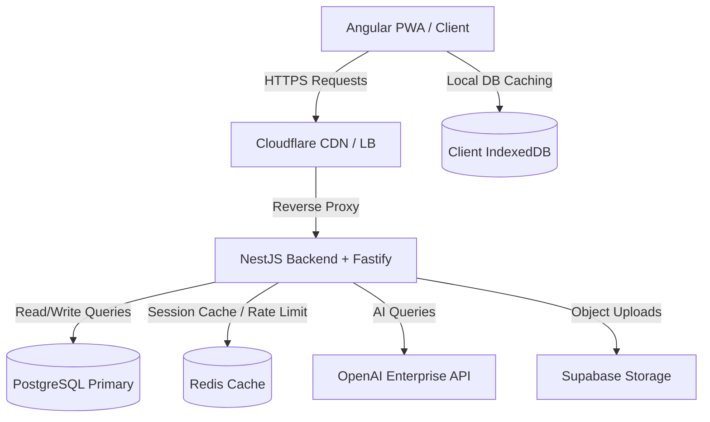

# 🛠️ FinMate Technical Requirement Document (TRD)

## 🏗️ Architecture

### System Architecture

FinMate uses a decoupled Client-Server architecture designed to support high performance and offline-first capabilities. The frontend operates as a progressive web app (PWA) with client-side encrypted storage. The backend operates as a stateless REST API powered by NestJS and Fastify, using PostgreSQL for relational durability and Redis for caching and session rate limiting.

### Frontend Architecture

- **Framework**: Angular 19+ utilizing Standalone Components, Signal-based reactivity, and OnPush change detection to minimize rendering overhead.
- **State Management**: NGXS for global state tracking, managing user credentials, session state, and local application states.
- **Offline Caching**: Service workers cache static assets, while IndexedDB stores decrypted transactions for offline reading.
- **Security**: Local key derivation (PBKDF2/Argon2) and local AES-256-GCM encryption/decryption before sending payloads to backend.

### Backend Architecture

- **Framework**: NestJS structured as a modular monolith. Fastify is configured as the HTTP driver to maximize throughput.
- **Data Layer**: TypeORM abstracts database interactions, utilizing optimistic locking concurrency models via `@VersionColumn()`.
- **Worker Queues**: BullMQ (Redis-backed) manages asynchronous tasks like invoice parsing, bulk import processing, and email notifications.

### API Architecture

- **Protocol**: RESTful JSON API using path-based versioning (`/api/v1`).
- **Real-time Sync**: WebSockets (Socket.io) push notifications and sync alerts when shared ledgers are updated.
- **Contracts**: OpenAPI 3.0 specification ([openapi.yaml](file:///d:/prvn/Projects/FinMate/openapi.yaml)) acts as the contract between client and server.

---

## ⚙️ Technology Decisions

### Frontend Framework: Angular 19+

- **Why chosen**: Robust dependency injection, standalone architecture reduces boilerplate, Signals offer fine-grained reactivity, and modular routes support lazy loading.
- **Pros**: Strong TypeScript enforcement, scalable for enterprise layouts, built-in security features (XSS prevention).
- **Cons**: Steeper learning curve compared to React.
- **Alternatives Rejected**: React (lacks built-in architectural structure, requiring ad-hoc state and routing choices).

### Database: PostgreSQL 16

- **Why chosen**: Strict ACID compliance is mandatory for financial ledger tables. Native support for UUIDs and JSONB columns.
- **Pros**: Reliable transaction boundaries, rich indexing (B-Tree, GiST), standard SQL compatibility.
- **Cons**: Harder to scale horizontally compared to NoSQL.
- **Alternatives Rejected**: MongoDB (NoSQL databases are prone to eventual consistency issues, which is unacceptable for financial ledgers).

### Cache Layer: Redis 7.x

- **Why chosen**: In-memory speeds are needed for API rate limiting, session storage, and queue management.
- **Pros**: Sub-millisecond latency, pub/sub capability, native data structures.
- **Cons**: Data loss risk if configured strictly as in-memory without persistence.
- **Alternatives Rejected**: Memcached (lacks rich data structure support and pub/sub queues).

---

## 🔒 Security Requirements

### Authentication

- JWT pairs: Short-lived Access Token (15 mins) and long-lived Refresh Token (7 days).
- Tokens are signed using HS256 with key validation verified at startup.
- Multi-factor authentication (MFA) powered by TOTP (Google Authenticator) verified on critical actions.

### Authorization

- Role-Based Access Control (RBAC) enforced via NestJS interceptors.
- Scoped verification: Personal contexts verify strict ownership (`user_id == req.user.id`). Shared contexts verify group membership and role levels.

### Data Encryption

- **Client-Side (Zero-Knowledge)**: Raw transaction titles, description content, and note bodies are encrypted on the client device using AES-256-GCM. The encryption key never leaves the client.
- **Server-Side (At-Rest)**: Sensitive columns like `amount_total`, `amount_owed`, and user profile data are encrypted at rest using TypeORM value transformers (`pgcrypto` or KMS integration).
- **In-Transit**: TLS 1.3 enforced for all network transactions.

### Rate Limiting

- Enforced globally and per-route using Redis:
  - Standard routes: 100 requests per minute.
  - Auth routes (login/register): 5 requests per minute.
  - Return `HTTP 429 Too Many Requests` with `Retry-After` header when exceeded.

---

## ⚡ Performance Requirements

- **First Contentful Paint (FCP)**: < 1.5 seconds.
- **Time to Interactive (TTI)**: < 3.0 seconds.
- **Lighthouse CI Performance Score**: > 90.
- **Initial Bundle Size**: < 200KB (gzipped).
- **API Response Target (p95)**: < 200ms.
- **Database Query Performance**: < 50ms for indexed operations.

---

## 📈 Scalability Plan

### Expected Users & Growth Assumptions

- MVP launch: 1,000 active users.
- Year 1 target: 10,000 active users with up to 100,000 transaction records.
- Max group size: 100 members.

### Scaling Strategy

1. **Database Read/Write Decoupling**: Implement read replicas for analytics queries, directing write traffic to the primary instance.
2. **Caching Aggregations**: Cache monthly balance summaries in Redis, invalidating them only when a new expense is posted or voided.
3. **Stateless App Nodes**: Run multiple NestJS container instances behind a Cloudflare load balancer to support horizontal auto-scaling.
