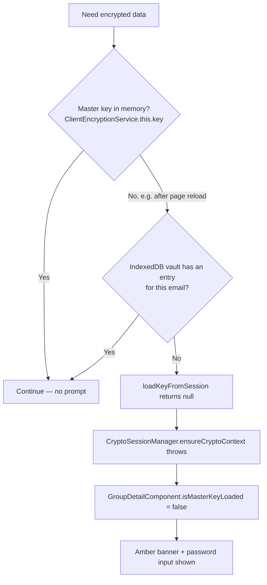

# Master Key Prompt Minimization Audit

Date: 2026-07-26.

Scope: when and why the "Enter password to unlock vault" banner can appear during normal, already-logged-in use. No changes to the cryptographic model, no new persistence of unwrapped keys, hybrid encryption scope unchanged. This is an audit and implementation plan; the two low-risk fixes it recommends are implemented at the end (§6).

Files read in full for this audit: `crypto-session-manager.service.ts`, `group-key.service.ts`, `zk-key-vault.service.ts`, `encryption.service.ts`, `auth.state.ts`, `auth.service.ts`, `jwt.interceptor.ts`, `crypto-bootstrap.service.ts`, plus every call site of `clearKey`/`beginLogout`/`clearPersistentCache`/`deleteKey`/`clearAll`/`invalidateGroupKey` across the frontend, and the password-prompt/error-messaging code in `group-detail.component.ts`, `create-expense-modal.component.ts`, and `group-members.component.ts`.

## 1. Current Crypto Recovery Flow

The in-memory check and the IndexedDB check are the **only** two recovery attempts that exist today — both live inside `ClientEncryptionService.loadKeyFromSession()`, called once per `ensureCryptoContext()`/`initializeGroupKeysAndSelfHeal()` invocation. There is no third silent attempt, no retry-with-backoff, and no cross-tab check before the banner shows. Once both checks miss, the banner is the immediate, first-line result — not a last resort after other options were exhausted, because there genuinely are no other options: the master key is derived from the user's password and is never stored in any recoverable form other than the local IndexedDB vault entry that `loadKeyFromSession` already checked.

## 2. Every Location a Password Prompt Can Occur

| Location                                                                   | Trigger                                                                                                        | Message shown                                                                                                                           |
| -------------------------------------------------------------------------- | -------------------------------------------------------------------------------------------------------------- | --------------------------------------------------------------------------------------------------------------------------------------- |
| `group-detail.component.ts` — amber banner (`!isMasterKeyLoaded()`)        | `initializeGroupKeysAndSelfHeal()`, called from `fetchMembers()` success, `refreshGroupKey()`, `unlockVault()` | "Enter password to unlock vault" + password input + button — the **only** place in the app with an actual password input                |
| `create-expense-modal.component.ts` — `scopeKeyMessage()` for `no_session` | `resolveGroupScopeKey()`/`refreshScopeKeyStatus()` when `ensureGroupKey` reports `no_session`                  | "Your session key is not loaded. Please refresh the page and log in again." — **no password input**, and the advice is wrong (see §4.2) |
| `group-members.component.ts` — generic invite-error message                | `ensureGroupKey()`'s catch-all `return null` path in `sendBulkInvites`/`generateSecureInviteLink`              | "Group key not available. Please unlock your vault." — **no password input**, just a thrown error surfaced as `inviteError`             |

Three different components, three different messages, only one of which actually lets the user do anything about it. This is itself a finding (§4.3), independent of _how often_ any of them fire.

## 3. Per-Investigation-Point Findings

### 3.1 Token Refresh

**No.** Read `jwt.interceptor.ts` and `auth.state.ts` in full. A 401 triggers `authService.refresh()`; on success it dispatches `RefreshTokenSuccess`, which only updates the NGXS `token`/`refreshToken`/`user` fields — it does not call `clearKey()`, `beginLogout()`, or touch `CryptoSessionManager`'s epoch anywhere. The only crypto-clearing path tied to token refresh is when the refresh **itself** fails (both access and refresh tokens dead), which dispatches `Logout` — correctly, since the session is genuinely over at that point and a real re-login (not just an unlock) is unavoidable.

### 3.2 Route Navigation

**No.** `CryptoSessionManager`, `GroupKeyService`, and `ClientEncryptionService` are all `providedIn: 'root'` singletons with no route-level `providers:` overrides anywhere in `app.routes.ts` or the feature route files that would re-instantiate them. In-memory key state survives all in-app navigation.

### 3.3 Group Navigation

**No**, for the same reason as 3.2 — `GroupKeyService`'s in-memory group-key cache is keyed by `groupId`, and switching groups doesn't clear or recreate the service. Each group's key is cached independently once resolved once.

### 3.4 Browser Refresh

**Partially recoverable, and this is already handled as well as it can be.** A full page reload always destroys `ClientEncryptionService.key` (in-memory) — no code can prevent that, it's how JS heaps work. Recovery after that depends entirely on the IndexedDB vault:

- If `deriveAndStoreKey()` successfully persisted the key at login (`storeKey()` returned `true`), refresh is fully silent — `loadKeyFromSession()` finds it and no banner appears. **This is already the common case and needs no fix.**
- If persistence failed at login time (`storeKey()` fell back to its in-memory-only `fallbackMap`, e.g. IndexedDB unavailable in that browser/mode), the user is **already told at login** via `SetPersistenceWarning`, rendered app-wide in `main-layout.component.html`: _"you'll need to sign in again after refreshing or reopening the app."_ This is an honest, already-good disclosure for a genuinely un-fixable environment constraint — nothing to silently recover here, since there's no key to recover.

### 3.5 Multiple Tabs — real gap found

`CryptoSessionManager.broadcast()` **does** send a `crypto-session-ready` event on every successful `ensureCryptoContext()`. But `handleBroadcast()` (the receiving side) only acts on `crypto-session-ended` and `recovery-blocked` — `crypto-session-ready` is broadcast and never listened for. Concretely: if Tab A is showing the unlock banner and the user types their password there, Tab A calls `deriveAndStoreKey()`, which persists the key to the (origin-shared) IndexedDB vault and broadcasts `crypto-session-ready`. Tab B, which may be showing its _own_ unlock banner for the same underlying cause, does nothing with that event — B's banner stays up until B happens to run its own `loadKeyFromSession()` again for an unrelated reason (a manual refresh, a new fetch). **This is the multi-tab duplicate-prompt gap** — fixed in §6.1.

### 3.6 Service Lifetime

Confirmed via `@Injectable({ providedIn: 'root' })` on all three (`CryptoSessionManager`, `GroupKeyService`, `ClientEncryptionService`) and no countervailing route-level provider overrides (3.2). They live for the entire application/tab lifetime; nothing accidentally destroys or recreates them mid-session.

### 3.7 Duplicate Recovery

No duplicate **prompts** — the banner is driven by a single `isMasterKeyLoaded` signal on `GroupDetailComponent`, so however many concurrent operations independently call `ensureCryptoContext()`, only one banner can ever be shown at a time on that page. What _is_ fragmented: `CryptoSessionManager`'s attempt-counting in `handleRecoverableFailure` is keyed by `{userId, groupId, operationType, failureClass}` — different callers pass different `operationType` strings (`'expense_encrypt'`, `'expense_decrypt'`, `'login'`, etc.), so concurrent failures from the same root cause (no master key) are tracked as separate scopes rather than converging. This doesn't cause extra prompts, but it means the "two silent attempts then escalate" policy never actually converges across call sites for this specific failure class — a design inconsistency worth knowing about, not urgent to fix (documented, not implemented, per the low-risk-only constraint).

### 3.8 Idle Timeout

**Does not exist.** Searched the entire frontend for idle/inactivity/timeout-driven session clearing — the only matches were unrelated enum values (`CoordinatorPhase = 'idle' | ...`, `scopeKeyStatus = 'idle'`). There is no code anywhere that clears crypto state due to inactivity, so this cannot be a cause of unexpected prompts today, and there's nothing to fix.

## 4. Recommended Changes

### 4.1 Cross-tab reactive recovery (real gap — fix now, §6.1)

Wire `CryptoSessionManager.handleBroadcast()` to act on `crypto-session-ready` the same way it already acts on the other two event types: when another tab establishes the session, this tab should re-attempt its own `ensureCryptoContext()` rather than waiting for its next unrelated crypto call. Low risk: it's an additive branch in an existing, already-tested handler, and the worst case if it's ever wrong is an extra harmless retry.

### 4.2 Fix `create-expense-modal`'s misleading `no_session` message (real gap — fix now, §6.2)

"Please refresh the page and log in again" is actively wrong advice once IndexedDB has already been confirmed empty (refreshing changes nothing; the user is already logged in, there's no "log in again" action available without first logging out). The message should point at what actually works: entering the password in the unlock banner. Low risk: it's a string change in a single `case` branch, already covered by existing tests.

### 4.3 Unify password-prompt messaging (real gap — documented, not implemented)

Three components independently decide what to tell the user about the same underlying condition, with inconsistent wording and only one of the three offering an actual way to fix it. The correct architecture is for `CryptoSessionManager` to own a single, app-wide "needs unlock" signal and unlock UI (a natural extension of the centralization the crypto-reliability spec already calls for), rather than each component inventing its own message. This is a real improvement but not low-risk — it changes UI structure in three places and would need its own dedicated pass. Flagged for a future session, not attempted here.

### 4.4 Everything else: no code change recommended

Token refresh, route navigation, group navigation, service lifetime, and idle timeout were all verified — by reading the actual code, not assumption — to not cause unnecessary prompts. Browser refresh already recovers silently whenever IndexedDB persistence succeeded at login, which is the common case; the narrow case where it can't (persistence genuinely unavailable) is already honestly disclosed via the existing `SetPersistenceWarning` banner. There is nothing to "fix" in these areas because there is no bug in them — introducing new mechanisms here (e.g. a synthetic idle-based re-prompt, or attempting to work around a browser's own storage-eviction policy) would add complexity to solve a problem that doesn't exist in this codebase today.

## 5. Implementation Plan (by impact)

1. **§4.1 Cross-tab reactive recovery** — highest impact for the specific "I already unlocked it in another tab" complaint; smallest, safest change (one new branch in an existing handler).
2. **§4.2 Fix the misleading create-expense-modal message** — smaller impact (only affects users who reach that specific modal while `no_session`), but a pure string/logic fix with no risk.
3. **§4.3 Unified password-prompt UI** — largest impact on consistency, but out of scope for this pass (not low-risk); recommended as the next dedicated crypto-UX task.

## 6. Implemented (low-risk, backwards-compatible)

Both changes below were implemented, verified (typecheck, full test suite, targeted regression tests), and committed as part of this audit.

### 6.1 `CryptoSessionManager` now reacts to `crypto-session-ready` from other tabs

When another tab reports its session is ready, and this tab's own state is not `Ready`, it now re-attempts `ensureCryptoContext()` rather than waiting for its next unrelated crypto call to happen to retry.

### 6.2 `create-expense-modal`'s `no_session` message corrected

Now tells the user their session key needs to be unlocked with their password (matching what the group page's banner actually does), instead of suggesting a refresh/re-login that doesn't address a confirmed-empty vault.
