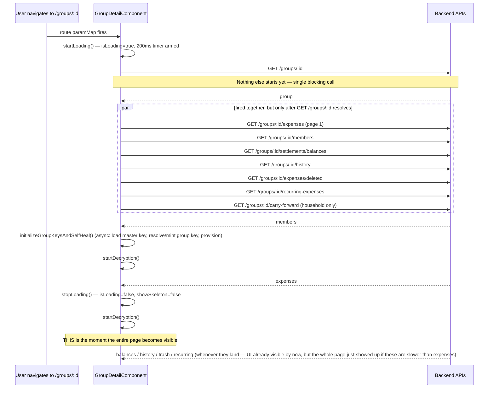
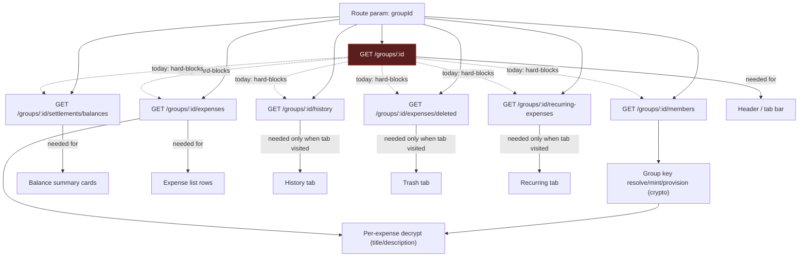

# Group Detail UX & Progressive Loading Audit

Date: 2026-07-26.

Scope: frontend loading architecture, perceived performance, and UX only. No backend API changes, no business-logic changes. This is an audit and implementation plan — no code was changed as part of this document.

Files read in full for this audit: `frontend/src/app/features/groups/pages/group-detail/group-detail.component.ts` (1548 lines), `group-detail.component.html` (2414 lines), `frontend/src/app/features/groups/services/groups.service.ts`, `expenses.service.ts`, and the five child components it composes (`group-balances`, `group-members`, `group-history-log`, `group-trash`, `analytics-charts`).

## 0. "Expense Detail page" — does not exist as a separate route

There is no dedicated Expense Detail page or route. `groups.routes.ts` has exactly three routes: the groups list, join-by-invite, and `:id` → `GroupDetailComponent`. Viewing or editing a single expense happens via `CreateExpenseModalComponent`, opened as an overlay from within Group Detail (`isExpenseModalOpen` signal) — in create mode for a new expense, in edit mode when passed an existing `expense` input. There's no separate loading sequence to audit for an "Expense Detail page"; its loading behavior is covered under Group Detail's ledger tab (§3) and the modal itself (§6.5).

## 1. Current Loading Flow



**The single template gate is the whole story:**

```html
@if (showSkeleton()) { <!-- one full-page skeleton --> }
@if (!showSkeleton() && group()) { <!-- header, tab bar, ALL tab content --> }
```

`showSkeleton` is only cleared inside `fetchExpenses()`'s `next`/`error` handlers (`group-detail.component.ts:769,777`). So:

- The header, tab bar, offline banner, key-status banners, and the settings/history/trash/recurring tabs — none of which need expense data — are all invisible until the expenses list specifically finishes loading.
- `getGroup()` is a hard blocking dependency for the other six calls, even though none of them actually need the `Group` object — they only need the `groupId` string from the route, which is available immediately.

## 2. Component → Required API(s) → Can Render Before? Dependency Table

| Component / section | Actually requires | Currently waits for | Can render independently? |
| --- | --- | --- | --- |
| Header (group name, currency badge, offline/key-status banners) | `group()` only | `showSkeleton()` (⟶ expenses) | **Yes** — needs only `GET /groups/:id` |
| Tab bar | `group()` only | `showSkeleton()` (⟶ expenses) | **Yes** — same |
| Balance summary cards (top of ledger tab) | `balances()` | `showSkeleton()` (⟶ expenses) | **Yes** — needs only `GET .../settlements/balances`, already fetched in parallel, just gated behind the wrong flag |
| Expense list (ledger tab) | `expenses()`, `members()` for split display names | `getGroup()` → itself | Genuinely needs `expenses`; `members` dependency is soft (falls back gracefully if absent — see `fetchExpenses`'s mapping code, which only backfills from `members()` if the API response didn't already include display names) |
| Expense decryption (title/description text) | master key session, `members()` (for role), group key resolution, then per-expense ciphertext | `fetchMembers()` success → `initializeGroupKeysAndSelfHeal()` | Already decoupled from the page shell via `decryptCoordinator`'s own phase/summary signals (`decryptionPhase`, `showKeysWaitingBanner`) — genuinely good existing pattern, per-expense progressive reveal already works once the shell is visible |
| `GroupBalancesComponent` (rendered inside ledger tab) | `balances`, `suggestedSettlements`, `members`, `userBalance` — all passed as `input.required<>()` | Parent's `balances()`/`members()` signals | Already correctly receives data via Input, does not re-fetch — no duplicate-request problem here |
| `GroupMembersComponent` (settings tab) | `members`, `groupId`, `isOwnerOrAdmin` — all `input.required<>()` | Parent's `members()` signal | Same — correctly Input-driven, no re-fetch |
| `AnalyticsChartsComponent` (analytics tab) | `groupId`, `currency` inputs only | Fetches its **own** data via its own injected `ExpensesService` call | **Already fully independent** — doesn't mount until `activeTab() === 'analytics'`, doesn't share the parent's `expenses()` signal at all. This is the best existing example of the pattern the rest of the page should copy. |
| History tab (`GroupHistoryLogComponent`) | `historyLogs()` | Eagerly fetched on page load, gated by `showSkeleton` | Data fetch could be deferred to first tab visit; template mount is already deferred (`@if (activeTab() === 'history')`) |
| Trash tab (`GroupTrashComponent`) | `deletedExpenses()` | Same as history | Same |
| Recurring tab | `recurringExpenses()` | Same | Same |
| Settings tab (contributions section) | Contributions, fetched via `loadContributionsForMonth()` | **Already** deferred — only called when `tab === 'settings'` via the queryParams subscriber | This is the second good existing example — the pattern just isn't applied consistently to the other tabs |
| "Add Expense" trigger button | `groupId`, `members()` (for participant list) | Physically inside the `showSkeleton` gate — button doesn't exist in the DOM until the whole page unblocks | **Yes**, trivially — needs nothing the header doesn't already have |

## 3. API Dependency Graph



The only edges that should actually exist as *hard* dependencies are `GetMembers → KeyProvision → Decrypt` and `GetExpenses → Decrypt`. Every dotted "hard-blocks" edge from `GetGroup` is an artifact of the current code structure (all six calls living inside `getGroup()`'s `next` callback), not a real data dependency — `groupId` is all any of them need.

## 4. UX Pain Points (in priority order, by how often a real user hits them)

1. **Every page load is gated on the slowest of `getGroup()` + `getExpenses()` in series**, even though `getGroup()` returns a small, fast row and the other five/six calls don't need its response at all. On a slow connection or a large group with many expenses, the user stares at a full-page skeleton for the sum of two round trips instead of the max of one.
2. **Header, tab bar, and balance cards are invisible for no reason.** These need data that's usually available first (`group`, `balances`), but are held hostage by the flag that only clears when the slowest, least-visually-critical-first thing (the expense list) finishes.
3. **The "Add Expense" button doesn't exist until the whole page unblocks.** A user who just wants to log one expense has to wait for history/trash/recurring data they may never look at.
4. **History, trash, and recurring data are fetched unconditionally on every page load**, even though the default tab is "ledger" and most sessions probably never visit those tabs. Three of the seven initial requests are very likely wasted work on a typical visit.
5. **No error signal for history/trash/carry-forward fetch failures** (`fetchHistoryLogs`, `fetchDeletedExpenses`, `fetchCarryForward` — `group-detail.component.ts:824-855`): each just does `console.error` and leaves the signal at its default empty array. A user who opens the History tab after a failed background fetch sees "no history yet" — indistinguishable from a genuinely empty group. This is already flagged as `RC1_READINESS.md` finding **M-1**, independently confirmed here from the loading-architecture angle: it's the same class of bug this audit is about — a section silently presenting a wrong state instead of an explicit error with retry, exactly what "independent failures" (§UX Improvements 3 in the brief) is asking to fix.
6. **No stale-while-revalidate.** Navigating away and back to a group re-shows the full skeleton and re-fetches everything from scratch; there is no cached "last known state" shown instantly while a background refresh runs.
7. **Redundant decryption trigger.** `startDecryption()` is called once from `fetchMembers()`'s success handler and again from `fetchExpenses()`'s success handler (`group-detail.component.ts:452-453` and `773`). Not a correctness bug — the coordinator cancels and restarts cleanly — but it's wasted work and a sign the two fetches aren't clearly coordinated.

## 5. What's Already Good (don't undo this)

- `AnalyticsChartsComponent` and the Settings tab's contributions loader are already exactly the target pattern: self-contained data fetch, triggered only when the section is actually viewed, own loading state. Use these as the internal reference implementation, not an external one.
- `GroupBalancesComponent` and `GroupMembersComponent` already receive data via `input.required<>()` from the parent rather than re-fetching — there is **no duplicate-request problem** to solve for these two. Any redesign must preserve single-fetch-in-parent-signal, or it would introduce the duplication that doesn't currently exist.
- `membersError`/`balancesError` signals and their dedicated banners already exist (`group-detail.component.html:2212,2233`) — the "independent failure" pattern is partially built; it just needs to (a) extend to history/trash/carry-forward and (b) not be trapped behind the same all-or-nothing skeleton.
- `fetchExpenses(groupId, silent)` already has a `silent` mode that swaps the global skeleton for the section-scoped `isLoadingExpenses` signal — used today for filter/pagination changes. The exact same code path can be reused for the initial load; this isn't a new mechanism to invent, just a new call site.
- The 200ms skeleton-delay timer (`startLoading()`) already prevents skeleton flash on fast connections. Keep this pattern per-section in the redesign.

## 6. Recommended Architecture

### 6.1 Decouple `getGroup()` from everything else

Fire all seven initial requests (`group`, `expenses`, `members`, `balances`, `history`, `trash`, `recurring`) from the route param immediately, using only `groupId`. None of them actually need the `Group` object first. This alone removes the single biggest sequential dependency in the current flow.

### 6.2 One skeleton/error/retry per section, not one global gate

Replace the two-branch `showSkeleton()` / `!showSkeleton() && group()` template gate with independent gates per section, each backed by its own trio of signals (already the established naming convention — extend it):

| Section | Loading signal (add if missing) | Error signal (exists / add) | Data signal (exists) |
| --- | --- | --- | --- |
| Header | `isLoadingGroup` (new) | `groupError` (new) | `group` |
| Balance cards | `isLoadingBalances` (new) | `balancesError` (exists) | `balances` |
| Ledger list | `isLoadingExpenses` (exists — reuse for initial load too) | `ledgerError` (exists) | `expenses` |
| History tab | `isLoadingHistory` (new) | `historyError` (new) | `historyLogs` |
| Trash tab | `isLoadingTrash` (new) | `trashError` (new) | `deletedExpenses` |
| Recurring tab | `isLoadingRecurring` (new) | `recurringError` (new) | `recurringExpenses` |

Each section's template renders one of three states independently: its own skeleton, its own error banner with a retry button calling the same `fetch*` method, or its data — never blocked by a sibling section's state.

### 6.3 Fetch tab-specific data lazily, on first visit, then cache

History, trash, and recurring should not fire on initial page load. Fetch them the first time `activeTab()` becomes their tab (the `route.queryParams` subscriber already has this exact branching for `settings`/`recurring` contribution loads — extend the same `if (tab === 'history' && !historyFetchedOnce)` style guard to all three). Once fetched, keep the signal populated so revisiting the tab in the same session doesn't refetch — this is the "shared state / avoid duplicate requests" ask, achieved with a simple per-tab "have we fetched this yet" boolean rather than a new caching layer.

### 6.4 Hoist the shell above the data gate

Header, tab bar, and the "Add Expense" trigger should render as soon as `group()` is set — not wait for `showSkeleton()` tied to expenses. Concretely: split the current single `@if (!showSkeleton() && group())` into `@if (group())` for the shell, with each inner section keeping its own loading/error gate from §6.2.

### 6.5 Background refresh on revisit (stale-while-revalidate)

This requires an actual cache, which doesn't exist today (§ groups.service.ts has no `shareReplay`/storage). Two honest options, in order of effort:

- **Cheap version**: keep the component's signals populated across navigations (don't reset them in `ngOnInit`; only reset+refetch if `groupId` actually changed). Angular already keeps the component instance alive across query-param-only navigation within the same route; the bug today is that `startLoading()` unconditionally shows the skeleton again even when `group()` already holds the right group's data. Guard it: skip the skeleton entirely if `group()?.id === groupId`, refetch in the background, and diff-update signals when the new response lands.
- **Real version**: introduce a small per-`groupId` cache (in-memory Map, TTL-based) in `GroupsService`/`ExpensesService`, return cached value synchronously alongside a background refresh — standard SWR. Higher effort, only worth it if users frequently bounce between groups (dashboard → group → dashboard → different group), which isn't confirmed by this audit; recommend the cheap version first and revisit if telemetry shows repeat-visit is common.

### 6.6 Parallelization already exists where it matters — don't add ceremony

The six/seven calls are already fired without `forkJoin`/sequential chaining relative to each other (§1's `par` block) — the only serialization to remove is the `getGroup()` prefix. Resist the urge to introduce `forkJoin` or Angular route resolvers here: a resolver would reintroduce a single blocking gate before the route even activates, which is the opposite of this brief's goal ("Do not... use route resolvers... only where justified" — none of these calls justify one, since the whole point is *not* to block navigation on any of them).

### 6.7 Loading priority model

Explicit priority tiers, so future changes to this page have a rule to check against instead of relying on tribal knowledge: **a higher-priority section must never be made to wait on a lower-priority one.**

| Priority | Section | Rationale |
| --- | --- | --- |
| P0 | Route shell, tab bar, "Add Expense" trigger | Needs only `group()`; must be interactive before any other data arrives |
| P1 | Group header (name, currency, offline/key-status banners) | Same data as P0, grouped separately only because it's a distinct visual region |
| P1 | Expense list (ledger tab) | The primary reason a user opens this page |
| P2 | Balance cards | Important, but secondary to seeing what was actually spent |
| P2 | Members (avatars, roles) | Needed for split display names and the Add Expense participant list, but tolerant of arriving slightly after the ledger |
| P3 | History (on tab visit) | Not needed until explicitly requested |
| P3 | Trash (on tab visit) | Same |
| P3 | Recurring (on tab visit) | Same |
| P4 | Analytics (on tab visit) | Heaviest computation, least time-sensitive, already correctly deferred today |

This directly motivates §6.4 (P0/P1 must not sit behind the same gate as P2 data) and §6.3 (P3/P4 must not fire until requested at all). Any future addition to this page should be slotted into this table before deciding how eagerly to fetch it.

## 7. Success Metrics

API response time alone doesn't capture what this audit is trying to fix — the problem was never "an API is slow," it was "the user is blocked by a request that has nothing to do with what they're looking at." Track perceived performance directly:

| Metric | Definition | Today (estimated from code, not measured) | Target |
| --- | --- | --- | --- |
| Time to first meaningful paint | Header + tab bar visible | `getGroup()` + `getExpenses()` in series (§1) | `getGroup()` alone (§6.1) |
| Time until "Add Expense" is usable | Trigger button exists and is clickable | Same as above — trapped behind the same gate | Same as first meaningful paint |
| Time until expense list appears | `expenses()` populated and rendered | `getGroup()` + `getExpenses()` in series | `max(getGroup(), getExpenses())` in parallel |
| Time until page is fully hydrated | Every P0–P2 section has data or a settled error state | All seven calls, since three of them (history/trash/recurring) are on the critical path today even though nothing displays them | `max(group, expenses, members, balances)` only — P3/P4 excluded, since they're not fetched until requested |

These aren't currently instrumented anywhere in the codebase (no RUM/perf-mark calls found in `group-detail.component.ts`); adding them (e.g. `performance.mark()` at each milestone) should be a small, early implementation step so the phased rollout in §8 can be checked against real numbers instead of code-reading estimates.

## 8. Proposed Loading Flow

```mermaid
sequenceDiagram
    participant U as User navigates to /groups/:id
    participant C as GroupDetailComponent
    participant API as Backend APIs

    U->>C: route paramMap fires (groupId known immediately)
    par all seven fire together, independently
        C->>API: GET /groups/:id
        C->>API: GET /groups/:id/expenses
        C->>API: GET /groups/:id/members
        C->>API: GET /groups/:id/settlements/balances
    end
    Note over C: History/trash/recurring NOT fetched yet — deferred to first tab visit
    API-->>C: group (first, usually fastest)
    C->>C: Header + tab bar + "Add Expense" render immediately
    API-->>C: balances
    C->>C: Balance cards render (independent of expenses/members)
    API-->>C: members
    C->>C: Key provisioning starts in background; member avatars render
    API-->>C: expenses
    C->>C: Ledger rows render (skeleton→content per-section, not page-wide)
    C->>C: Per-expense decrypt reveals titles progressively (unchanged — already good)

    U->>C: clicks "History" tab (first visit)
    C->>API: GET /groups/:id/history
    C->>C: History tab shows its own skeleton, then content or its own error+retry
```

Nothing in this flow is blocked on anything unrelated. If `balances` is slow, the user is already reading their expense list. If `expenses` is slow, the user can already see who's in the group and open Settings. If one call fails, only its own section shows an error — everything else stays usable.

## 9. Prioritized Implementation Plan (highest impact first)

1. **Un-block the six/seven calls from `getGroup()`.** Move them out of `getGroup()`'s `next` callback into the same `route.paramMap` subscriber, keyed only on `groupId`. Single highest-impact, lowest-risk change — pure reordering, no new signals needed.
2. **Split the page-wide skeleton gate into per-section gates**, starting with header+tabs (render on `group()` alone) and balance cards (render on `balances()` alone). Reuses the existing `showSkeleton`-delay-timer pattern, just scoped down.
3. **Route the initial `fetchExpenses()` call through the existing `silent`/`isLoadingExpenses` path** instead of the global `startLoading()`/`showSkeleton`. This is a one-line call-site change (`fetchExpenses(groupId, true)` on initial load) since the section-level plumbing already exists.
4. **Defer history/trash/recurring fetches to first tab visit**, mirroring the existing `settings`/contributions pattern in the `queryParams` subscriber. Removes 3 of 7 requests from the common-case page load entirely.
5. **Add loading/error signals for history/trash/carry-forward** (currently `console.error`-only), matching the `membersError`/`balancesError` pattern already in place. Closes RC1 finding M-1 as a side effect.
6. **Guard against re-showing the skeleton on same-group revisits** (§6.5 cheap version) — background-refresh instead of blank-then-reload.
7. **(Optional, low priority) Remove the redundant second `startDecryption()` trigger** — cosmetic/efficiency only, not user-visible.

Steps 1–5 are independent of each other and can land as separate, individually-verifiable changes, consistent with this session's established one-commit-per-logical-change pattern. Step 6 depends on 1–3 being in place first (there's no point building revisit-caching on top of the still-sequential load). Step 7 can happen anytime.

## 10. Potential Regressions / Edge Cases to Watch

- **Household groups and `fetchCarryForward`**: currently fired only when `res.groupType === 'household'`, inside the `getGroup()` callback (it needs to know the group type before deciding to fetch at all). When un-blocking the other six calls from `getGroup()`, carry-forward must stay conditional on `group()?.groupType === 'household'` — it cannot fire blindly in the same `par` block as the rest, since it genuinely depends on `getGroup()`'s response for that one branch decision. This is the one real, necessary exception to "everything only needs `groupId`."
- **`fetchExpenses`'s split-name backfill from `members()`** (`group-detail.component.ts:730-750`): if expenses resolve before members (very possible once both fire in parallel instead of members going first), the backfill silently no-ops (falls through to whatever the API already returned) rather than erroring — verified safe, but worth an explicit test once reordered, since today members always happens to be in flight by the time this code runs.
- **`initializeGroupKeysAndSelfHeal` currently only triggers from `fetchMembers()`'s success handler.** If members fails (`membersError.set(true)`) under the new independent-failure model, key provisioning and thus decryption never starts, even if expenses loaded fine — expenses would sit permanently in "waiting for keys" state with no obvious path to retry beyond the member-list retry itself. Worth an explicit decision: should a failed members fetch retry automatically, or should the ledger's "waiting for keys" banner gain a manual retry that re-attempts `fetchMembers()` specifically? Not solved by this audit — flagged for the implementation step.
- **Filter/pagination changes** (`applyFilters`, `retryLoadLedger`, pagination controls) already call `fetchExpenses(groupId, true)` (silent mode) — unaffected by this redesign, since they don't touch the global skeleton today either.
- **`onOnline`/`refreshGroupKey`/`unlockVault` handlers** re-call `fetchExpenses`/`fetchBalances` directly — these should continue working unchanged since they call the same methods, just now those methods manage their own section-scoped loading state consistently instead of sometimes-global/sometimes-silent.
- **Tests**: checked `group-detail.component.spec.ts` directly — it does **not** assert call ordering (no `toHaveBeenCalledBefore`/sequence checks), only that `getGroup` was called with the right id. Low regression risk on that front. It's still worth re-running the full suite after reordering, since mocked services resolving synchronously (`of(mockGroup)`) in tests can mask timing bugs that only appear with real async HTTP latency.
