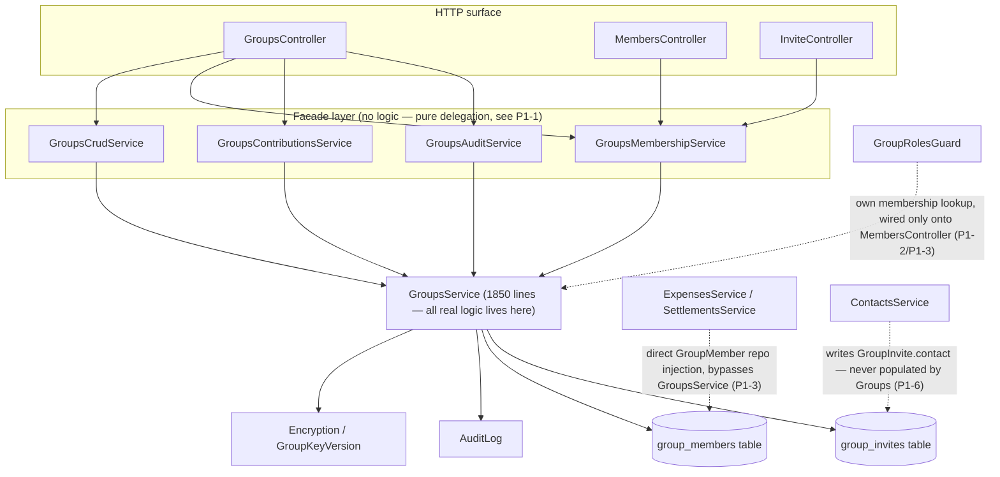

# Groups Module Architecture Audit

Date: 2026-07-25
Scope: audit only. No application code changes.
Method: independent read-only research pass over `backend/src/app/groups/`, `backend/src/app/auth/{guards,decorators}/group-roles.*`, `shared/data-models/src/lib/group*.entity.ts` + `dto/group*.dto.ts`, `frontend/src/app/features/groups/`, and the cross-module touch points in `expenses.service.ts`/`settlements.service.ts`/`contacts.service.ts` where Groups logic leaks across module boundaries. Every finding below was independently re-verified against the current file (not taken on trust from the research pass) before being written down; line numbers are current as of this audit.

This follows the same methodology used to audit and freeze the Expense module
(`docs/audits/expense-architecture-audit.md`, `docs/EXPENSE_MODULE_FREEZE.md`): find duplicate
business logic, multiple sources of truth, dead code, obsolete APIs, architectural drift, and
documentation gaps — not general compliance-vs-docs checking (that already exists, dated
2026-07-16, in `docs/audits/groups-audit.md`, and its findings are cross-checked against current
code in §8 below rather than repeated).

## Module Overview

The Groups module owns group CRUD, membership/roles, invite issuance and resolution (both durable
`group_invites` and a permanent per-group join link), per-ledger-month contribution percentages,
group-key-version persistence, and the group history/audit read surface. It delegates Carry
Forward ledger math to the Expense module and group-key cryptographic operations to the Encryption
module, but owns the HTTP surface and authorization for both.

**File inventory** (all files that exist — this matters, see Finding P1-1):

| File | Lines | Role |
| --- | --- | --- |
| `groups.service.ts` | 1850 | All business logic. Every method any other file in this module calls eventually lands here. |
| `groups.controller.ts` | 428 | HTTP surface: group CRUD, history, carry-forward passthrough, contributions, key endpoints |
| `members.controller.ts` | 104 | Member list/update/remove HTTP surface |
| `invite.controller.ts` | 28 | Invite-details/lookup HTTP surface |
| `groups.module.ts` | 61 | DI wiring |
| `groups.service.spec.ts` | 1166 | The **only** spec file in the backend Groups directory |
| `services/groups-crud.service.ts` | 57 | Facade — see P1-1 |
| `services/groups-membership.service.ts` | 106 | Facade — see P1-1 |
| `services/groups-contributions.service.ts` | 20 | Facade — see P1-1 |
| `services/groups-audit.service.ts` | 17 | Facade — see P1-1 |

## Source-of-Truth Map

| Responsibility | Current owner | Notes |
| --- | --- | --- |
| Group CRUD, archive, currency lock | `GroupsService` (via `GroupsCrudService` facade) | Currency lock enforced in exactly one place (`groups.service.ts:437-457`) — no drift found here |
| Membership role transitions, owner-transfer, leave/remove | `GroupsService.updateMember` / `.removeMember` | Caller-role checks now present (GRP-001 fix verified, see §8) but reimplemented per-method, not shared — see P1-2 |
| "Is this user an active/invited member" resolution | **No single owner** — at least 4 variants inside `GroupsService` alone, a 5th in `GroupRolesGuard`, and independent copies in `ExpensesService`/`SettlementsService` | See P1-3 |
| Route-level role gating | `GroupRolesGuard` + `@GroupRoles()`, but only wired onto `MembersController` | `GroupsController`/`InviteController` rely solely on inline checks inside `GroupsService` — two enforcement mechanisms for one concern, see P1-2 |
| Invite issuance (durable) | `GroupsService.inviteMember` and `GroupsService.createGroupInvite` — two independent mint sites | See P1-4 |
| Invite issuance (permanent link) | `GroupsService.createGroup` / `.regenerateInviteToken` | Never expires (tracked, GRP-004, still open) |
| Invite resolution/join | `GroupsService.getInviteDetails` and `.joinGroupByToken` — two independent copies of the same dual-path (GroupInvite-then-Group.inviteToken) resolution | See P1-4 |
| Group-key-version persistence | `GroupsService` (create/rotate/provision/get) | Contract (`groups-contract.md:15`) attributes this to "the membership service boundary" — not accurate, see P2-6 |
| Group history/audit read | `GroupsService.getGroupHistory` (backend, returns raw ciphertext) + `GroupsService.getHistoryLogs` (frontend, decrypts with active key only) | Matches `KNOWN_ISSUES.md` KI-1 / `docs/audits/history-decryption-audit.md`; GRP-007, still open, corroborates prior finding |
| Member-summary / display-name resolution | **`GroupsService.memberSummary()`** (`groups.service.ts:66-89`) | A **fourth** nickname-first display resolver, not migrated to the canonical `common/member-display.util.ts` — see P1-5 |
| Contact-claim linkage for invited members | `GroupInvite.contact` field, written by `ContactsService`, **never populated** by the Groups module that creates the rows | See P1-6 |

## Dependency Map

- **Groups → Encryption/Key Management**: group-key mint/rotate/provision (`GroupKeyVersion`,
  `MemberWrappedGroupKey`), read-only from Groups' perspective otherwise.
- **Groups → Users**: membership identity, public wrapping keys, shadow-user auto-provisioning on
  invite (undocumented behavior, see P2-7).
- **Groups → Audit logging**: `AuditLog` writes for group/member/invite/key/contribution actions
  (GRP-002 fix verified present, see §8).
- **Expense → Groups**: reads `GroupMember`/`joinStatus` directly via its own repository injection
  rather than calling into Groups (`expenses.service.ts` — see P1-3); Carry Forward HTTP surface is
  owned by `GroupsController` but all ledger math delegates back into `ExpensesCarryForwardService`.
- **Settlements → Groups**: same pattern — direct `GroupMember` repository injection instead of a
  shared membership-check call (`settlements.service.ts` — see P1-3).
- **Contacts → Groups**: `ContactsService` writes to `GroupInvite.contact` on claim/merge, but no
  Groups-module code path ever sets that field at invite-creation time — a one-directional,
  currently-broken dependency (P1-6).

## Architecture Diagram

## Findings

Findings are labeled **Correctness**, **Maintainability**, or **Future improvement** per the task's
required distinction, in addition to P0/P1/P2 severity.

### P0

None. No live security hole or data-corruption path was found. GRP-001 (privilege escalation via
unauthorized role change) was independently re-verified as fixed — see §8.

### P1

#### P1-1: The four `services/groups-*.service.ts` facades contain no logic — the module is a single 1850-line service wearing a four-file costume

**Maintainability.**

Every method in `GroupsCrudService`, `GroupsMembershipService`, `GroupsContributionsService`, and
`GroupsAuditService` is a single-line delegation to the identically-named `GroupsService` method
(e.g. `GroupsCrudService.createGroup`, `groups-crud.service.ts:15-21`, is exactly
`return this.groupsService.createGroup(owner, dto, context);`, and this pattern repeats for every
method in all four files). All three controllers inject the facades, never `GroupsService`
directly (`groups.controller.ts`, `members.controller.ts:27-29`, `invite.controller.ts:15-17`).

Impact: the file layout implies a domain split (crud/membership/contributions/audit) mirroring the
Expense module's genuine `ExpensesCrudService`/`ExpensesAnalyticsService`/etc. facades — but unlike
Expense's facades, none of these actually partition behavior. A reader or an AI agent extending
this module would reasonably expect to find membership logic in `GroupsMembershipService` and be
wrong; everything is in one 1850-line class. This is the single biggest reason new work on this
module risks adding a fifth copy of something that should be centralized (see P1-2, P1-3, P1-4).

Recommendation: either give the facades real ownership of their slice of `GroupsService`'s logic
(genuine split, matching the Expense module's pattern), or collapse them and have controllers
inject `GroupsService` directly. Do not leave the illusion of a split in place.

#### P1-2: Group-member role checks are duplicated inline at 11+ call sites, plus a second, only-partially-applied enforcement mechanism

**Maintainability**, with a **Correctness**-adjacent consequence (spectator lockout, see below).

`role !== 'owner' && role !== 'admin'`-shaped checks are retyped independently at, at minimum:
`updateGroup` (`groups.service.ts:408`), `inviteMember` (`:514`), `updateMember`'s role-change
branch (`:775,780,786-788`), `updateMember`'s removed branch (`:871,877-879`), `removeMember`
(`:981,987-989`), `regenerateInviteToken` (`:1080`), `createGroupInvite` (`:1290`),
`provisionGroupKeys` (`:1341`), `getMissingGroupKeys` (`:1454`), `rotateGroupKey` (`:1492`),
`updateContributions` (`:1669`), and `archiveGroup` (`:1770`, owner-only variant). None of these
call a shared "assert caller can manage this group" helper.

Separately, `GroupRolesGuard` + `@GroupRoles()` (`backend/src/app/auth/guards/group-roles.guard.ts:20-84`,
decorator at `group-roles.decorator.ts:3-5`) is a second, declarative enforcement mechanism — but
it is wired only onto `MembersController` (`members.controller.ts:32,53,63,85`); `GroupsController`
and `InviteController` have no `@GroupRoles` at all. Verified: the decorator's role-union type is
`'owner' | 'admin' | 'member' | 'viewer'` — **`spectator` is not a member of the type**, and no
`@GroupRoles(...)` call anywhere lists it. Since `GroupMember.role` (`group-member.entity.ts:53-54`)
and `expenses.service.ts` both treat `spectator` as a real, first-class role, a spectator is denied
`GET/PATCH/DELETE /groups/:id/members` outright — a real, user-visible authorization bug (tracked
as GRP-003, confirmed still open, see §8).

Recommendation: extract one `assertCanManageGroup(caller: GroupMember)`-style helper for the inline
checks, and either extend `GroupRolesGuard` to cover all three controllers or remove it in favor of
the inline pattern — not both, split arbitrarily by controller.

#### P1-3: "Is this user an active member of this group" is resolved at least six different ways across two modules

**Maintainability**, with real drift risk.

Within `GroupsService` alone: a named helper `getActiveMembership()` (`groups.service.ts:91-107`,
used by only 5 of the many methods that need this check); a verbatim-duplicated inline
`createQueryBuilder('member')...andWhere(joinStatus='active')...getOne()` at 9 separate call sites
that do not call the helper (`findGroupById:366-371`, `updateGroup:397-402`,
`inviteMember:505-511`, `listMembers:721-726`, `getGroupHistory:1031-1036`,
`regenerateInviteToken:1072-1077`, `getContributions:1613-1618`, `updateContributions:1661-1666`,
`archiveGroup:1760-1765`); and a third variant in `updateMember`/`removeMember`
(`groups.service.ts:746-759`, `:924-937`) that deliberately widens the filter to admit
`'invited'` callers too, with a manual follow-up check. `GroupRolesGuard` implements a **fourth**
algorithm independently (`group-roles.guard.ts:38-72`) — `.findOne()` rather than query-builder,
with its own self-update/self-remove carve-out logic.

Outside the Groups module: `ExpensesService` and `SettlementsService` both inject
`@InjectRepository(GroupMember)` directly (`expenses.service.ts:85`, `settlements.service.ts:67`)
and re-derive `joinStatus === 'active'` / `In(['active','invited'])` checks locally throughout,
rather than calling into any Groups-owned membership-check API. There is no shared "assert active
membership" utility anywhere in the codebase that any of these six variants call.

Recommendation: this is the highest-value consolidation target in the module — one canonical
membership-resolution function, exported for cross-module use, would collapse six independent
implementations (with six independent chances to drift) into one.

#### P1-4: Invite-token generation is duplicated four times; invite resolution is duplicated twice

**Maintainability**, moderate drift risk (invite/join is a security-relevant path).

Generation: `createGroup` mints the permanent `group.inviteToken` (`groups.service.ts:215`,
`randomUUID()`, no expiry); `regenerateInviteToken` re-mints the identical field
(`:1093`); `inviteMember`'s unregistered-target branch mints a durable `GroupInvite` with a 7-day
expiry computed inline (`:657-661`); `createGroupInvite` mints another durable `GroupInvite` with
the **identical** 7-day-expiry computation, copy-pasted rather than shared (`:1310-1312`).

Resolution: `getInviteDetails` (`:1099-1170`) and `joinGroupByToken` (`:1172-1210`) each
independently re-implement the same two-branch fallback (`GroupInvite`-first-with-expiry-check,
then `Group.inviteToken` fallback with no expiry semantics at all on that path) rather than sharing
one `resolveInviteByToken()`. Both call the shared `isInviteExpired()` helper (`:62-64`) for the
expiry test itself, but the surrounding branch structure is duplicated wholesale.

Recommendation: factor invite minting and invite resolution into two shared private methods each
called from all their current sites.

#### P1-5: `GroupsService.memberSummary()` is a fourth, previously-uncounted nickname-first display resolver

**Maintainability** — extends a finding this codebase already tracked and partially fixed, but
missed one instance.

`docs/audits/expense-architecture-audit.md` P2-3 and `docs/changes/display-name-resolver-consolidation.md`
named and consolidated exactly two backend duplicates (`SettlementsService.memberDisplay`,
`ExpensesService.carryForwardMemberDisplay`) into one canonical `resolveMemberDisplay`
(`backend/src/app/common/member-display.util.ts:19-37`). Neither document's scope included the
Groups module. Verified: `GroupsService.memberSummary()` (`groups.service.ts:66-89`) independently
implements the same `nickname ||` -first priority rule for both the user-backed and contact-backed
branches, used to build member-list/invite-response rows (`:1133,1165,1602,1643`). It is not a
byte-identical duplicate of `resolveMemberDisplay` — it returns a different shape
(`{memberType, displayName, email, phoneNumber}` vs. `{groupMemberId, userId, contactId,
displayName, email}`), has no `|| user.email` fallback for `displayName`, and additionally masks
auto-provisioned placeholder emails (`m.user.email.endsWith('@placeholder.finmate') ? null : ...`,
`:77-79`) — a rule specific to the shadow-user invite flow (P2-7) that the canonical resolver has
no reason to know about. So this is not a simple "call the shared function instead" fix; it is a
real, separate finding that the display-name-resolver consolidation's own "no other inline copies
exist in `backend/src/app`" verification claim (`display-name-resolver-consolidation.md:103`) did
not hold for the Groups module, because Groups was never in that task's scope.

Recommendation: when member display-name resolution is next touched, evaluate whether
`memberSummary`'s member-list-response shape should compose the canonical `resolveMemberDisplay`
(for the nickname/name-fallback part) plus its own memberType/phone/placeholder-masking logic, or
whether it's different enough to justify staying separate — do not silently merge it without
checking the placeholder-masking behavior is preserved.

#### P1-6: `GroupInvite.contact` is read/written by `ContactsService` but never populated by the Groups module that creates the rows

**Correctness** — a currently-broken cross-module path, not just a maintainability concern.

`ContactsService`'s claim flow (`contacts.service.ts:313-315`) and merge flow (`:591-593`) both run
`UPDATE group_invites SET ... WHERE contact_id = :id`, i.e. they depend on `GroupInvite.contact`
being populated for any invite tied to a `Contact`. Verified: neither `GroupInvite`-creating path in
`GroupsService` sets it — `inviteMember`'s `groupInviteRepository.create({...})`
(`groups.service.ts:662-673`) sets `inviteeUser` only, and `createGroupInvite`'s equivalent
(`:1314-1321`) does the same. `GroupInvite.contact` (`group-invite.entity.ts:36-37`) is therefore
always `null` on every row the Groups module produces today, so `ContactsService`'s
contact-scoped `group_invites` updates are currently no-ops against real data — a silently
non-functional feature interaction between two modules.

Recommendation: this is a real bug, not a style issue. Since this audit's rules forbid code changes,
it is reported here rather than fixed; whoever picks this up next should confirm whether Contacts'
claim/merge flows are meant to update pending invites (likely yes, given the write exists) and, if
so, populate `contact` at `GroupInvite` creation time.

### P2

#### P2-1: `canChangeRole()` is a permanent no-op stub gating a real UI control

**Maintainability / UX**, not security (backend enforces correctly regardless).

`GroupDetailComponent.canChangeRole(member)` (`group-detail.component.ts:1325-1328`) is
`void member; return true;` — always `true`. It gates the role-change control's visibility in the
template (`group-detail.component.html:1872`, `@if (canChangeRole(member))`), so every member —
including viewers — currently sees a role-change control for every other member, which will then
be rejected by the backend's (correctly enforced, see §8) authorization check on submit. Its own
spec (`group-detail.component.spec.ts:245-261`) documents this as expected behavior rather than
flagging it, which suggests the no-op may be intentional-but-undocumented (e.g., "let the backend
be the only enforcement point, and don't bother hiding the control client-side") rather than an
oversight — but it directly contradicts the pattern used one method below it,
`canRemoveMember()` (`:1330-1347`), which does real caller-role branching for the same conceptual
problem in the same component.

#### P2-2: `EncryptedGroupKey` entity is fully dead

Registered in `groups.module.ts:5,35` and `backend/src/ormconfig.ts:24,71`, but a repo-wide search
found no `@InjectRepository(EncryptedGroupKey)` anywhere in `backend/src` — no repository, no
service method, no controller reference. It appears superseded by the `GroupKeyVersion` +
`MemberWrappedGroupKey` versioned-key model and was never removed.

#### P2-3: `Group.visibility` is written but never read for access control

Set on create (`groups.service.ts:210`) and update (`:432`), values `'private' | 'invite_only' |
'public_readonly'`. Verified via repo-wide search: no other file in `backend/src/app` references
`visibility` at all. `findGroupById`, `listGroups`, `checkGroupWriteAccess`, and `GroupRolesGuard`
all ignore it. `'public_readonly'` in particular implies broader/unauthenticated read access that
no code path currently grants — worth flagging since the field's mere existence could mislead a
future implementer into assuming it's already enforced somewhere.

#### P2-4: Two exported DTO interfaces have zero consumers

`WrappedGroupKeyResponse` and `RotateGroupKeyResponse`
(`shared/data-models/src/lib/dto/group-key.dto.ts:60-66,80-85`) are exported from the package
barrel but referenced nowhere else in the repo — backend return types use inline object literals
or `Promise<any>` instead (see P2-5).

#### P2-5: Loose typing on several public service methods, and one facade with a return type that doesn't match reality

`GroupsService.inviteMember` returns `Promise<any>` (`groups.service.ts:504`), mirrored by its
facade `GroupsMembershipService.inviteMember` (`services/groups-membership.service.ts:19`).
`GroupsService.joinGroupByToken` also returns `Promise<any>` (`:1176`), but its facade
`GroupsMembershipService.joinGroupByToken` declares a narrower `Promise<GroupMember>`
(`services/groups-membership.service.ts:56-61`) — verified the actual returned payload is
`{ member, wrappedGroupKey, groupKeyVersionId, groupKeyVersion, groupId }`, not a bare
`GroupMember`. A consumer trusting the facade's declared type would be misled by the compiler into
thinking they have a `GroupMember`. `getPendingInvitations` also returns `Promise<any[]>` (`:1577`).
Several controller handlers use `@Req() req: any` (`members.controller.ts:37,54,68,90`,
`groups.controller.ts:133,421`).

#### P2-6: `docs/contracts/groups-contract.md`'s "membership service boundary" claim doesn't match the code

The contract states Groups "own[s] group key-version persistence through the membership service
boundary" (`groups-contract.md:15`). In practice `GroupsMembershipService` owns no persistence
logic of its own (see P1-1) — it is a pass-through to `GroupsService`, so "the membership service
boundary" is nominal, not a real logic boundary. Low-severity doc precision issue, not a
behavioral contradiction (the contract's actual "Must Never" rules are honored — see §8).

#### P2-7: Undocumented shadow-user auto-provisioning on invite

Inviting an unknown email/phone silently creates a `User` row with `status:'invited'` and an
Argon2-hashed random password; phone-only invitees get a synthetic
`<phone>@placeholder.finmate` email (`groups.service.ts:185-211,485-514`), which is then masked
back out of API responses (`memberSummary`, P1-5). This is real, load-bearing behavior with no
mention in `groups-contract.md` or `ARCHITECTURE.md`.

#### P2-8: Missing test coverage, concentrated on the two most security-sensitive frontend components

Backend: `groups.service.spec.ts` (1166 lines, the only backend spec in this module) has no test
for `getContributions`, `updateContributions`, `getPendingInvitations`, `createGroupInvite`,
`regenerateInviteToken`, `getMissingGroupKeys`, or `getGroupHistory` (verified via grep — no match
for any of these method names in the spec file). There are no controller-level spec files for
`GroupsController`, `MembersController`, or `InviteController` at all.

Frontend: no spec file exists for `GroupMembersComponent` (bulk invite flow, TIK
generate/wrap/base64url-encode, QR/share modals — the module's actual key-handling code) or
`JoinGroupComponent` (join + key-unwrap flow). These are the two components doing real
cryptographic work in this module's frontend, and neither has any unit-test coverage.
`GroupDetailComponent`'s spec covers role-adjacent methods only shallowly (`canChangeRole` is
tested as returning `true` unconditionally, i.e. the no-op is asserted, not caught).

#### P2-9: Frontend TIK wrapping logic is duplicated within one file

`GroupMembersComponent` implements the TIK (Temporary Invite Key) generate/wrap/base64url-encode
sequence twice with near-identical bodies: once in `sendBulkInvites()` (`:322-336`) and again in
`generateSecureInviteLink()` (`:438-449`). Both also bypass the frontend `GroupsService` and call
`HttpClient` directly (`:452-457`), as does `JoinGroupComponent` (`:140-151`) — inconsistent with
the rest of the frontend's service-layering convention, and confirmed by inventory: the frontend
`GroupsService` has no methods for `provisionGroupKeys`/`rotateGroupKey`/`getMyGroupKey`/
`listGroupKeyVersions`/`getMissingGroupKeys` even though the backend endpoints exist
(`groups.controller.ts:354-427`).

## Duplicate Implementations

| Area | Duplicates | Severity |
| --- | --- | --- |
| Membership-active-check resolution | `getActiveMembership` helper + 9 inline copies + a distinct `updateMember`/`removeMember` variant, inside Groups; a 4th algorithm in `GroupRolesGuard`; independent copies in `ExpensesService`/`SettlementsService` | P1 |
| Group-member role authorization | 11+ inline checks in `GroupsService`, plus a separate `GroupRolesGuard` mechanism wired onto only one of three controllers | P1 |
| Invite-token minting | 4 independent mint sites (2 for the permanent link, 2 for durable `GroupInvite` rows) | P1 |
| Invite resolution | `getInviteDetails` / `joinGroupByToken` — same two-branch fallback logic duplicated | P1 |
| Member display-name resolution | Canonical `resolveMemberDisplay` (backend/common) vs. `GroupsService.memberSummary()` — not migrated, different shape | P1 |
| "Owner cannot leave" guard | Verbatim copy in `updateMember` (`:852-856`) and `removeMember` (`:955-960`) | P2 |
| TIK wrap/generate sequence | Duplicated within `GroupMembersComponent` (`sendBulkInvites` vs. `generateSecureInviteLink`) | P2 |

## Dead Code / Obsolete APIs

- `EncryptedGroupKey` entity — registered, zero usage (P2-2).
- `WrappedGroupKeyResponse`, `RotateGroupKeyResponse` DTO interfaces — exported, zero consumers (P2-4).
- `Group.visibility` field — written, never read (P2-3) — not "dead code" in the executable sense,
  but dead in the authorization sense: it authorizes nothing.
- No TODO/FIXME/HACK comments and no commented-out code blocks were found anywhere in
  `backend/src/app/groups/**` or `frontend/src/app/features/groups/**`.

## Documentation Gaps

- `docs/audits/groups-audit.md` (2026-07-16) is stale on its own lead finding: "❌ 11-A" describes
  `updateMember` as having "no caller-role check," citing `groups.service.ts:700-741` (pre-fix).
  Current code at the equivalent location (`:771-798`) has the check (GRP-001, verified fixed, see
  §8). Per this repo's established convention, **not edited** — it's a frozen point-in-time
  snapshot, and `docs/contracts/groups-contract.md` (the actual authoritative document, per its own
  header) is not contradicted by current code.
- `docs/contracts/groups-contract.md`'s "membership service boundary" phrasing overstates
  `GroupsMembershipService`'s real role (P2-6) — a precision issue, not a behavioral contradiction.
- Shadow-user auto-provisioning (P2-7) and the TIK/QR invite mechanics duplicated in
  `GroupMembersComponent` (P2-9) are real, load-bearing behavior with no mention in
  `groups-contract.md` or `ARCHITECTURE.md`.
- `InviteDetailsResponse` (`shared/data-models/src/lib/api-responses.ts:111-125`) under-declares
  its own shape: the actual `getInviteDetails`/`joinGroupByToken`/`getPendingInvitations` payloads
  include `memberType`, `joinStatus`, `groupKeyVersionId`, and `groupKeyVersion` fields the
  interface doesn't declare (`groups.service.ts:1130-1136,1161-1168`); `PendingInvitationResponse`
  inherits the same gap. Also two independent type declarations
  (`UpdateContributionDto` backend DTO vs. `UpdateContributionsPayload` frontend interface,
  `group.dto.ts:181-191` / `api-responses.ts:168-174`) describe the same request-body shape.

## Recommendations

1. Resolve P1-3 first (membership-check consolidation) — it has the widest blast radius (two other
   modules depend on the pattern it would replace) and the clearest, most mechanical fix.
2. Resolve P1-6 (the `GroupInvite.contact` gap) as a scoped correctness fix, independent of any
   broader refactor — it's a one-field bug with a narrow, well-understood blast radius (Contacts'
   claim/merge flows), not an architecture question.
3. Decide P1-1's shape (real facade split vs. collapse) before doing P1-2/P1-4/P1-5's
   consolidation work, since where the consolidated logic should live depends on that decision.
4. P1-2 (role-check helper) and P1-4 (invite mint/resolve helpers) are natural companions to P1-3
   — all three are "extract one function, replace N call sites" work with low behavioral risk.
5. P1-5 (`memberSummary`) needs a decision, not just a mechanical extraction — confirm whether the
   placeholder-email-masking and `memberType`/`phoneNumber` fields belong in a generalized
   `resolveMemberDisplay`, or whether `memberSummary` should stay a distinct, Groups-specific
   projection that merely calls the canonical resolver for the name part.
6. P2 items (dead entity/DTOs/field, no-op stub, missing tests, doc-shape drift) are safe to batch
   into a lower-priority cleanup pass, following the same pattern as
   `docs/changes/legacy-cleanup.md` — none of them block other work.
7. Add test coverage for `GroupMembersComponent` and `JoinGroupComponent` (P2-8) before any future
   change to the invite/key-provisioning flow — right now a regression in TIK wrapping or the
   join-time key unwrap would not be caught by any automated test.

## Recommendation

**Needs architecture consolidation first.**

No P0 (no live security hole or data-corruption path — GRP-001 was independently re-verified as
already fixed). One confirmed, narrow correctness bug exists (P1-6, `GroupInvite.contact` never
populated) and should be fixed, but it doesn't block the module broadly — it affects one
cross-module feature path (Contacts' invite-claim linkage), not general Groups usage. This alone
would not justify "requires correctness fixes before further development."

What does justify **not** treating Groups as "ready for implementation work" is the sheer density
of duplicated logic found: membership-active-checks implemented six different ways across two
modules, role-authorization checks retyped at 11+ call sites plus a second, partially-applied
guard mechanism, invite-token minting duplicated four times, invite resolution duplicated twice,
and a previously-uncounted fourth display-name resolver. This is a materially higher duplication
density than the Expense module had before its own consolidation pass, and the facade-service
layer's cosmetic (non-functional) split (P1-1) means the file structure actively points a future
implementer toward the wrong mental model. Building new Groups-module features today — invite UX
changes, new roles, new membership states — would very likely add a *seventh* copy of a membership
check or a *fifth* invite-mint site rather than extending a single source of truth, exactly the
failure mode this audit methodology exists to catch before it compounds further.
