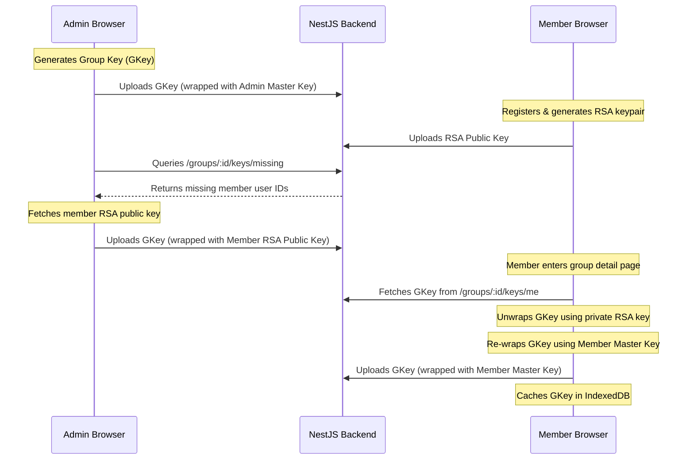

# Zero-Knowledge Group Key Flow

FinMate uses a Zero-Knowledge (ZK) encryption system to ensure that all personal and group financial data (expense titles, descriptions, attachments) remains private and undecryptable by the server. Only authorized members of a group hold the keys required to decrypt shared ledger items.

---

## Key Types & Flows

### Flow A: Personal Encryption (Symmetric)
- **Target**: Personal expenses (not part of any group).
- **Key**: User's master key, derived client-side from their password and email via PBKDF2.
- **Wrapping**: Content keys are wrapped symmetrically using the user's master key and stored on the server.
- **Decryption**: Direct symmetric unwrap using the active session key.

### Flow B: Direct Invitation (Asymmetric)
- **Target**: Registered users invited to a group.
- **Key**: Group symmetric key (AES-256-GCM), wrapped using the recipient's public wrapping key (RSA-OAEP 2048-bit).
- **Wrapping**:
  - The inviter fetches the recipient's public wrapping key from `/users/:userId/public-key`.
  - The inviter encrypts/wraps the group key using this public key.
  - The inviter uploads the wrapped key to the server under `/groups/:groupId/keys` mapped to the recipient's user ID.
- **Joining & Decryption**:
  - The recipient accepts the invite.
  - The recipient's browser fetches the wrapped key from `/groups/:groupId/keys/me`.
  - The recipient unwraps it using their asymmetric private wrapping key (stored locally/IndexedDB, unlocked by master key).
  - The recipient re-wraps the group key symmetrically using their master key, posts this symmetric version to the server, and caches the raw group key in IndexedDB.

### Flow C: Link Invitation (Temporary Invite Key - TIK)
- **Target**: Unregistered users or users without active public wrapping keys invited via secure link.
- **Key**: Group symmetric key (AES-256-GCM), wrapped with a one-time Temporary Invite Key (TIK, AES-GCM 256-bit).
- **Wrapping**:
  - The inviter generates a new random TIK.
  - The inviter wraps the group key with this TIK.
  - The inviter uploads the wrapped group key and the hash of the TIK to the server.
  - The inviter generates a link containing the invite token and the raw TIK in the hash fragment: `https://finmate.com/groups/join/:token#:tik`.
- **Joining & Decryption**:
  - The recipient clicks the link. The browser loads the TIK from `window.location.hash` (the server never sees the hash fragment).
  - The recipient's browser joins the group and receives the TIK-wrapped group key from `/groups/join/:token`.
  - The browser decrypts/unwraps the group key using the TIK.
  - The browser re-wraps the group key symmetrically with the user's master key, uploads the self-wrapped symmetric key to `/groups/:groupId/keys`, and stores the key in IndexedDB.

---

## Key Provisioning Lifecycle

---

## Recovery & Self-Healing

To keep keys updated and handle cases where members are invited while offline or before their public keys are generated:
1. **Self-Healing on Admin Load**:
   Whenever an owner or admin of a group loads the Group Detail page, the application automatically runs a background task (`checkAndProvisionMissingKeys`):
   - Queries the backend for members who lack a wrapped group key.
   - Fetches their public wrapping keys, encrypts the group key for them, and uploads the wrapped keys to the server.
2. **Manual Key Refresh**:
   If a member loads the group page and their key is not yet provisioned, the UI displays a warning banner. Clicking the **Refresh Group Key** button clears local session key caches and re-fetches the key status from the server to check if an admin has provisioned it since their last load.

---

## Troubleshooting Guide

### Issue: Banners show "Encryption key missing for this group"
- **Cause**: The group key has not been wrapped for your account yet (common if you were added to the group while the admin was offline).
- **Solution**:
  1. Ask the group owner or any admin to log in and open the Group Detail page.
  2. Once they do, click the **Check for Key** button on your warning banner to synchronize.

### Issue: Expenses show "Expense unavailable" with a lock icon
- **Cause**: Decryption failed. This happens if the local group key is missing, or if the expense was encrypted with a different key version that you don't possess.
- **Solution**:
  1. Verify your password by unlocking the vault if prompted.
  2. Trigger **Refresh Group Key** to ensure you have the latest active group key version.
  3. If key rotation has occurred, ensure an admin has visited the page to provision the rotated keys for your account.
