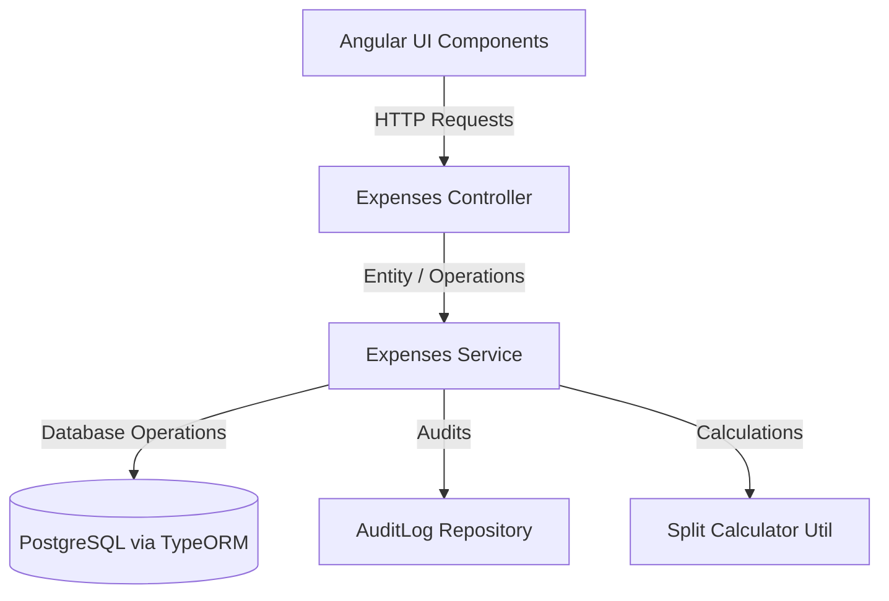

# 💰 FinMate — Complete Expenses Module Design, Models & Planning Specification

This file serves as the single source of truth for the complete **Expenses Module** in FinMate. It consolidates all details—database schemas, TypeORM entities, TypeScript interfaces, request/response DTOs, validation decorators, core mathematical algorithms, API routes, security boundaries, and frontend logic.

---

## 🧩 1. Module Overview & Architecture
The Expenses Module manages personal and group-based financial transactions. It supports dynamic split calculations, soft-delete restoration windows, zero-knowledge attachment syncing, audit logging, and concurrency control.



---

## 🗄️ 2. Database Entities & Data Models

### A. Expense Entity (`expense.entity.ts`)
*   **Path**: `shared/data-models/src/lib/expense.entity.ts`
*   **Description**: Stores the header details of an expense. Text fields (`title`, `description`) are client-side encrypted (Zero-Knowledge), while amount fields are server-side encrypted (SSE) using a TypeORM value transformer.

```typescript
import { Entity, PrimaryGeneratedColumn, Column, ManyToOne, CreateDateColumn, UpdateDateColumn, VersionColumn, Index, DeleteDateColumn } from 'typeorm';
import { User } from './user.entity';
import { Group } from './group.entity';
import { encryptionTransformer } from './encryption.transformer';

@Entity('expenses')
@Index(['group', 'status', 'expenseDate'])
@Index(['group', 'category'])
@Index(['group', 'ledgerMonth'])
export class Expense {
  @PrimaryGeneratedColumn('uuid')
  id!: string;

  @Column({ type: 'varchar', length: 160 })
  title!: string;

  @Column({ type: 'text', nullable: true })
  description?: string;

  @Column({
    type: 'varchar',
    name: 'amount_total',
    length: 255,
    transformer: encryptionTransformer,
  })
  amountTotal!: number;

  @Column({ type: 'char', length: 3 })
  currency!: string;

  @Column({ type: 'varchar', length: 64 })
  category!: string;

  @ManyToOne(() => User, { nullable: false })
  paidByUser!: User;

  @ManyToOne(() => User, { nullable: false })
  ownerUser!: User;

  @ManyToOne(() => Group, { nullable: true })
  group?: Group;

  @Column({ type: 'date' })
  expenseDate!: string;

  @Column({ type: 'varchar', length: 20, default: 'posted' })
  status!: 'draft' | 'posted' | 'void';

  /**
   * Household-only: the billing month this expense belongs to (format `YYYY-MM`).
   * Null for normal group and personal expenses.
   */
  @Column({ type: 'char', length: 7, nullable: true })
  ledgerMonth?: string;

  /**
   * True if this expense is a system-generated carry-forward record from
   * a previous month's surplus balance (household groups only).
   */
  @Column({ type: 'boolean', default: false })
  isCarryForward!: boolean;

  @VersionColumn()
  version!: number;

  @CreateDateColumn()
  createdAt!: Date;

  @UpdateDateColumn()
  updatedAt!: Date;

  @DeleteDateColumn({ name: 'deleted_at', nullable: true })
  deletedAt?: Date;
}
```

### B. Expense Split Entity (`expense-split.entity.ts`)
*   **Path**: `shared/data-models/src/lib/expense-split.entity.ts`
*   **Description**: Stores the calculated owed shares for each participant. Contains a database CHECK constraint ensuring that exactly one participant field (User ID or Group Member ID) is non-null.

```typescript
import { Entity, PrimaryGeneratedColumn, Column, CreateDateColumn, UpdateDateColumn, ManyToOne, Check } from 'typeorm';
import { Expense } from './expense.entity';
import { User } from './user.entity';
import { GroupMember } from './group-member.entity';
import { encryptionTransformer } from './encryption.transformer';

@Entity('expense_splits')
@Check('("participantUserId" IS NOT NULL AND "participantGroupMemberId" IS NULL) OR ("participantUserId" IS NULL AND "participantGroupMemberId" IS NOT NULL)')
export class ExpenseSplit {
  @PrimaryGeneratedColumn('uuid')
  id!: string;

  @ManyToOne(() => Expense, { nullable: false })
  expense!: Expense;

  @ManyToOne(() => User, { nullable: true })
  participantUser?: User;

  @ManyToOne(() => GroupMember, { nullable: true })
  participantGroupMember?: GroupMember;

  @Column({ type: 'varchar', length: 16 })
  splitType!: 'equal' | 'fixed' | 'percent' | 'share';

  @Column('decimal', { precision: 12, scale: 4 })
  shareValue!: number;

  @Column({
    type: 'varchar',
    name: 'amount_owed',
    length: 255,
    transformer: encryptionTransformer,
  })
  amountOwed!: number;

  @Column({ type: 'boolean', default: false })
  isSettled!: boolean;

  @Column({ type: 'timestamptz', nullable: true })
  settledAt?: Date;

  @CreateDateColumn()
  createdAt!: Date;

  @UpdateDateColumn()
  updatedAt!: Date;
}
```

---

## 📩 3. Data Transfer Objects (DTOs)
*   **Path**: `shared/data-models/src/lib/dto/expense.dto.ts`
*   **Description**: Validates payloads on incoming request bodies using `class-validator` and handles nested transformation with `class-transformer`.

```typescript
import { IsString, IsNotEmpty, MaxLength, IsOptional, IsEnum, IsNumber, Min, IsUUID, IsArray, ValidateNested, IsInt, IsDateString } from 'class-validator';
import { Type } from 'class-transformer';

export class ExpenseSplitInputDto {
  @IsUUID('4', { message: 'Participant User ID must be a valid UUID v4' })
  @IsOptional()
  participantUserId?: string;

  @IsUUID('4', { message: 'Participant Group Member ID must be a valid UUID v4' })
  @IsOptional()
  participantGroupMemberId?: string;

  @IsEnum(['equal', 'fixed', 'percent', 'share'], { message: 'Invalid split algorithm type' })
  @IsNotEmpty({ message: 'Split type is required' })
  splitType!: 'equal' | 'fixed' | 'percent' | 'share';

  @IsNumber({}, { message: 'Share value must be a valid numeric calculation decimal' })
  @Min(0, { message: 'Share value cannot be negative' })
  shareValue!: number;
}

export class CreateExpenseDto {
  @IsString()
  @IsNotEmpty({ message: 'Expense title is required' })
  @MaxLength(160, { message: 'Expense title cannot exceed 160 characters' })
  title!: string;

  @IsString()
  @IsOptional()
  description?: string;

  @IsNumber({}, { message: 'Total amount must be a valid numeric currency value' })
  @Min(0.01, { message: 'Total amount must be greater than zero' })
  amountTotal!: number;

  @IsString()
  @IsNotEmpty({ message: 'Currency code is required' })
  @MaxLength(3, { message: 'Currency code must be exactly 3 characters' })
  currency!: string;

  @IsString()
  @IsNotEmpty({ message: 'Expense category is required' })
  @MaxLength(64, { message: 'Expense category cannot exceed 64 characters' })
  category!: string;

  @IsUUID('4', { message: 'Paid-by User ID must be a valid UUID' })
  @IsNotEmpty({ message: 'Payer ID is required' })
  paidByUserId!: string;

  @IsUUID('4', { message: 'Group ID must be a valid UUID' })
  @IsOptional()
  groupId?: string;

  @IsDateString({}, { message: 'Expense date must be a valid ISO date string (YYYY-MM-DD)' })
  @IsNotEmpty({ message: 'Expense date is required' })
  expenseDate!: string;

  @IsEnum(['draft', 'posted', 'void'], { message: 'Invalid expense status option' })
  @IsOptional()
  status?: 'draft' | 'posted' | 'void';

  @IsArray({ message: 'Splits must be a valid collection array' })
  @ValidateNested({ each: true })
  @Type(() => ExpenseSplitInputDto)
  splits!: ExpenseSplitInputDto[];

  @IsArray({ message: 'Attachment keys must be an array of strings' })
  @IsString({ each: true, message: 'Each attachment storage key must be a string' })
  @IsOptional()
  attachmentKeys?: string[];
}

export class UpdateExpenseDto {
  @IsString()
  @IsOptional()
  @MaxLength(160, { message: 'Expense title cannot exceed 160 characters' })
  title?: string;

  @IsString()
  @IsOptional()
  description?: string;

  @IsNumber({}, { message: 'Total amount must be a valid numeric currency value' })
  @Min(0.01, { message: 'Total amount must be greater than zero' })
  amountTotal?: number;

  @IsString()
  @IsOptional()
  @MaxLength(3, { message: 'Currency code must be exactly 3 characters' })
  currency?: string;

  @IsString()
  @IsOptional()
  @MaxLength(64, { message: 'Expense category cannot exceed 64 characters' })
  category?: string;

  @IsUUID('4', { message: 'Paid-by User ID must be a valid UUID' })
  @IsOptional()
  paidByUserId?: string;

  @IsDateString({}, { message: 'Expense date must be a valid ISO date string (YYYY-MM-DD)' })
  @IsOptional()
  expenseDate?: string;

  @IsEnum(['draft', 'posted', 'void'], { message: 'Invalid expense status option' })
  @IsOptional()
  status?: 'draft' | 'posted' | 'void';

  @IsArray({ message: 'Splits must be a valid collection array' })
  @IsOptional()
  @ValidateNested({ each: true })
  @Type(() => ExpenseSplitInputDto)
  splits?: ExpenseSplitInputDto[];

  @IsArray({ message: 'Attachment keys must be an array of strings' })
  @IsString({ each: true, message: 'Each attachment storage key must be a string' })
  @IsOptional()
  attachmentKeys?: string[];

  @IsInt({ message: 'Version must be an integer' })
  @IsNotEmpty({ message: 'Version is required to resolve concurrent edits' })
  version!: number;
}
```

---

## 🧮 4. Calculations & Split Algorithms
*   **Path**: `backend/src/app/expenses/split-calculator.util.ts`
*   **Description**: Handles splitting currencies deterministically. Rounds all outputs to two decimal places and handles remainder pennies by allocating them to the payer (or alphabetically first UUID participant).

```typescript
import { BadRequestException } from '@nestjs/common';
import { ExpenseSplitInputDto } from '@finmate/data-models';

export interface CalculatedSplit {
  participantUserId?: string;
  participantGroupMemberId?: string;
  splitType: 'equal' | 'fixed' | 'percent' | 'share';
  shareValue: number;
  amountOwed: number;
}

const toCents = (amount: number): number => Math.round((amount + Number.EPSILON) * 100);
const fromCents = (cents: number): number => cents / 100;

const splitParticipantKey = (split: ExpenseSplitInputDto): string => {
  const key = split.participantUserId || split.participantGroupMemberId;
  return key || '';
};

export const validateSplitParticipants = (splits: ExpenseSplitInputDto[]): void => {
  for (const split of splits) {
    const hasUser = !!split.participantUserId;
    const hasGroupMember = !!split.participantGroupMemberId;
    if ((hasUser && hasGroupMember) || (!hasUser && !hasGroupMember)) {
      throw new BadRequestException({
        errorCode: 'VAL_INVALID_INPUT',
        message: 'Each split must include exactly one participant identifier',
      });
    }
  }
};

export const calculateDeterministicSplits = (
  amountTotal: number,
  splits: ExpenseSplitInputDto[],
  payerKey?: string,
): CalculatedSplit[] => {
  if (!splits.length) {
    throw new BadRequestException({
      errorCode: 'VAL_INVALID_INPUT',
      message: 'At least one split is required',
    });
  }

  validateSplitParticipants(splits);

  const splitType = splits[0].splitType;
  const mixedTypes = splits.some((s) => s.splitType !== splitType);
  if (mixedTypes) {
    throw new BadRequestException({
      errorCode: 'VAL_INVALID_INPUT',
      message: 'All split lines must use the same splitType',
    });
  }

  const totalCents = toCents(amountTotal);
  if (totalCents <= 0) {
    throw new BadRequestException({
      errorCode: 'VAL_INVALID_INPUT',
      message: 'Total amount must be greater than zero',
    });
  }

  const withMeta = splits.map((s, index) => ({
    ...s,
    index,
    participantKey: splitParticipantKey(s),
  }));

  if (splitType === 'fixed') {
    const calculated = withMeta.map((s) => ({
      ...s,
      amountCents: toCents(s.shareValue),
    }));

    const fixedSum = calculated.reduce((acc, curr) => acc + curr.amountCents, 0);
    if (fixedSum !== totalCents) {
      throw new BadRequestException({
        errorCode: 'VAL_INVALID_INPUT',
        message: 'Fixed split amounts must equal amountTotal',
      });
    }

    return calculated.map((s) => ({
      participantUserId: s.participantUserId,
      participantGroupMemberId: s.participantGroupMemberId,
      splitType,
      shareValue: s.shareValue,
      amountOwed: fromCents(s.amountCents),
    }));
  }

  let totalWeight = 0;
  const weighted = withMeta.map((s) => {
    const weight = splitType === 'equal' ? 1 : Number(s.shareValue);
    if (!Number.isFinite(weight) || weight <= 0) {
      throw new BadRequestException({
        errorCode: 'VAL_INVALID_INPUT',
        message: 'Share values must be positive numbers',
      });
    }
    totalWeight += weight;
    return { ...s, weight };
  });

  if (splitType === 'percent' && Math.round(totalWeight * 100) !== 10000) {
    throw new BadRequestException({
      errorCode: 'VAL_INVALID_INPUT',
      message: 'Percent split values must sum to 100',
    });
  }

  const base = weighted.map((s) => ({
    ...s,
    amountCents: Math.floor((totalCents * s.weight) / totalWeight),
  }));

  const baseSum = base.reduce((acc, curr) => acc + curr.amountCents, 0);
  const remainder = totalCents - baseSum;

  const allocationOrder = [...base].sort((a, b) => {
    const aPayerPriority = a.participantKey === payerKey ? 0 : 1;
    const bPayerPriority = b.participantKey === payerKey ? 0 : 1;
    if (aPayerPriority !== bPayerPriority) {
      return aPayerPriority - bPayerPriority;
    }
    return a.participantKey.localeCompare(b.participantKey);
  });

  if (remainder > 0) {
    for (let i = 0; i < remainder; i++) {
      allocationOrder[i % allocationOrder.length].amountCents += 1;
    }
  }

  if (remainder < 0) {
    for (let i = 0; i < Math.abs(remainder); i++) {
      allocationOrder[i % allocationOrder.length].amountCents -= 1;
    }
  }

  return base.map((s) => ({
    participantUserId: s.participantUserId,
    participantGroupMemberId: s.participantGroupMemberId,
    splitType,
    shareValue: splitType === 'equal' ? 1 : s.shareValue,
    amountOwed: fromCents(s.amountCents),
  }));
};
```

---

## 🔌 5. Frontend Service Layer
*   **Path**: `frontend/src/app/features/groups/services/expenses.service.ts`
*   **Description**: Relocated HTTP client wrapper for components to query backend API controllers.

```typescript
import { Injectable, inject } from '@angular/core';
import { HttpClient, HttpParams } from '@angular/common/http';
import { Observable } from 'rxjs';
import { Expense } from '@finmate/data-models';

export interface GetExpensesResponse {
  data: Expense[];
  meta?: {
    totalItems: number;
  };
}

@Injectable({
  providedIn: 'root'
})
export class ExpensesService {
  private http = inject(HttpClient);

  /**
   * Fetch expenses for a group or personal dashboard.
   */
  getExpenses(
    groupId: string,
    options: { page?: number; limit?: number; category?: string; startDate?: string; endDate?: string } = {}
  ): Observable<GetExpensesResponse> {
    let params = new HttpParams().set('groupId', groupId);
    
    if (options.page !== undefined) {
      params = params.set('page', options.page.toString());
    }
    if (options.limit !== undefined) {
      params = params.set('limit', options.limit.toString());
    }
    if (options.category) {
      params = params.set('category', options.category);
    }
    if (options.startDate) {
      params = params.set('startDate', options.startDate);
    }
    if (options.endDate) {
      params = params.set('endDate', options.endDate);
    }

    return this.http.get<GetExpensesResponse>('/api/expenses', { params });
  }

  /**
   * Create a new expense.
   */
  createExpense(payload: any): Observable<Expense> {
    return this.http.post<Expense>('/api/expenses', payload);
  }

  /**
   * Update an existing expense.
   */
  updateExpense(id: string, payload: any): Observable<Expense> {
    return this.http.patch<Expense>(`/api/expenses/${id}`, payload);
  }

  /**
   * Delete an expense.
   */
  deleteExpense(id: string): Observable<void> {
    return this.http.delete<void>(`/api/expenses/${id}`);
  }

  /**
   * Restore a deleted expense.
   */
  restoreExpense(id: string): Observable<Expense> {
    return this.http.post<Expense>(`/api/expenses/${id}/restore`, {});
  }

  /**
   * Fetch monthly summaries for analytics.
   */
  getMonthlyAnalytics(groupId?: string): Observable<any[]> {
    let url = '/api/expenses/analytics/monthly';
    if (groupId && groupId !== 'personal') {
      url += `?groupId=${groupId}`;
    }
    return this.http.get<any[]>(url);
  }

  /**
   * Fetch category analytics.
   */
  getCategoryAnalytics(groupId?: string): Observable<any[]> {
    let url = '/api/expenses/analytics/categories';
    if (groupId && groupId !== 'personal') {
      url += `?groupId=${groupId}`;
    }
    return this.http.get<any[]>(url);
  }

  /**
   * Export expenses ledger.
   */
  exportExpenses(groupId: string, format: 'csv' | 'xlsx'): Observable<Blob> {
    return this.http.get(`/api/export/expenses?groupId=${groupId}&format=${format}`, {
      responseType: 'blob'
    });
  }

  /**
   * Import expenses.
   */
  importExpenses(formData: FormData): Observable<void> {
    return this.http.post<void>('/api/import/expenses', formData);
  }
}
```

---

## ⚡ 6. Core Business Logic Summary

### 🛡️ Access Control Policy
*   **Personal Context**: Governed by individual ownership. Only the user who paid or created the personal expense (`group_id` is null) can access or modify it.
*   **Shared Group Context**: Enforces Role-Based Access Control (RBAC):
    *   **Owners & Admins**: Can view, edit, delete, or restore any group expense.
    *   **Members**: Can only edit, delete, or restore expenses they authored or paid.
    *   **Viewers & Spectators**: Viewers have read-only access. Spectators can create/update their own expenses but are excluded from splits.

### 🔐 Server-Side Encryption (SSE)
Amounts are securely stored as ciphertexts inside `VARCHAR(255)` columns in the PostgreSQL database. They are transparently encrypted and decrypted using `AES-256-GCM` via TypeORM value transformers.
To calculate analytics without decrypting every row in SQL:
1. Load base fields and the encrypted values into memory.
2. Decrypt in memory inside NestJS services before computing summaries.

### ⚠️ API Errors
*   `VAL_INVALID_INPUT` (400): Request parameters validation failure.
*   `EXP_CURRENCY_MISMATCH` (400): Mismatch between transaction currency and group base currency.
*   `EXP_SPECTATOR_SPLIT` (400): Including spectator members in splits.
*   `EXP_MONTH_LOCKED` (403): Mutation of household expenses in finalized past months.
*   `EXP_RESTORE_WINDOW` (403): Restoring a soft-deleted expense outside the deadline window.
*   `CON_VERSION_CONFLICT` (412): Version mismatch resulting from concurrent updates.
