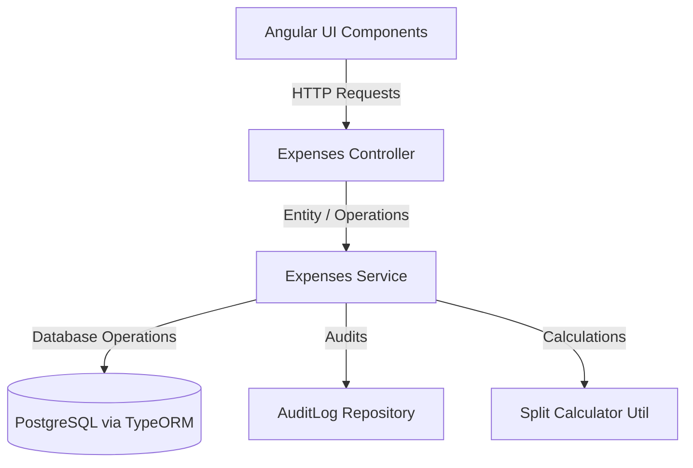

# 💰 FinMate — Complete Expenses Module Design, Models & Planning Specification

This file serves as the single source of truth for the complete **Expenses Module** in FinMate. It consolidates all details—database schemas, TypeORM entities, TypeScript interfaces, request/response DTOs, validation decorators, core mathematical algorithms, API routes, security boundaries, and frontend logic.

---

## 🧩 1. Module Overview & Architecture

The Expenses Module manages personal and group-based financial transactions. It supports dynamic split calculations, soft-delete restoration windows, zero-knowledge attachment syncing, audit logging, and concurrency control.



---

## 🗄️ 2. Database Entities & Data Models

### A. Expense Entity (`expense.entity.ts`)

- **Path**: `shared/data-models/src/lib/expense.entity.ts`
- **Description**: Stores the header details of an expense. Text fields (`title`, `description`) are client-side encrypted (Zero-Knowledge), while amount fields are server-side encrypted (SSE) using a TypeORM value transformer.

```typescript
import { Entity, PrimaryGeneratedColumn, Column, ManyToOne, CreateDateColumn, UpdateDateColumn, VersionColumn, Index, DeleteDateColumn } from 'typeorm';
import { User } from './user.entity';
import { Group } from './group.entity';

@Entity('expenses')
@Index(['group', 'status', 'expenseDate'])
@Index(['group', 'category'])
@Index(['group', 'ledgerMonth'])
export class Expense {
  @PrimaryGeneratedColumn('uuid')
  id!: string;

  @Column({ type: 'text' })
  title!: string;

  @Column({ type: 'text', nullable: true })
  description?: string;

  @Column('decimal', {
    name: 'amount_total',
    precision: 12,
    scale: 2,
  })
  amountTotal!: number;

  @Column({ type: 'char', length: 3 })
  currency!: string;

  @Column({ type: 'varchar', length: 64 })
  category!: string;

  @ManyToOne(() => User, { nullable: false })
  paidByUser!: User;

  @ManyToOne(() => User, { nullable: false })
  ownerUser!: User;

  @ManyToOne(() => Group, { nullable: true })
  group?: Group;

  @Column({ type: 'date' })
  expenseDate!: string;

  @Column({ type: 'varchar', length: 20, default: 'posted' })
  status!: 'draft' | 'posted' | 'void';

  /**
   * Household-only: the billing month this expense belongs to (format `YYYY-MM`).
   * Null for normal group and personal expenses.
   */
  @Column({ type: 'char', length: 7, nullable: true })
  ledgerMonth?: string;

  /**
   * True if this expense is a system-generated carry-forward record from
   * a previous month's surplus balance (household groups only).
   */
  @Column({ type: 'boolean', default: false })
  isCarryForward!: boolean;

  @VersionColumn()
  version!: number;

  @CreateDateColumn()
  createdAt!: Date;

  @UpdateDateColumn()
  updatedAt!: Date;

  @DeleteDateColumn({ name: 'deleted_at', nullable: true })
  deletedAt?: Date;
}
```

### B. Expense Split Entity (`expense-split.entity.ts`)

- **Path**: `shared/data-models/src/lib/expense-split.entity.ts`
- **Description**: Stores the calculated owed shares for each participant. Contains a database CHECK constraint ensuring that exactly one participant field (User ID or Group Member ID) is non-null.

```typescript
import { Entity, PrimaryGeneratedColumn, Column, CreateDateColumn, UpdateDateColumn, ManyToOne, Check } from 'typeorm';
import { Expense } from './expense.entity';
import { User } from './user.entity';
import { GroupMember } from './group-member.entity';

@Entity('expense_splits')
@Check('("participantUserId" IS NOT NULL AND "participantGroupMemberId" IS NULL) OR ("participantUserId" IS NULL AND "participantGroupMemberId" IS NOT NULL)')
export class ExpenseSplit {
  @PrimaryGeneratedColumn('uuid')
  id!: string;

  @ManyToOne(() => Expense, { nullable: false })
  expense!: Expense;

  @ManyToOne(() => User, { nullable: true })
  participantUser?: User;

  @ManyToOne(() => GroupMember, { nullable: true })
  participantGroupMember?: GroupMember;

  @Column({ type: 'varchar', length: 16 })
  splitType!: 'equal' | 'fixed' | 'percent' | 'share';

  @Column('decimal', { precision: 12, scale: 4 })
  shareValue!: number;

  @Column('decimal', {
    name: 'amount_owed',
    precision: 12,
    scale: 2,
  })
  amountOwed!: number;

  @Column({ type: 'boolean', default: false })
  isSettled!: boolean;

  @Column({ type: 'timestamptz', nullable: true })
  settledAt?: Date;

  @CreateDateColumn()
  createdAt!: Date;

  @UpdateDateColumn()
  updatedAt!: Date;
}
```

### C. Group Member Contribution Entity (`group-member-contribution.entity.ts`)

- **Path**: `shared/data-models/src/lib/group-member-contribution.entity.ts`
- **Description**: Stores the custom percentage share of a group member for a given household ledger month. Sum of percentages of all active members in a month must equal exactly 100.00.

```typescript
import { Entity, PrimaryGeneratedColumn, Column, ManyToOne, Unique, CreateDateColumn, UpdateDateColumn } from 'typeorm';
import { GroupMember } from './group-member.entity';

@Entity('group_member_contributions')
@Unique(['groupMember', 'ledgerMonth'])
export class GroupMemberContribution {
  @PrimaryGeneratedColumn('uuid')
  id!: string;

  @ManyToOne(() => GroupMember, { nullable: false, onDelete: 'CASCADE' })
  groupMember!: GroupMember;

  @Column({ type: 'char', length: 7 })
  ledgerMonth!: string; // Format: YYYY-MM

  @Column('decimal', { precision: 5, scale: 2 })
  percentage!: number; // Percentage value (e.g. 60.00 for 60%)

  @CreateDateColumn()
  createdAt!: Date;

  @UpdateDateColumn()
  updatedAt!: Date;
}
```

---

## 📩 3. Data Transfer Objects (DTOs)

- **Path**: `shared/data-models/src/lib/dto/expense.dto.ts`
- **Description**: Validates payloads on incoming request bodies using `class-validator` and handles nested transformation with `class-transformer`.

```typescript
import { IsString, IsNotEmpty, MaxLength, IsOptional, IsEnum, IsNumber, Min, IsUUID, IsArray, ValidateNested, IsInt, IsDateString } from 'class-validator';
import { Type } from 'class-transformer';

export class ExpenseSplitInputDto {
  @IsUUID('4', { message: 'Participant User ID must be a valid UUID v4' })
  @IsOptional()
  participantUserId?: string;

  @IsUUID('4', { message: 'Participant Group Member ID must be a valid UUID v4' })
  @IsOptional()
  participantGroupMemberId?: string;

  @IsEnum(['equal', 'fixed', 'percent', 'share'], { message: 'Invalid split algorithm type' })
  @IsNotEmpty({ message: 'Split type is required' })
  splitType!: 'equal' | 'fixed' | 'percent' | 'share';

  @IsNumber({}, { message: 'Share value must be a valid numeric calculation decimal' })
  @Min(0, { message: 'Share value cannot be negative' })
  shareValue!: number;
}

export class CreateExpenseDto {
  @IsString()
  @IsNotEmpty({ message: 'Expense title is required' })
  @MaxLength(160, { message: 'Expense title cannot exceed 160 characters' })
  title!: string;

  @IsString()
  @IsOptional()
  description?: string;

  @IsNumber({}, { message: 'Total amount must be a valid numeric currency value' })
  @Min(0.01, { message: 'Total amount must be greater than zero' })
  amountTotal!: number;

  @IsString()
  @IsNotEmpty({ message: 'Currency code is required' })
  @MaxLength(3, { message: 'Currency code must be exactly 3 characters' })
  currency!: string;

  @IsString()
  @IsNotEmpty({ message: 'Expense category is required' })
  @MaxLength(64, { message: 'Expense category cannot exceed 64 characters' })
  category!: string;

  @IsUUID('4', { message: 'Paid-by User ID must be a valid UUID' })
  @IsNotEmpty({ message: 'Payer ID is required' })
  paidByUserId!: string;

  @IsUUID('4', { message: 'Group ID must be a valid UUID' })
  @IsOptional()
  groupId?: string;

  @IsDateString({}, { message: 'Expense date must be a valid ISO date string (YYYY-MM-DD)' })
  @IsNotEmpty({ message: 'Expense date is required' })
  expenseDate!: string;

  @IsEnum(['draft', 'posted', 'void'], { message: 'Invalid expense status option' })
  @IsOptional()
  status?: 'draft' | 'posted' | 'void';

  @IsArray({ message: 'Splits must be a valid collection array' })
  @ValidateNested({ each: true })
  @Type(() => ExpenseSplitInputDto)
  splits!: ExpenseSplitInputDto[];

  @IsArray({ message: 'Attachment keys must be an array of strings' })
  @IsString({ each: true, message: 'Each attachment storage key must be a string' })
  @IsOptional()
  attachmentKeys?: string[];
}

export class UpdateExpenseDto {
  @IsString()
  @IsOptional()
  @MaxLength(160, { message: 'Expense title cannot exceed 160 characters' })
  title?: string;

  @IsString()
  @IsOptional()
  description?: string;

  @IsNumber({}, { message: 'Total amount must be a valid numeric currency value' })
  @Min(0.01, { message: 'Total amount must be greater than zero' })
  amountTotal?: number;

  @IsString()
  @IsOptional()
  @MaxLength(3, { message: 'Currency code must be exactly 3 characters' })
  currency?: string;

  @IsString()
  @IsOptional()
  @MaxLength(64, { message: 'Expense category cannot exceed 64 characters' })
  category?: string;

  @IsUUID('4', { message: 'Paid-by User ID must be a valid UUID' })
  @IsOptional()
  paidByUserId?: string;

  @IsDateString({}, { message: 'Expense date must be a valid ISO date string (YYYY-MM-DD)' })
  @IsOptional()
  expenseDate?: string;

  @IsEnum(['draft', 'posted', 'void'], { message: 'Invalid expense status option' })
  @IsOptional()
  status?: 'draft' | 'posted' | 'void';

  @IsArray({ message: 'Splits must be a valid collection array' })
  @IsOptional()
  @ValidateNested({ each: true })
  @Type(() => ExpenseSplitInputDto)
  splits?: ExpenseSplitInputDto[];

  @IsArray({ message: 'Attachment keys must be an array of strings' })
  @IsString({ each: true, message: 'Each attachment storage key must be a string' })
  @IsOptional()
  attachmentKeys?: string[];

  @IsInt({ message: 'Version must be an integer' })
  @IsNotEmpty({ message: 'Version is required to resolve concurrent edits' })
  version!: number;
}

export class MemberPercentageInputDto {
  @IsUUID('4', { message: 'Member ID must be a valid UUID' })
  @IsNotEmpty({ message: 'Member ID is required' })
  memberId!: string;

  @IsNumber({}, { message: 'Percentage must be a valid decimal number' })
  @Min(0, { message: 'Percentage cannot be negative' })
  percentage!: number;
}

export class UpdateContributionDto {
  @IsString()
  @IsNotEmpty({ message: 'Ledger month is required' })
  @MaxLength(7)
  ledgerMonth!: string; // YYYY-MM

  @IsArray({ message: 'Contributions must be an array' })
  @ValidateNested({ each: true })
  @Type(() => MemberPercentageInputDto)
  contributions!: MemberPercentageInputDto[];
}
```

---

## 🧮 4. Calculations & Split Algorithms

- **Path**: `backend/src/app/expenses/split-calculator.util.ts`
- **Description**: Handles splitting currencies deterministically. Rounds all outputs to two decimal places and handles remainder pennies by allocating them to the payer (or alphabetically first UUID participant).

```typescript
import { BadRequestException } from '@nestjs/common';
import { ExpenseSplitInputDto } from '@finmate/data-models';

export interface CalculatedSplit {
  participantUserId?: string;
  participantGroupMemberId?: string;
  splitType: 'equal' | 'fixed' | 'percent' | 'share';
  shareValue: number;
  amountOwed: number;
}

const toCents = (amount: number): number => Math.round((amount + Number.EPSILON) * 100);
const fromCents = (cents: number): number => cents / 100;

const splitParticipantKey = (split: ExpenseSplitInputDto): string => {
  const key = split.participantUserId || split.participantGroupMemberId;
  return key || '';
};

export const validateSplitParticipants = (splits: ExpenseSplitInputDto[]): void => {
  for (const split of splits) {
    const hasUser = !!split.participantUserId;
    const hasGroupMember = !!split.participantGroupMemberId;
    if ((hasUser && hasGroupMember) || (!hasUser && !hasGroupMember)) {
      throw new BadRequestException({
        errorCode: 'VAL_INVALID_INPUT',
        message: 'Each split must include exactly one participant identifier',
      });
    }
  }
};

export const calculateDeterministicSplits = (amountTotal: number, splits: ExpenseSplitInputDto[], payerKey?: string): CalculatedSplit[] => {
  if (!splits.length) {
    throw new BadRequestException({
      errorCode: 'VAL_INVALID_INPUT',
      message: 'At least one split is required',
    });
  }

  validateSplitParticipants(splits);

  const splitType = splits[0].splitType;
  const mixedTypes = splits.some((s) => s.splitType !== splitType);
  if (mixedTypes) {
    throw new BadRequestException({
      errorCode: 'VAL_INVALID_INPUT',
      message: 'All split lines must use the same splitType',
    });
  }

  const totalCents = toCents(amountTotal);
  if (totalCents <= 0) {
    throw new BadRequestException({
      errorCode: 'VAL_INVALID_INPUT',
      message: 'Total amount must be greater than zero',
    });
  }

  const withMeta = splits.map((s, index) => ({
    ...s,
    index,
    participantKey: splitParticipantKey(s),
  }));

  if (splitType === 'fixed') {
    const calculated = withMeta.map((s) => ({
      ...s,
      amountCents: toCents(s.shareValue),
    }));

    const fixedSum = calculated.reduce((acc, curr) => acc + curr.amountCents, 0);
    if (fixedSum !== totalCents) {
      throw new BadRequestException({
        errorCode: 'VAL_INVALID_INPUT',
        message: 'Fixed split amounts must equal amountTotal',
      });
    }

    return calculated.map((s) => ({
      participantUserId: s.participantUserId,
      participantGroupMemberId: s.participantGroupMemberId,
      splitType,
      shareValue: s.shareValue,
      amountOwed: fromCents(s.amountCents),
    }));
  }

  let totalWeight = 0;
  const weighted = withMeta.map((s) => {
    const weight = splitType === 'equal' ? 1 : Number(s.shareValue);
    if (!Number.isFinite(weight) || weight <= 0) {
      throw new BadRequestException({
        errorCode: 'VAL_INVALID_INPUT',
        message: 'Share values must be positive numbers',
      });
    }
    totalWeight += weight;
    return { ...s, weight };
  });

  if (splitType === 'percent' && Math.round(totalWeight * 100) !== 10000) {
    throw new BadRequestException({
      errorCode: 'VAL_INVALID_INPUT',
      message: 'Percent split values must sum to 100',
    });
  }

  const base = weighted.map((s) => ({
    ...s,
    amountCents: Math.floor((totalCents * s.weight) / totalWeight),
  }));

  const baseSum = base.reduce((acc, curr) => acc + curr.amountCents, 0);
  const remainder = totalCents - baseSum;

  const allocationOrder = [...base].sort((a, b) => {
    const aPayerPriority = a.participantKey === payerKey ? 0 : 1;
    const bPayerPriority = b.participantKey === payerKey ? 0 : 1;
    if (aPayerPriority !== bPayerPriority) {
      return aPayerPriority - bPayerPriority;
    }
    return a.participantKey.localeCompare(b.participantKey);
  });

  if (remainder > 0) {
    for (let i = 0; i < remainder; i++) {
      allocationOrder[i % allocationOrder.length].amountCents += 1;
    }
  }

  if (remainder < 0) {
    for (let i = 0; i < Math.abs(remainder); i++) {
      allocationOrder[i % allocationOrder.length].amountCents -= 1;
    }
  }

  return base.map((s) => ({
    participantUserId: s.participantUserId,
    participantGroupMemberId: s.participantGroupMemberId,
    splitType,
    shareValue: splitType === 'equal' ? 1 : s.shareValue,
    amountOwed: fromCents(s.amountCents),
  }));
};
```

---

## 🔌 5. Frontend Service Layer

- **Path**: `frontend/src/app/features/groups/services/expenses.service.ts`
- **Description**: HTTP client wrapper for components to query backend API controllers. Integrates with `ClientEncryptionService` and `AuthState` to transparently encrypt outgoing `title`/`description` fields and decrypt them on retrieval.

**Key integration points:**

1.  Injects `Store` (NGXS) and `ClientEncryptionService`.
2.  `encryptPayload(payload)` — private helper that loads the master key from IndexedDB via `ZkKeyVaultService` and encrypts `title`/`description` before HTTP transmission.
3.  Outgoing `createExpense` / `updateExpense` — pipes through `from(encryptPayload(...))` → `mergeMap` HTTP call → async decrypt response.
4.  Incoming `getExpenses` / `restoreExpense` — decrypts each expense's `title`/`description` after HTTP response via `mergeMap` + `Promise.all`. Decryption failures gracefully substitute a generic placeholder (`DECRYPTION_FAILED_PLACEHOLDER`) to ensure ciphertexts never bleed into the UI, maintaining user-friendly, non-technical error states.

```typescript
import { Injectable, inject } from '@angular/core';
import { HttpClient, HttpParams } from '@angular/common/http';
import { from, Observable } from 'rxjs';
import { map, mergeMap } from 'rxjs/operators';
import { environment } from '../../../../environments/environment';
import { Store } from '@ngxs/store';
import { AuthState } from '../../../core/auth/auth.state';
import { ClientEncryptionService } from '../../../core/services/encryption.service';
import {
  CategoryAnalyticsPoint,
  CreateExpenseDto,
  Expense,
  GetExpensesResponse,
  MonthlyAnalyticsPoint,
  UpdateExpenseDto,
} from '@finmate/data-models';
import { SESSION_EXPIRED_MESSAGE } from '../../../core/constants/crypto.constants';
import {
  mapDecryptExpense,
  mapDecryptExpenses,
} from '../../../core/utils/crypto-operators';

@Injectable({
  providedIn: 'root',
})
export class ExpensesService {
  private http = inject(HttpClient);
  private store = inject(Store);
  private encryptionService = inject(ClientEncryptionService);
  private baseUrl = environment.apiBaseUrl;

  /**
   * Encrypts CreateExpenseDto or UpdateExpenseDto outgoing payloads.
   */
  private async encryptPayload(
    payload: CreateExpenseDto | UpdateExpenseDto,
  ): Promise<any> {
    const user = this.store.selectSnapshot(AuthState.getUser);
    const email = user?.email;
    if (email) {
      const key = await this.encryptionService.loadKeyFromSession(email);
      if (!key) {
        throw new Error(SESSION_EXPIRED_MESSAGE);
      }

      const encrypted = { ...payload };

      if (payload.title) {
        encrypted.title = await this.encryptionService.encrypt(
          payload.title,
          key,
        );
      }

      if (payload.description) {
        encrypted.description = await this.encryptionService.encrypt(
          payload.description,
          key,
        );
      }

      return encrypted;
    }
    return payload;
  }

  /**
   * Fetch expenses for a group or personal dashboard.
   */
  getExpenses(
    groupId: string,
    options: {
      page?: number;
      limit?: number;
      category?: string;
      startDate?: string;
      endDate?: string;
    } = {},
  ): Observable<GetExpensesResponse> {
    let params = new HttpParams().set('groupId', groupId);

    if (options.page !== undefined) {
      params = params.set('page', options.page.toString());
    }
    if (options.limit !== undefined) {
      params = params.set('limit', options.limit.toString());
    }
    if (options.category) {
      params = params.set('category', options.category);
    }
    if (options.startDate) {
      params = params.set('startDate', options.startDate);
    }
    if (options.endDate) {
      params = params.set('endDate', options.endDate);
    }

    return this.http
      .get<GetExpensesResponse>(`${this.baseUrl}/expenses`, { params })
      .pipe(
        mergeMap(async (res) => {
          if (res.data) {
            const decryptedData = await new Promise<Expense[]>((resolve) => {
              mapDecryptExpenses<Expense>(this.store, this.encryptionService)(
                from([res.data as Expense[]]),
              ).subscribe((data) => resolve(data));
            });
            res.data = decryptedData;
          }
          return res;
        }),
      );
  }

  /**
   * Create a new expense.
   */
  createExpense(payload: CreateExpenseDto): Observable<Expense> {
    return from(this.encryptPayload(payload)).pipe(
      mergeMap((encryptedPayload) =>
        this.http.post<Expense>(`${this.baseUrl}/expenses`, encryptedPayload),
      ),
      mapDecryptExpense(this.store, this.encryptionService),
    );
  }

  /**
   * Update an existing expense.
   */
  updateExpense(id: string, payload: UpdateExpenseDto): Observable<Expense> {
    return from(this.encryptPayload(payload)).pipe(
      mergeMap((encryptedPayload) =>
        this.http.patch<Expense>(
          `${this.baseUrl}/expenses/${id}`,
          encryptedPayload,
        ),
      ),
      mapDecryptExpense(this.store, this.encryptionService),
    );
  }

  /**
   * Delete an expense.
   */
  deleteExpense(id: string): Observable<void> {
    return this.http.delete<void>(`${this.baseUrl}/expenses/${id}`);
  }

  /**
   * Restore a deleted expense.
   */
  restoreExpense(id: string): Observable<Expense> {
    return this.http
      .post<Expense>(`${this.baseUrl}/expenses/${id}/restore`, {})
      .pipe(mapDecryptExpense(this.store, this.encryptionService));
  }

  /**
   * Fetch monthly summaries for analytics.
   */
  getMonthlyAnalytics(groupId?: string): Observable<MonthlyAnalyticsPoint[]> {
    let url = `${this.baseUrl}/expenses/analytics/monthly`;
    if (groupId && groupId !== 'personal') {
      url += `?groupId=${groupId}`;
    }
    return this.http.get<MonthlyAnalyticsPoint[]>(url);
  }

  /**
   * Fetch category analytics.
   */
  getCategoryAnalytics(groupId?: string): Observable<CategoryAnalyticsPoint[]> {
    let url = `${this.baseUrl}/expenses/analytics/categories`;
    if (groupId && groupId !== 'personal') {
      url += `?groupId=${groupId}`;
    }
    return this.http.get<CategoryAnalyticsPoint[]>(url);
  }

  /**
   * Export expenses ledger.
   */
  exportExpenses(groupId: string, format: 'csv' | 'xlsx'): Observable<Blob> {
    return this.http.get(
      `${this.baseUrl}/export/expenses?groupId=${groupId}&format=${format}`,
      {
        responseType: 'blob',
      },
    );
  }

  /**
   * Import expenses.
   */
  importExpenses(formData: FormData): Observable<void> {
    return this.http.post<void>(`${this.baseUrl}/import/expenses`, formData);
  }
}
```

---

## 👥 6. Group Member Invitation Flow

This section covers how users are added to groups, detailing both the existing backend structures and the planned frontend implementation.

### A. Backend Implementation (Existing)

- **Controller**: `MembersController` (`@Controller('groups/:id/members')`)
- **Service**: `GroupsService`
  - `inviteMember(userId, groupId, dto: InviteMemberDto)`:
    - Accepts `email` and optional `role` (`admin`, `member`, `viewer`).
    - Enforces RBAC: Only group **Owners** and **Admins** can invite.
    - If the user exists: updates/re-invites `GroupMember` with `joinStatus: 'invited'`.
    - If the user does not exist: creates a placeholder `User` with `status: 'invited'` and saves the membership.
  - `listMembers(userId, groupId)`:
    - Lists all memberships.
  - `updateMember(userId, groupId, memberId, dto: UpdateMemberDto)`:
    - _Self-update_: Accepting invitation (`joinStatus: 'active'`) or leaving (`joinStatus: 'left'`).
    - _Admin-update_: Promoting/demoting `role`, or removing (`joinStatus: 'removed'`).
  - `removeMember(userId, groupId, memberId)`:
    - Removes or leaves membership.

### B. Frontend Implementation Plan (Pending)

#### 1. Service Integration

Add the following endpoints to frontend `GroupsService` (`frontend/src/app/features/groups/services/groups.service.ts`):

```typescript
inviteMember(groupId: string, email: string, role: string): Observable<GroupMember> {
  return this.http.post<GroupMember>(`/api/groups/${groupId}/members`, { email, role });
}

updateMember(groupId: string, memberId: string, payload: { role?: string; joinStatus?: string }): Observable<GroupMember> {
  return this.http.patch<GroupMember>(`/api/groups/${groupId}/members/${memberId}`, payload);
}

removeMember(groupId: string, memberId: string): Observable<void> {
  return this.http.delete<void>(`/api/groups/${groupId}/members/${memberId}`);
}
```

#### 2. UI Components Update

- **Modify `GroupMembersComponent`** (`frontend/src/app/features/groups/components/group-members/group-members.component.ts`) from a read-only list to support management actions:
  - **Invite Form**: Add an inline input field for email and a role dropdown (visible only to Owners/Admins) to send invites.
  - **Role Management**: Render a select dropdown for active members to allow Owners/Admins to promote or demote roles.
  - **Kick Action**: Render a "Remove" button next to members, visible to Owners/Admins (disabled for self/owner).

#### 3. Dashboard / Invitations List Component

- Create a "Pending Invitations" dashboard/section in the layout, letting users see active invitations sent to them.
- Provide simple "Accept" and "Decline" buttons.

---

## 📊 7. Household Monthly Contribution & Carry-Forward Logic

Enables household groups to establish custom monthly spending targets for each user, calculate month-end balances based on these targets, and display relative visual status.

### A. Core Calculations & Target-matching

In a household group, the total posted expenses $S$ for a ledger month represents the group's monthly expenditure.

- Each participant $u$'s target contribution is calculated as:
  $$T_u = S \times \text{percentage}_u$$
- The actual amount user $u$ contributed (paid) is $P_u$.
- The status delta is:
  $$D_u = P_u - T_u$$
- If $D_u > 0$: User $u$ has over-contributed (spent more than their share) by $+D_u$.
- If $D_u < 0$: User $u$ has under-contributed by $-D_u$.

### B. Month-End Rollover setting

- **Single Toggle Settings**: A setting `carryForwardEnabled` (boolean) on the Group entity controls the ledger month closure behavior:
  - **Enabled (ON)**: At the end of the month, the delta balance $D_u$ is carried forward into the next month's ledger as a system-generated carry-forward expense (amount = $D_u$ underpayer pays overpayer).
  - **Disabled (OFF)**: Deltas are not rolled over. Members must settle the balances directly using the smart settlement recommendations, resetting starting balances for the new month to 0.

### C. Dashboard Comparison Bar Graph (Visual representation)

On the main Group Dashboard, a comparison widget renders a progress bar for each active member:

- **Expected Base**: Shows actual paid amount $P_u$ relative to their expected target $T_u$.
- **Visual Status Colors**:
  - If $D_u > 0$ (Over-contributed): The bar is filled up to $T_u$ and the extra segment $+D_u$ is rendered in **green** with a `+` label.
  - If $D_u < 0$ (Under-contributed): The bar is filled up to $P_u$, and the remaining segment to meet the target $T_u$ is highlighted in **red/orange** with a `-` label indicating the remaining amount left to pay/contribute.

---

## 📊 8. Import/Export (CSV, XLSX) Support

Enables offline bulk editing and migrations. Exported files align with the import schema, allowing zero-modification re-imports of the exact same records.

### 📋 CSV Schema v1 (and XLSX Template Columns)

Both CSV and XLSX files share the same column layout and header names:

| Column Index | Column Header | Data Type | Constraint / Validation                                          | Description                                                                               |
| :----------- | :------------ | :-------- | :--------------------------------------------------------------- | :---------------------------------------------------------------------------------------- |
| 1            | `date`        | Date      | Required. Format: `YYYY-MM-DD`. Must be in the past or today.    | The calendar date of the expense.                                                         |
| 2            | `title`       | String    | Required. Max 160 characters.                                    | Short name of the expense.                                                                |
| 3            | `amount`      | Decimal   | Required. Positive number (> 0.00). Max 2 decimal places.        | Total expenditure amount.                                                                 |
| 4            | `currency`    | String    | Required. ISO 4217 code (3 chars, uppercase, e.g. `INR`, `USD`). | Transaction currency.                                                                     |
| 5            | `category`    | String    | Required. Max 64 characters.                                     | Expense category (e.g. Travel, Food).                                                     |
| 6            | `payer_email` | String    | Required. Valid email format. Must belong to an active member.   | The user who paid the amount.                                                             |
| 7            | `split_type`  | String    | Required. Enum: `equal`, `fixed`, `percent`, `share`.            | Distribution algorithm model.                                                             |
| 8            | `shares_data` | String    | Optional. Semicolon-separated list: `email:value;email:value`.   | Allocation parameters. If empty, defaults to equal splits among all active group members. |
| 9            | `description` | String    | Optional. Text format.                                           | Additional contextual notes.                                                              |

### 🛡️ Validation & Atomic Processing Rules

1. **Row-Level Structural Integrity**:
   - **Emails Resolution**: All emails in `payer_email` and `shares_data` must resolve to registered user records currently active in the group.
   - **Currency Check**: Must match currency codes active in the group parameters.
   - **Split Math Validation**:
     - `equal`: Shares data can be omitted or define participant emails with values of `1` (weights).
     - `fixed`: Sum of values in `shares_data` must equal the exact value of the `amount` column.
     - `percent`: Sum of values in `shares_data` must equal exactly `100.00`.
     - `share`: Shares sum can be arbitrary; fractional owed values are computed relative to the total share sum.
2. **Transactional Atomicity**:
   - API uploads are processed within a single database transaction boundary.
   - If any validation check fails (e.g., cell parsing error, unknown member email, invalid split math), the entire file import is rejected and rolled back. No partial records are committed.

---

## 🧮 9. Settlement Simplification Logic

This section defines the mathematical formulas, rounding specifications, tie-breaking ordering rules, and the greedy matching algorithm used to simplify group debts.

### 🪙 1. Net Balance Computation

A user's net balance within a group is calculated as the sum of all their paid expenses minus the sum of their owes from splits, and adjusted by confirmed settlements:

$$\text{Net Balance}(U) = \sum \text{PaidExpenses}(U) - \sum \text{OwedAmount}(U) + \sum \text{ReceivedSettlements}(U) - \sum \text{PaidSettlements}(U)$$

Where:

- `PaidExpenses(U)`: Sum of `amount_total` for all expenses in the group paid by user $U$.
- `OwedAmount(U)`: Sum of `amount_owed` for all expense splits in the group assigned to user $U$.
- `ReceivedSettlements(U)`: Sum of confirmed settlements where user $U$ is the creditor (`to_user_id == U`).
- `PaidSettlements(U)`: Sum of confirmed settlements where user $U$ is the debtor (`from_user_id == U`).

_Note: Proposed or cancelled settlements are excluded from the balance calculation._

### 🪙 2. Rounding Behavior and Remainder Allocation

All database monetary columns are stored using `decimal(12,2)`. To prevent loss of pennies during division (e.g. splitting $10.00 equally between 3 people):

1.  **Split Calculation**: Each participant's share is calculated as:
    $$\text{Share} = \text{round\_half\_up}\left(\frac{\text{amount\_total}}{N}, 2\right)$$
2.  **Remainder Detection**: The sum of shares is subtracted from `amount_total` to find the rounding remainder:
    $$\text{Remainder} = \text{amount\_total} - \sum_{i=1}^{N} \text{Share}_i$$
3.  **Deterministic Allocation**: The remainder (always $< \$0.01$ per person in magnitude) is allocated to the payer (`paid_by_user_id`). If the payer is not part of the split, it is allocated to the participant with the lexicographically smallest UUID `user_id` (alphabetically first).

### 🔀 3. Deterministic Sorting & Tie-Breaking

To guarantee that the simplification algorithm produces identical outputs on both client and server:

- **Creditors List**: Users with a net balance $> 0.00$. Sorted descending by balance. If two balances are equal, they are sorted alphabetically by `user_id` (UUID string) ascending.
- **Debtors List**: Users with a net balance $< 0.00$. Sorted ascending by balance (most negative first). If two balances are equal, they are sorted alphabetically by `user_id` ascending.

### 🤖 4. Simplification Algorithm (Greedy Matching Pseudocode)

```typescript
interface MemberBalance {
  userId: string;
  balance: number;
}

interface SimplifiedTransaction {
  fromUserId: string;
  toUserId: string;
  amount: number;
  currency: string;
}

function simplifyDebts(balances: MemberBalance[], currency: string): SimplifiedTransaction[] {
  // 1. Filter out users with zero balances (within a 0.005 tolerance for floating points)
  let activeBalances = balances.filter((b) => Math.abs(b.balance) >= 0.01);

  // 2. Prepare transaction list
  const transactions: SimplifiedTransaction[] = [];

  while (true) {
    // 3. Separate and sort debtors and creditors
    let debtors = activeBalances
      .filter((b) => b.balance < 0)
      .sort((a, b) => {
        if (Math.abs(a.balance - b.balance) < 0.0001) {
          return a.userId.localeCompare(b.userId); // Tie-break lexicographically
        }
        return a.balance - b.balance; // Most negative first
      });

    let creditors = activeBalances
      .filter((b) => b.balance > 0)
      .sort((a, b) => {
        if (Math.abs(a.balance - b.balance) < 0.0001) {
          return a.userId.localeCompare(b.userId); // Tie-break lexicographically
        }
        return b.balance - a.balance; // Largest positive first
      });

    // If either list is empty, we are done
    if (debtors.length === 0 || creditors.length === 0) {
      break;
    }

    const debtor = debtors[0];
    const creditor = creditors[0];

    // Calculate transfer amount
    const debitAmount = Math.abs(debtor.balance);
    const creditAmount = creditor.balance;
    const transferAmount = Math.min(debitAmount, creditAmount);

    // Round to 2 decimal places (standard financial rounding)
    const roundedTransfer = Math.round(transferAmount * 100) / 100;

    if (roundedTransfer > 0) {
      transactions.push({
        fromUserId: debtor.userId,
        toUserId: creditor.userId,
        amount: roundedTransfer,
        currency: currency,
      });
    }

    // Update balances
    debtor.balance += transferAmount;
    creditor.balance -= transferAmount;

    // Refresh active balances list by filtering out settled users
    activeBalances = activeBalances
      .map((b) => {
        if (b.userId === debtor.userId) return { ...b, balance: debtor.balance };
        if (b.userId === creditor.userId) return { ...b, balance: creditor.balance };
        return b;
      })
      .filter((b) => Math.abs(b.balance) >= 0.01);
  }

  return transactions;
}
```

### 📋 5. Worked Examples

#### Example A: Simple Debt (No Tie-Breaks)

- **Inputs**:
  - `User_A` (UUID: `aaaa...`): Paid $90.00.
  - `User_B` (UUID: `bbbb...`): Paid $0.00, owes $30.00.
  - `User_C` (UUID: `cccc...`): Paid $0.00, owes $60.00.
- **Calculated Balances**:
  - `User_A`: $+90.00 - 0.00 = +90.00$ (Creditor)
  - `User_B`: $0.00 - 30.00 = -30.00$ (Debtor)
  - `User_C`: $0.00 - 60.00 = -60.00$ (Debtor)
- **Execution**:
  - Debtors sorted: `[User_C (-60.00), User_B (-30.00)]`
  - Creditors sorted: `[User_A (+90.00)]`
  - Match 1: `User_C` pays `User_A`. Amount: `min(60, 90) = 60`. `User_C` balance becomes 0 (removed). `User_A` balance becomes `+30.00`.
  - Match 2: `User_B` pays `User_A`. Amount: `min(30, 30) = 30`. Both become 0.
- **Expected Outputs**:
  1.  `User_C` pays `User_A`: **$60.00**
  2.  `User_B` pays `User_A`: **$30.00**

#### Example B: Rounding Remainder (Equal Split of $10.00)

- **Inputs**:
  - `User_A` (UUID: `aaaa...`): Paid $10.00. Split equal among A, B, C.
  - `User_B` (UUID: `bbbb...`): Paid $0.00.
  - `User_C` (UUID: `cccc...`): Paid $0.00.
- **Calculations**:
  - Base share = $10.00 / 3 = 3.3333... \rightarrow 3.33$ each.
  - Sum of shares = $3.33 \times 3 = 9.99$.
  - Remainder = $10.00 - 9.99 = 0.01$.
  - The $0.01$ remainder is allocated to the payer (`User_A`).
- **Allocated Splits**:
  - `User_A` owes: $3.33 + 0.01 = 3.34$.
  - `User_B` owes: $3.33$.
  - `User_C` owes: $3.33$.
- **Calculated Balances**:
  - `User_A`: $+10.00 - 3.34 = +6.66$ (Creditor)
  - `User_B`: $0.00 - 3.33 = -3.33$ (Debtor)
  - `User_C`: $0.00 - 3.33 = -3.33$ (Debtor)
- **Execution**:
  - Debtors sorted: `[User_B (-3.33), User_C (-3.33)]` (sorted lexicographically by UUID `bbbb...` before `cccc...`).
  - Creditors sorted: `[User_A (+6.66)]`
  - Match 1: `User_B` pays `User_A`. Amount: `3.33`. `User_B` balance becomes 0. `User_A` balance becomes `+3.33`.
  - Match 2: `User_C` pays `User_A`. Amount: `3.33`. Both become 0.
- **Expected Outputs**:
  1.  `User_B` pays `User_A`: **$3.33**
  2.  `User_C` pays `User_A`: **$3.33**

#### Example C: Sorting & Tie-Breaking (Multiple equal balances)

- **Inputs**:
  - `User_A` (UUID: `1111...`): owes $100.00
  - `User_B` (UUID: `2222...`): owes $100.00
  - `User_C` (UUID: `3333...`): is owed $200.00
- **Calculated Balances**:
  - `User_A`: $-100.00$ (Debtor)
  - `User_B`: $-100.00$ (Debtor)
  - `User_C`: $+200.00$ (Creditor)
- **Execution**:
  - Debtors have equal balances. Sorted lexicographically by UUID string: `User_A` (`1111...`) is sorted before `User_B` (`2222...`).
  - Match 1: `User_A` pays `User_C`. Amount: `100.00`. `User_A` balance becomes 0. `User_C` balance becomes `+100.00`.
  - Match 2: `User_B` pays `User_C`. Amount: `100.00`. Both become 0.
- **Expected Outputs**:
  1.  `User_A` pays `User_C`: **$100.00**
  2.  `User_B` pays `User_C`: **$100.00**

---

## ⚡ 10. Core Business Logic Summary

### 🛡️ Access Control Policy

- **Personal & Direct Splits**: Governed by individual ownership. Only the creator/payer who added the personal expense (`group_id` is null) can update or delete it. If it is split directly with friends (using `participantUserId` in splits), those friends also gain read access to see the transaction in their history, balance aggregates, and ledger list.
- **Shared Group Context**: Enforces Role-Based Access Control (RBAC):
  - **Owners & Admins**: Can view, edit, delete, or restore any group expense.
  - **Members**: Can only edit, delete, or restore expenses they authored or paid.
  - **Viewers & Spectators**: Viewers have read-only access. Spectators can create/update their own expenses but are excluded from splits.

### 🔐 Server-Side Encryption (SSE)

Amounts are securely stored as ciphertexts inside `VARCHAR(255)` columns in the PostgreSQL database. They are transparently encrypted and decrypted using `AES-256-GCM` via TypeORM value transformers.
To calculate analytics without decrypting every row in SQL:

1. Load base fields and the encrypted values into memory.
2. Decrypt in memory inside NestJS services before computing summaries.

### ⚠️ API Errors

- `VAL_INVALID_INPUT` (400): Request parameters validation failure.
- `EXP_CURRENCY_MISMATCH` (400): Mismatch between transaction currency and group base currency.
- `EXP_SPECTATOR_SPLIT` (400): Including spectator members in splits.
- `EXP_MONTH_LOCKED` (403): Mutation of household expenses in finalized past months.
- `EXP_RESTORE_WINDOW` (403): Restoring a soft-deleted expense outside the deadline window.
- `CON_VERSION_CONFLICT` (412): Version mismatch resulting from concurrent updates.

---

## 🤝 11. Concurrency Worked Scenario

### Scenario: Non-Overlapping Automerge (Expense Update)

1.  `Expense_1` is created (Version = 1, `description = "Dinner"`, `category = "Food"`).
2.  **User A** edits `description` locally to `"Goa Celebration Dinner"`.
3.  **User B** concurrently edits `category` locally to `"Dining"`.
4.  User B submits their patch request containing `"version": 1`. It succeeds; `Expense_1` database state becomes `version = 2`, `category = "Dining"`.
5.  User A submits their patch request containing `"version": 1`.
6.  The server rejects User A's update since version in database (2) != version submitted (1), returning `412 CON_VERSION_CONFLICT`.
7.  User A's client intercepts the `412` error, fetches `Expense_1` latest state (`version = 2`, `category = "Dining"`), and checks for field overlap:
    - _Local Edit_: `description`
    - _Server Edit_: `category` (no overlap)
8.  Client merges them (`description = "Goa Celebration Dinner"`, `category = "Dining"`), sets `"version": 2`, and re-submits automatically. The update succeeds.

# ================================================================================

# 📝 Implementation Tracker & Progress Log

This section records all completed and outstanding implementation work specifically for the **Expenses Module** and related **Group Member Invitation flow**.

## 🚀 Current Module Status: COMPLETED

### ✅ Completed Backend Tasks

- **Database Schema**: Designed and migrated `expenses` and `expense_splits` tables. Amount columns (`amount_total`, `amount_owed`) use `VARCHAR(255)` to support AES-256-GCM Server-Side Encryption (SSE) via custom TypeORM transformers.
- **CRUD API Controller**: Exposed standard CRUD REST endpoints (`POST`, `GET` with offset pagination, `PATCH`, `DELETE`).
- **Split Calculations**: Built a deterministic utility that splits currencies, rounds half-up, and allocates remainder cents to the payer or alphabetical UUID.
- **Validation Rules**: Implemented spectator split exclusions, currency base-match validation, and household previous-month locks.
- **Soft Delete & Restore**: Supported soft-deletion (`void` status) and restricted restoration to deletion month + 7 days grace.
- **Analytics Engine**: Created monthly, yearly, and category distribution summaries with in-memory decryption.
- **Group Trash & History**: Added endpoints to view deleted expenses and query logs from the `AuditLog` table.
- **Membership Backend APIs**: Completed backend endpoints for inviting (`POST /members`), updating roles/accepting invitations (`PATCH /members/:memberId`), and removing members (`DELETE /members/:memberId`).

### ✅ Completed Frontend Tasks

- **HTTP Service Layer**: Relocated `ExpensesService` under feature folder to isolate all REST endpoints.
- **Expense Modals**: Created standalone modal component (`CreateExpenseModalComponent`) featuring Edit Mode, currency icons, attachments file-uploading, and validation.
- **Interactive Ledger Timeline**: Main page (`GroupDetailComponent`) groups expenses, displays category icons, filters by category/dates, and manages pagination.
- **Ledger Import/Export**: Integrated client-side Excel (`xlsx`) / CSV file upload and ledger exports.
- **Custom Modals**: Custom confirmation component (`ConfirmModalComponent`) replaces standard browser alerts.
- **Zero-Knowledge Encryption Integration**: Integrated transparent client-side PBKDF2 + AES-256-GCM encryption/decryption of expense `title` and `description` fields in `ExpensesService`. Master key derived on login via `AuthState`, securely cached in IndexedDB via `ZkKeyVaultService` as a non-extractable `CryptoKey` to survive page refreshes, and cleared on logout. Decryption failures gracefully display a generic placeholder to prevent ciphertext bleed into the UI and avoid sharing technical details with the user.

### 📋 Next Actions / Future Scope

- *No pending tasks. The module is fully implemented according to specifications.*

### ✅ Completed Implementation Features

- **Group Setting & Invitation System**:
  - [x] Create TypeORM migration for user columns, invite token, and contributions table.
  - [x] Add search endpoint and lookup/invite service logic on backend.
  - [x] Add public invite-link details route and join-by-token API.
  - [x] Implement group-member contributions and carry-forward calculation updates.
  - [x] Build frontend routes for `/groups/join/:inviteToken`.
  - [x] Build Group Settings UI with Carry-Forward toggle and contribution percentages widget.
  - [x] Add Dashboard Invitation Manager widget.
  - [x] Add Household Dashboard Bar Graph widget.
- **Zero-Knowledge Encryption Key Management**: ✅ Completed (2026-06-21).
- **Real-time Conflict Interceptor / Optimistic Locking**: ✅ Completed (2026-06-28). Automate client-side merging or display conflict diff modals upon `CON_VERSION_CONFLICT` (412) status codes.

---

## 📝 Change Log

### 2026-07-15

- **Summary**: Rebased `Expense-module` onto `Developement` (Flow-B key management + expense-decryption state machine merged; both branches' fixes preserved). Fixed migration CLI DataSource missing the key-versioning entities (`GroupKeyVersion`, `MemberWrappedGroupKey`, `EncryptedExpenseKey` added to `backend/src/ormconfig.ts`). Synced `package-lock.json` with the `husky` devDependency. Documented the central decryption pipeline and `RATE_LIMIT_ENABLED` in ARCHITECTURE.md; recorded the interim history-title decryption behavior in KNOWN_ISSUES.md (KI-1). Full architecture audit of the merged expense module produced (see audit artifact); verification: frontend+backend builds green, frontend 181/181 tests, backend 190/190 in runnable suites.
- **Artifacts Updated**:
  - expsnsis-module-plan.md
  - ARCHITECTURE.md
  - docs/KNOWN_ISSUES.md

### 2026-06-28

- **Summary**: Completed documentation sync audit. Updated database schemas, frontend service code block, tracker checklist, API endpoint directory, and architectural descriptions to match the actual codebase implementation.
- **Artifacts Updated**:
  - [expsnsis-module-plan.md](file:///d:/prvn/Projects/FinMate/expsnsis-module-plan.md)
  - [DATABASE_SCHEMA.md](file:///d:/prvn/Projects/FinMate/DATABASE_SCHEMA.md)
  - [API.md](file:///d:/prvn/Projects/FinMate/API.md)
  - [ARCHITECTURE.md](file:///d:/prvn/Projects/FinMate/ARCHITECTURE.md)
  - [APP_FLOW.md](file:///d:/prvn/Projects/FinMate/APP_FLOW.md)

### 2026-06-21

- **Summary**: Integrated zero-knowledge client-side encryption into the Expenses Module frontend service layer.
- **Changes Made**:
  - Updated Section 5 (Frontend Service Layer) code reference to reflect encryption integration with `Store`, `AuthState`, and `ClientEncryptionService`.
  - Moved "Zero-Knowledge Encryption Key Management" from Next Actions to Completed Frontend Tasks.
  - Added `encryptPayload` helper documentation and encrypt/decrypt flow descriptions for all CRUD methods.
- **Artifacts Updated**:
  - [expsnsis-module-plan.md](file:///d:/prvn/Projects/FinMate/expsnsis-module-plan.md)

### 2026-06-18 (Part 3)

- **Summary**: Added detailed schema and math specifications for Group Member invitations, lookup search, join tokens, dashboard personal expenses, household monthly contributions, and direct-friend splits.
- **Changes Made**:
  - Inserted `GroupMemberContribution` entity into Database Entities & Models.
  - Inserted `MemberPercentageInputDto` and `UpdateContributionDto` into DTOs section.
  - Added Section 7 detailing Household Monthly Contribution, carry-forward roll-overs, and Dashboard comparison bar graph visual logic.
  - Updated access control definitions for personal direct splits with friends.
- **Artifacts Updated**:
  - [expsnsis-module-plan.md](file:///d:/prvn/Projects/FinMate/expsnsis-module-plan.md)
