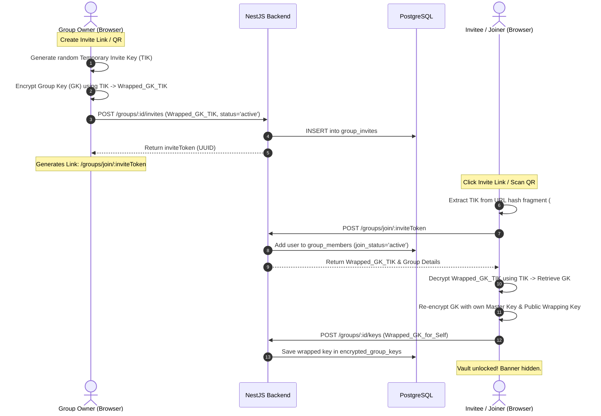
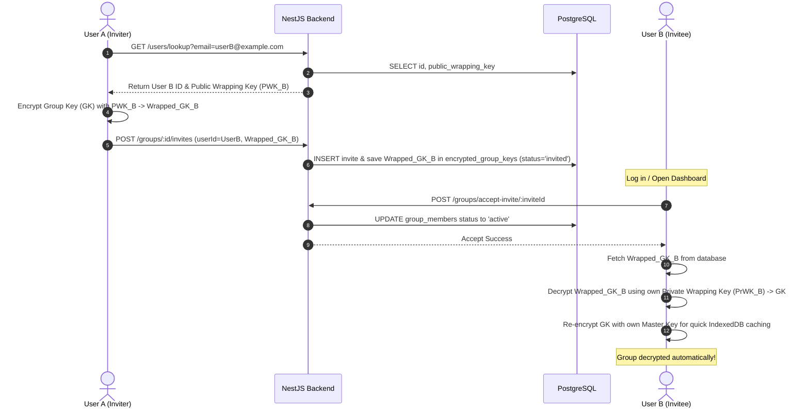
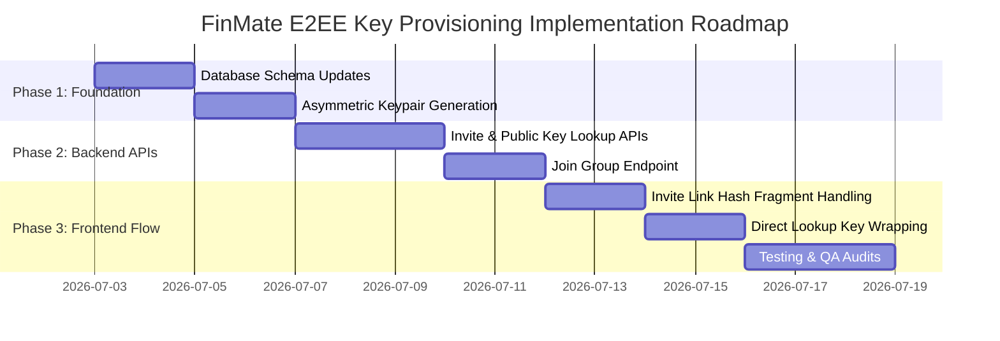

# FinMate – Zero-Knowledge Group Key Provisioning Architecture

This document specifies the end-to-end cryptographic and system design for automatic group key provisioning in FinMate, eliminating the constraint where group creators or admins must be online to provision keys for newly joined members.

---

## 1. Cryptographic Key Taxonomy

To support this architecture, FinMate uses a tiered key management system:

| Key Name | Type | Purpose | Location | Lifetime |
| :--- | :--- | :--- | :--- | :--- |
| **Master Key** | Symmetric (AES-256) | Encrypts the user's private vault (private wrapping key, local DB cache). | Derived via PBKDF2 from password; cached in-memory and in IndexedDB vault. | Revoked on logout or session expiry. |
| **User Data Key (UDK)** | Symmetric (AES-256) | Encrypts personal-scope data (personal expenses, notes, goals). | Derived from Master Key; cached in memory. | Revoked on logout. |
| **Public Wrapping Key (PWK)** | Asymmetric Public (RSA-OAEP 2048) | Used by other users to encrypt (wrap) group keys for this user. | Plaintext in database (`users.public_wrapping_key`). | Permanent. |
| **Private Wrapping Key (PrWK)** | Asymmetric Private (RSA-OAEP 2048) | Used by this user to decrypt (unwrap) group keys wrapped for them. | Encrypted with Master Key in database (`users.encrypted_private_wrapping_key`). | Permanent (unwrapped on session init). |
| **Group Key (GK)** | Symmetric (AES-256) | Encrypts group-scope data (group expenses, notes, attachments). | Cached in memory; stored in database wrapped per-user. | Rotated on demand or member eviction. |
| **Temporary Invite Key (TIK)** | Symmetric (AES-256) | Encrypts the GK for a specific invitation link/QR code. | Extracted from URL hash fragment (`#InviteKey`); never sent to the backend. | One-time / Ephemeral. |

---

## 2. Core Architecture: Automatic Key Provisioning

We define three user flows that guarantee group keys are provisioned automatically without requiring the owner to manually log in and open the group.

### Flow A: Joining via Invite Link or QR Code
When a group owner/admin generates an invite link or QR code, the client-side app generates a **Temporary Invite Key (TIK)**.



---

### Flow B: Lookup Invite for Registered Users (Direct Invite)
When User A invites User B directly by entering User B's email or username in the application, User A is online by definition. The client-side app resolves the key immediately.



---

### Flow C: Lookup Invite for Unregistered Users (Fallback)
If User A invites an email address that is not yet registered on FinMate:
1. User A's browser cannot retrieve a `public_wrapping_key` for the invitee.
2. The browser automatically generates a random **Temporary Invite Key (TIK)**.
3. The browser encrypts the `GroupKey` using the `TIK` -> `Wrapped_GK_TIK` and uploads it.
4. The system sends an email invitation containing: `/register?inviteToken=xyz#TIK`.
5. When the invitee registers, their browser extracts `TIK` from the hash fragment, decrypts the `GroupKey`, generates their asymmetric keypair, and uploads their newly wrapped key.

---

## 3. Alternative Architectures Considered

We evaluated two alternative approaches before final selection:

### Alternative 1: Server-Managed Key Escrow (KMS)
* **Description**: The server manages a master Key Management Service (KMS) where the group keys are stored. The server distributes keys to authorized users.
* **Pros**: Simple UI flow; offline sharing is handled by the server.
* **Cons**: **Violates the Zero-Knowledge principle**. A backend compromise or subpoena would expose all historical transaction details.

### Alternative 2: Lazy Key Rotation / Provisioning (Current System)
* **Description**: Invited users join the group immediately but cannot see transactions until an admin or owner opens the page and runs background key healing.
* **Pros**: Simple cryptographic flow.
* **Cons**: **Terrible UX**. Users get locked out of groups and see warnings like "Ask the owner to open this group page."

---

## 4. Threat Model & Security Review

| Threat | Mitigation | Risk Level |
| :--- | :--- | :--- |
| **Database Compromise** | The database only contains ciphertext for names, descriptions, notes, and wrapped keys. Attackers cannot read transaction data or decrypt the keys. | **Low** |
| **Backend Compromise (Malicious API)** | The backend could attempt to serve a fake public key for User B. Mitigation: Implement client-side signature verification of public keys using a user-identity hash chain (future roadmap). | **Medium** |
| **XSS (Cross-Site Scripting)** | Malicious script attempts to export keys. Mitigation: The PBKDF2 Master Key and Group Keys are stored in IndexedDB as **non-extractable** `CryptoKey` objects. JavaScript cannot read the raw key bytes; it can only execute encrypt/decrypt commands. | **Low** |
| **URL Hash Leakage (TIK)** | A user shares the full invite link (including `#TIK`) publicly. Mitigation: TIKs are single-use or expire after a short duration. The URL fragment is never logged by web servers (omitted from HTTP requests). | **Medium** |

---

## 5. Storage Specification

### Current Release Storage (Standard PWA)
- **In-Memory Cache**: Active `CryptoKey` objects are stored in memory (`Map<groupId, CryptoKey>`) in `GroupKeyService` and `ClientEncryptionService` for fast access.
- **IndexedDB Vault**: The Master Key and unwrapped Group Keys are stored in IndexedDB using `ZkKeyVaultService` with `extractable: false`. This ensures session survival across page refreshes.
- **Session Lifetimes**: Log out clears both the memory caches and IndexedDB key tables.

### Future Release Storage (Native Packaging / Roadmap)
- **Biometric Unlock**: Replaces standard IndexedDB caching with a hardware-backed keystore (Keychain/Keystore via Capacitor) unlocked via FaceID/Fingerprint.
- **Encrypted IndexedDB**: Local caching of transactional logs is encrypted using a local key derived via device hardware credentials.

---

## 6. Offline Synchronization Design

To support future offline operations:
1. **Key Preservation**: Unwrapped group keys cached in IndexedDB remain accessible offline.
2. **Offline Writing**: New expenses are encrypted locally using the cached Group Key, saved to a queue in IndexedDB, and given a temporary client-side UUID.
3. **Queue Synchronization**: When connectivity is restored, the client-side background sync service flushes the queue, uploading the encrypted payloads to the backend.

---

## 7. Database Schema Updates

To support invite-time key wrapping and public key lookup, the following schema additions are required:

### 1. Update `users` table:
```sql
ALTER TABLE users ADD COLUMN public_wrapping_key TEXT NULL;
ALTER TABLE users ADD COLUMN encrypted_private_wrapping_key TEXT NULL;
```

### 2. Create `group_invites` table:
```sql
CREATE TABLE group_invites (
  id UUID PRIMARY KEY DEFAULT uuid_generate_v4(),
  group_id UUID REFERENCES groups(id) ON DELETE CASCADE,
  invite_token UUID UNIQUE DEFAULT uuid_generate_v4(),
  invited_email VARCHAR(255) NULL,
  invitee_user_id UUID REFERENCES users(id) ON DELETE SET NULL,
  wrapped_group_key TEXT NULL, -- Group Key wrapped with TIK or User B's public key
  status VARCHAR(20) DEFAULT 'pending', -- pending, accepted, expired
  created_at TIMESTAMPTZ DEFAULT NOW(),
  expires_at TIMESTAMPTZ
);
CREATE INDEX idx_group_invites_token ON group_invites(invite_token);
```

---

## 8. API Design

### 1. `POST /api/groups/:id/invites` (Create Invitation)
- **Role**: Owner/Admin creates a new invite.
- **Payload**:
```json
{
  "email": "friend@example.com",
  "wrappedGroupKey": "iv_base64:ciphertext_base64" // Wrapped with PWK or TIK
}
```
- **Response**:
```json
{
  "id": "invite-uuid-123",
  "inviteToken": "token-uuid-456",
  "expiresAt": "2026-07-09T22:00:00Z"
}
```

### 2. `GET /api/users/lookup` (Resolve Public Key)
- **Role**: Active member looking up invitee's public key.
- **Query Params**: `email` or `username`
- **Response**:
```json
{
  "userId": "user-uuid-789",
  "publicWrappingKey": "mIICXAIBAAKBgQ..."
}
```

### 3. `POST /api/groups/join/:inviteToken` (Accept Invitation via Link)
- **Role**: Invitee accepting invite.
- **Response**:
```json
{
  "groupId": "group-uuid-abc",
  "wrappedGroupKey": "iv_base64:ciphertext_base64" // Wrapped with TIK
}
```

---

## 9. Implementation Roadmap



---

## 10. QA & Verification Checklist

- [ ] **No Duplicate Group Keys**: Verify that no invitations generate a brand-new group key for the same group.
- [ ] **Immediate Decryption**: Join a group via link on a new account and verify that expenses are decrypted immediately without logging out.
- [ ] **Zero-Knowledge Check**: Inspect server logs and database rows to verify that `wrapped_group_key` and `title` contain only ciphertext.
- [ ] **XSS Sanitization**: Confirm that the URL hash fragment (`#TIK`) is never logged or exposed in client error payloads.
- [ ] **Refresh Resilience**: Refresh the page after accepting the invite and check that the ledger remains decrypted.
- [ ] **Password Change Test**: Update user password, verify that UDK is re-wrapped, and confirm that all group expenses decrypt correctly.

---

## 11. Risks & Mitigations

- **Risk**: User joins via an expired invite link, leading to key decryption failure.
  - **Mitigation**: Detect expired invite tokens in the UI and show a clean error message: *"This invitation link has expired. Please request a new invite link from the group admin."*
- **Risk**: Asymmetric RSA wrapping key generation causes a performance lag on mobile devices during registration.
  - **Mitigation**: Run RSA-OAEP 2048 key generation inside a Web Worker thread to ensure smooth UI animations.
